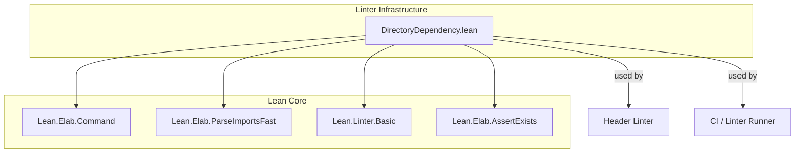
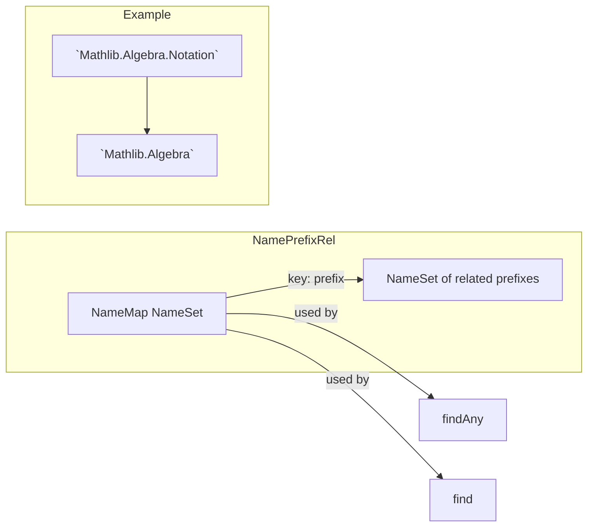

**Technical Brief: `DirectoryDependency.lean`**

---

### 1. KEY DEFINITIONS & THEOREMS

| Name | Type / Signature | Purpose |
|------|------------------|---------|
| `findImports` | `System.FilePath → IO (Array Name)` | Extracts import module names from a `.lean` file, omitting `Init`. |
| `Lean.Name.findPrefix` | `(Name → Option α) → Name → Option α` | Finds the longest prefix of a `Name` satisfying a predicate. |
| `Lean.Name.prefixes` | `Name → NameSet` | Returns all prefixes of a `Name`, including itself. |
| `Lean.Name.prefix?` | `Name → Option Name` | Returns the immediate parent prefix of a `Name`. |
| `Lean.Name.collectPrefixes` | `Array Name → NameSet` | Union of all prefixes of names in an array. |
| `Lean.Name.prefixToName` | `Name → Array Name → Option Name` | Finds a name in the array whose prefix matches the given `Name`. |
| `NamePrefixRel` | `NameMap NameSet` | Data structure encoding binary relations between name prefixes. |
| `NamePrefixRel.insert` | `NamePrefixRel → Name → Name → NamePrefixRel` | Adds a relation `n₁ → n₂`. |
| `NamePrefixRel.ofArray` | `Array (Name × Name) → NamePrefixRel` | Converts list of pairs into a `NamePrefixRel`. |
| `NamePrefixRel.find` | `NamePrefixRel → Name → Name → Option (Name × Name)` | Finds a pair of matching prefixes under the relation. |
| `NamePrefixRel.findAny` | `NamePrefixRel → Name → Array Name → Option (Name × Name)` | Efficiently checks if any prefix of `n₁` relates to any prefix of names in `ns`. |
| `NamePrefixRel.containsKey` | `NamePrefixRel → Name → Bool` | Checks if a key prefix exists in the map. |
| `NamePrefixRel.contains` | `NamePrefixRel → Name → Name → Bool` | Checks if any prefixes of two names are related. |
| `NamePrefixRel.getAllLeft` | `NamePrefixRel → Name → NameSet` | Collects all right-hand values for prefixes of a given name. |
| `allowedImportDirs` | `NamePrefixRel` | Specifies *allowed* import dependencies (opt-out model for low-level dirs). |
| `forbiddenImportDirs` | `NamePrefixRel` | Specifies *forbidden* import dependencies (blocklist of directory pairs). |
| `overrideAllowedImportDirs` | `NamePrefixRel` | Specifies *exceptions* to `forbiddenImportDirs`. |
| `checkBlocklist` | `Environment → Name → Array Name → Option MessageData` | Checks if an import violates `forbiddenImportDirs`, returning an error message if so. |
| `directoryDependencyCheck` | `Name → CommandElabM (Array MessageData)` | Main linter entrypoint: checks imports of a module against the allow/block/override lists. |
| `linter.directoryDependency` | `Option Bool` | Configurable toggle for the linter (default: `true`). |

---

### 2. NAMING CONVENTIONS

- **Prefixes**:
  - `find*`, `prefix*`, `collect*`, `prefixTo*`: utility functions on `Name`.
  - `ofArray`, `insert`, `find`, `contains*`, `getAllLeft`: methods on `NamePrefixRel`.
  - `allowedImportDirs`, `forbiddenImportDirs`, `overrideAllowedImportDirs`: configuration constants.
  - `checkBlocklist`, `directoryDependencyCheck`: linter logic functions.

- **Suffixes**:
  - `*?`: returns `Option` (e.g., `prefix?`).
  - `*Any`: returns first match among many (e.g., `findAny`).
  - `*All*`: collects all matches (e.g., `getAllLeft`).
  - `*Dirs`: directory-level configuration (`allowedImportDirs`, etc.).

- **Module/namespace**:
  - `Mathlib.Linter.DirectoryDependency`: main namespace.
  - `DirectoryDependency`: short alias for brevity.

---

### 3. TACTIC STACK

This file is **purely meta/declarative**, with no tactic usage in proofs (as it's a linter, not a theorem prover).  
However, it uses Lean’s **metaprogramming infrastructure**:

- `do`-notation (`Id.run`, `IO`, `CommandElabM`)
- `match` with `←`, `let?`, `if let`
- `Array`/`NameMap`/`NameSet` operations: `foldl`, `find?`, `contains`, `insert`, `append`, `filter`
- `MessageData` construction via `m!"..."`

No `simp`, `ring`, `aesop`, etc. — this is *not* a proof file.

---

### 4. PROOF LOGIC

No proofs are present. The logic is **data-driven validation**:

1. Parse imports of a module.
2. For each import, check if any prefix pair `(n₁, n₂)` in `forbiddenImportDirs` matches the module and import prefixes.
3. If found, check if the specific import is *not* in `overrideAllowedImportDirs`.
4. If still forbidden, emit a diagnostic message with the import chain.

The core logic is:
```lean
if forbiddenImportDirs.findAny mainModule imports = some (n₁, n₂) then
  if overrideAllowedImportDirs.contains mainModule imported = false then
    error
```

No induction, case analysis, or rewriting beyond pattern matching.

---

### 5. IMPORTS

- `Lean.Elab.Command`
- `Lean.Elab.ParseImportsFast`
- `Lean.Linter.Basic`
- `Lean.Elab.AssertExists`

> **Note**: No `mathlib` imports — this file is part of the *linter infrastructure*, not the library itself.

---

### 6. DEPENDENCY & OVERVIEW DIAGRAM

#### Mermaid: Module Dependency Overview



#### Mermaid: Linter Logic Flow

```mermaid
flowchart TD
  Start[Start: directoryDependencyCheck] --> CheckEnabled{Enabled?}
  CheckEnabled -- No --> End1[Return []]
  CheckEnabled -- Yes --> GetImports[Get imports of mainModule]
  GetImports --> CheckBlocklist[checkBlocklist]
  CheckBlocklist --> FindForbidden{forbiddenImportDirs.findAny?}
  FindForbidden -- Yes: (n₁,n₂) --> CheckOverride{overrideAllowedImportDirs.contains?}
  CheckOverride -- No --> EmitError[Return error message]
  CheckOverride -- Yes --> End2[Return []]
  FindForbidden -- No --> End2
```

#### Mermaid: NamePrefixRel Structure



---

### 7. THEORY SCOPE

This file implements a **modularity enforcement mechanism** for Mathlib:

- **Goal**: Prevent unintended cross-directory dependencies (e.g., `Algebra` importing `Topology`).
- **Approach**:
  - **Blocklist** (`forbiddenImportDirs`): top-level directory pairs that *must not* import each other.
  - **Allowlist** (`allowedImportDirs`): exceptions where imports *are* permitted (e.g., `Mathlib.Util` → `Batteries`).
  - **Override** (`overrideAllowedImportDirs`): fine-grained exceptions to blocklist entries.
- **Granularity**: Prefix-based (e.g., `Mathlib.Algebra.Notation` is treated as part of `Mathlib.Algebra`).
- **Design**: Opt-out for low-level modules (fewer config entries), opt-in for high-level ones.

This supports **modular development**, **dependency hygiene**, and **long-term maintainability** of Mathlib.

--- 

✅ *End of Technical Brief*
