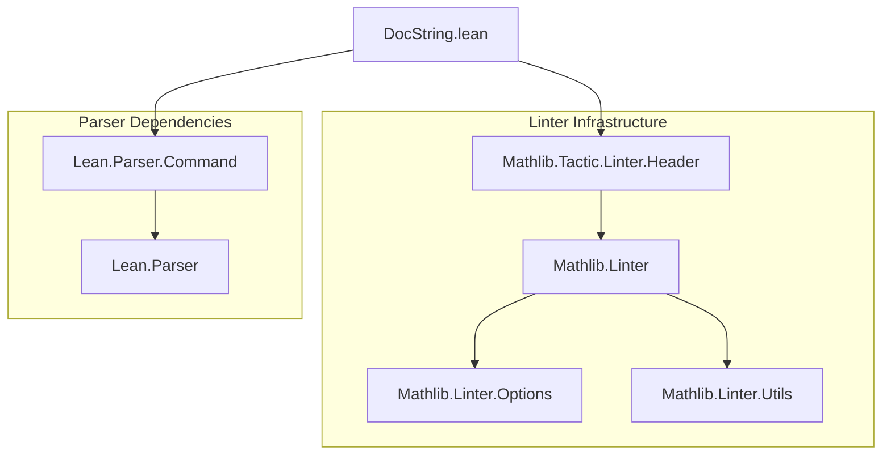
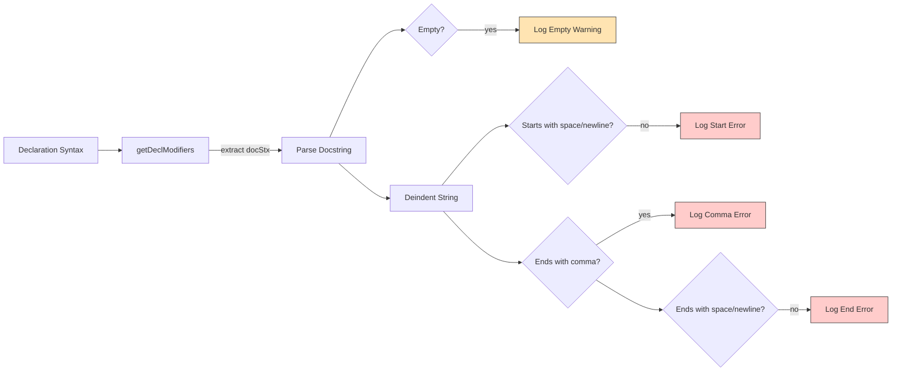

**Technical Brief: `DocString.lean` — DocString Style Linter for Lean 4**

---

### 1. **Key Definitions & Theorems**

| Name | Type | Purpose |
|------|------|---------|
| `linter.style.docString` | `Option Bool` | Global toggle for enabling the DocString linter suite. Default: `false`. |
| `linter.style.docString.empty` | `Option Bool` | Sub-toggle specifically for warning on *empty* docstrings. Default: `true`. |
| `getDeclModifiers : Syntax → Array Syntax` | `def` | Recursively extracts `declModifiers` syntax nodes from a declaration AST, skipping `#adaptation_note`s. |
| `deindentString (currIndent : Nat) (docString : String) : String` | `def` | Strips leading indentation (i.e., `currIndent` spaces after each `\n`) from a docstring. |
| `docStringLinter : Linter` | `def` | Main linter implementation: checks docstring formatting rules (non-empty, proper start/end punctuation/whitespace). |
| `initialize addLinter docStringLinter` | `initialize` | Registers the linter with the Lean linter framework. |

---

### 2. **Naming Conventions**

- **Prefixes**:
  - `linter.style.docString.*`: Option names follow `linter.<category>.<subsystem>` pattern.
  - `get*`: Functions extracting syntax or text (`getDeclModifiers`, `getDocStringText`).
  - `deindent*`: String-processing helpers.
- **Suffixes**:
  - `Linter`: Linter definitions end in `Linter`.
  - `empty`: Sub-option suffix for fine-grained toggles.
- **Syntax node patterns**:
  - `declModifiers`, `docComment`, `atom`, `node`: Lean parser AST node names used directly.

---

### 3. **Tactic Stack**

The file is **purely meta-level**, with no tactic usage in proofs (since it’s a linter, not a proof script).  
Key *metaprogramming* utilities used:

| Tactic / Utility | Role |
|------------------|------|
| `withSetOptionIn` | Temporarily sets linter options for scope. |
| `getLinterValue` | Reads linter option values. |
| `getFileMap`, `toPosition`, `column` | Source location analysis. |
| `getPos?`, `getTailPos?`, `unoffsetBy` | Syntax position manipulation. |
| `try … catch _ => continue` | Graceful error handling in parsing. |
| `Linter.logLintIf` | Conditional lint warning/error logging. |
| `m!"..."` | Monadic string interpolation (like `s!"..."` but in `IO`/`MetaM`). |

No `simp`, `ring`, `aesop`, etc. — this is *not* a proof file.

---

### 4. **Proof Logic**

Not applicable — this is a **linting module**, not a theorem-proving file.  
The logic is **procedural and syntactic**:

1. Parse declaration modifiers → extract docstring syntax node.
2. Compute indentation level from source position.
3. Normalize docstring (deindent, trim).
4. Check:
   - Non-empty (if `empty` linter enabled).
   - Starts with exactly one space or newline (after `/--`).
   - Ends with exactly one space or newline, *not* a comma.
5. Log warnings/errors via `Linter.logLintIf`.

---

### 5. **Imports**

| Import | Purpose |
|--------|---------|
| `Mathlib.Tactic.Linter.Header` | Provides infrastructure for linter registration and header linting. |
| `Lean.Parser.Command` | Needed to parse and inspect Lean command syntax (e.g., `declModifiers`, `docComment`). |
| `open Lean Elab Linter` | Brings core Lean metaprogramming and linter APIs into scope. |

---

### 6. **Dependency Graph (Mermaid)**

---

### 7. **Overview Diagram (Mermaid)**

---

### 8. **Theory Scope & Role**

- **Domain**: Formal library *style enforcement* for Lean 4.
- **Purpose**: Enforce consistent docstring formatting in mathlib (and downstream projects using this linter).
- **Scope**: Syntactic, not semantic — no reasoning about mathematical correctness, only formatting conventions.
- **Extensibility**: Designed for future expansion (e.g., more docstring rules) via modular `deindentString` and `docStringLinter`.

--- 

✅ **Summary**: This file implements a *syntactic linter* for docstring style, with configurable sub-rules, leveraging Lean’s metaprogramming and parser infrastructure.
