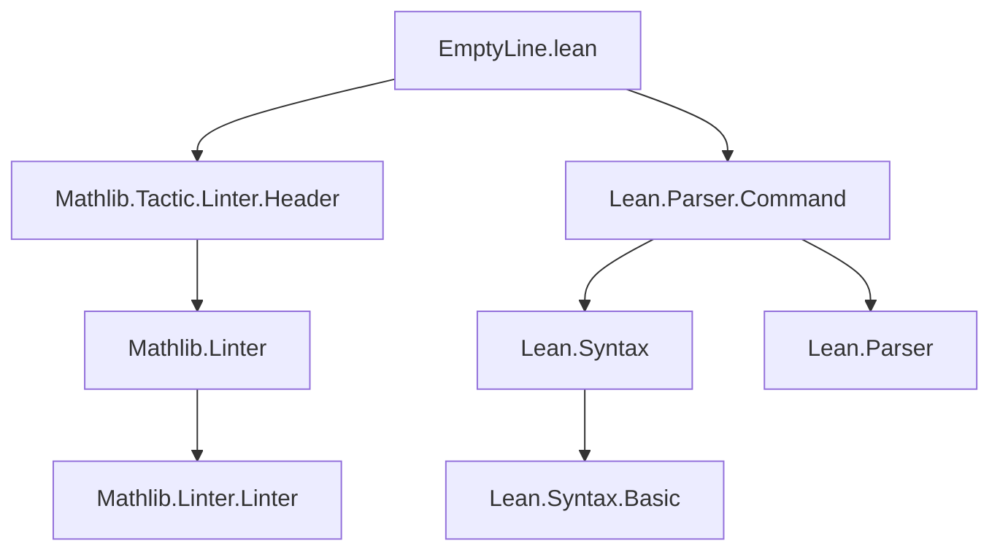
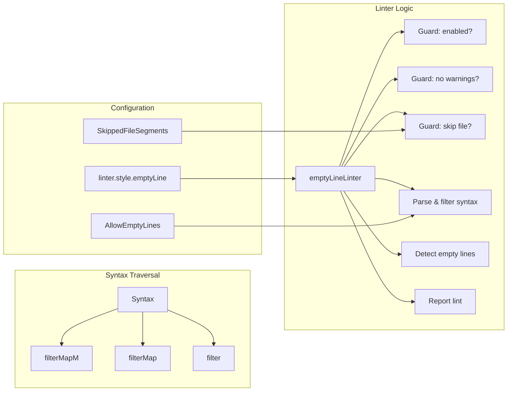

### Technical Brief: `EmptyLine.lean`

---

#### **1. Key Definitions & Theorems**

| Name | Type / Signature | Purpose |
|------|------------------|---------|
| `Substring.Raw.getRange` | `Substring.Raw → Syntax.Range` | Extracts the source range (start/end positions) from a raw substring. |
| `Syntax.filterMapM` | `{m : Type → Type} [Monad m] → Syntax → (Syntax → m (Option α)) → m (Array α)` | Monadic traversal of syntax tree, collecting `some` results. |
| `Syntax.filterMap` | `Syntax → (Syntax → Option α) → Array α` | Non-monadic version of `filterMapM`. |
| `Syntax.filter` | `Syntax → (Syntax → Bool) → Array Syntax` | Filters syntax nodes satisfying a predicate. |
| `linter.style.emptyLine` | `register_option : Bool` | Configurable toggle for enabling/disabling the linter. |
| `AllowEmptyLines` | `Std.HashSet SyntaxNodeKind` | Set of syntax node kinds where empty lines are *allowed* (e.g., doc comments, module docs). |
| `SkippedFileSegments` | `Std.HashSet Name` | Set of file name segments (e.g., `Tactic`, `Meta`) where the linter is *disabled*. |
| `emptyLineLinter` | `Linter` | Main linter implementation: detects and reports empty lines inside commands (outside docstrings). |

> **No theorems** are proven in this file — it is a *linter implementation*, not a mathematical theory.

---

#### **2. Naming Conventions**

- **Prefixes / Suffixes**:
  - `linter.style.*`: Option names for linter toggles (`linter.style.emptyLine`).
  - `AllowEmptyLines`, `SkippedFileSegments`: Descriptive compound nouns for configuration sets.
  - `filterMap`, `filterMapM`, `filter`: Standard functional programming naming for tree traversal/filtering.
  - `getRange?`, `getTrailing?`: Optional-returning accessor methods (Lean convention: `?` suffix for partial/optional functions).
  - `isOfKind`, `getKind`, `getAtomVal`: Syntax introspection methods.

---

#### **3. Tactic Stack**

The file uses **no Lean tactics** (e.g., `intro`, `rw`, `simp`) — it is a *meta-level* program (i.e., written in `meta`/`partial` functions, not in tactic mode).  
Instead, it uses:

- **Monadic combinators**: `do`, `←`, `match`, `if ... then ... else`, `for ... in ...`.
- **Array/HashSet operations**: `.push`, `.insertMany`, `.ofArray`, `.contains`, `.find?`.
- **String/Range utilities**: `.trim`, `.copy`, `.takeWhile`, `.offsetBy`, `.rawEndPos`.

---

#### **4. Proof Logic**

There is **no proof logic** — this is a *static analysis tool*, not a verification script.

**Execution flow of `emptyLineLinter`**:
1. **Guard clauses**:
   - Skip if linter is disabled.
   - Skip if file contains warnings (to avoid noise during development).
   - Skip if file path contains `Tactic`, `Meta`, or `Util`.
2. **Preprocess syntax**:
   - Trim trailing whitespace.
   - Extract substring and filter out allowed syntax nodes (`docComment`, `moduleDoc`, etc.).
3. **Detect empty lines**:
   - Split trailing content by `"\n\n"` to find candidate empty lines.
   - Track ranges of trailing whitespace/comments (to ignore embedded line breaks).
4. **Report violations**:
   - For each candidate empty line, check if it lies inside an allowed range.
   - If not, log a lint with context (previous/next lines + visual pointer `↓`).

---

#### **5. Imports**

| Import | Purpose |
|--------|---------|
| `Mathlib.Tactic.Linter.Header` | Provides infrastructure for linter registration and options. |
| `Lean.Parser.Command` | Required for `Syntax` and `Parser.Command.*` constants (e.g., `` ``Parser.Command.docComment ``). |

> **No Mathlib theorems or definitions are imported** — only Lean core and parser utilities.

---

#### **6. Mermaid Diagrams**

##### **Dependency Graph**

##### **File Overview**

---

#### **7. Summary**

- **Domain**: Static analysis for Lean code style (specifically, enforcing no *uncommented* empty lines inside commands).
- **Scope**: Narrow — only affects `emptyLine` linting behavior.
- **Key Insight**: Uses *syntax tree traversal* and *range analysis* to distinguish between:
  - *Allowed* empty lines (e.g., inside docstrings),
  - *Forbidden* empty lines (inside tactic blocks, definitions, etc.).
- **Design Pattern**: Functional tree traversal (`filterMapM`, `filter`) + monadic state handling (`do`-block with `get`, `set`).

This file exemplifies Lean’s capability for *metaprogramming* — building tools that inspect and annotate Lean code without altering its semantics.
