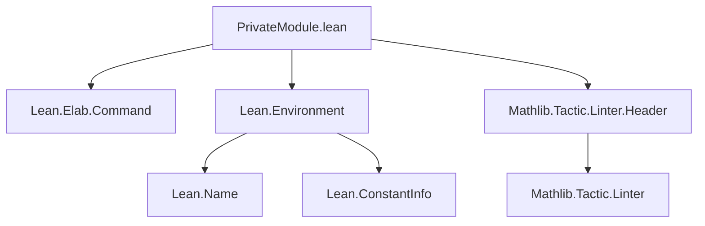
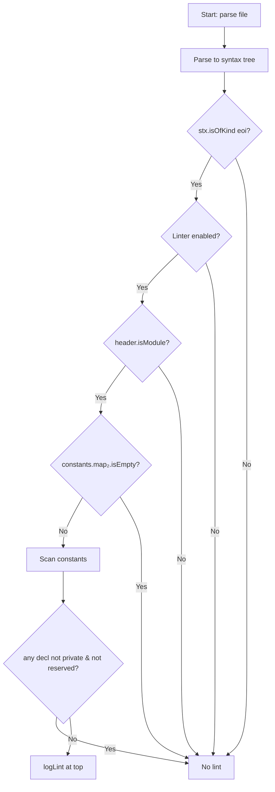

**Technical Brief: `PrivateModule.lean` Linter**

---

### 1. **Key Definitions & Theorems**

| Name | Type | Purpose |
|------|------|---------|
| `linter.privateModule` | `Option Bool` | Configuration option to enable/disable the linter; default `false`. |
| `privateModule` | `Linter` | Main linter implementation: checks if a module contains only private declarations and logs a lint at `eoi`. |
| `isPrivateName` | `Name → Bool` (imported from `Lean.Environment`) | Predicate to detect if a name is private (explicitly or by default). |
| `isReservedName` | `Env → Name → Bool` (imported) | Predicate to detect reserved names (e.g., auto-generated, lazily realized). |
| `getEnv` | `MetaM Env` | Retrieves the current environment. |
| `constants.map₂` | `Env → List (Name × ConstantInfo)` | Returns all locally-defined constants in the environment. |

---

### 2. **Naming Conventions**

- **Prefixes**:
  - `linter.` — for linter options (e.g., `linter.privateModule`)
  - `is_` — for predicates (e.g., `isPrivateName`, `isReservedName`)
- **Suffixes**:
  - None prominent beyond standard Lean naming (`_name`, `_decl`, `_info`).
- **Module/namespace**:
  - `Mathlib.Linter` — namespace for linter definitions.
  - `register_option` — standard Lean pattern for linter configuration.

---

### 3. **Tactic Stack**

- **Tactics used**:
  - `do`-block sequencing (metaprogramming monad)
  - `unless`, `if ... then ... else`, `for ... in ... do`
  - `return`, `logLint`
  - `getLinterValue`, `getLinterOptions`, `getEnv`, `isOfKind`, `isModule`, `isEmpty`
- **No `simp`, `ring`, `aesop`, or `conv`** — purely environment inspection and control flow.

---

### 4. **Proof Logic / Execution Flow**

1. **Trigger condition**: Linter runs only on `Parser.Command.eoi` (end-of-input token).
2. **Guard checks**:
   - Check if linter is enabled via `getLinterValue`.
   - Check if current file is a module (`header.isModule`).
   - Check if any constants are defined (`constants.map₂.isEmpty`).
3. **Scan declarations**:
   - Iterate over all constants in `constants.map₂`.
   - Skip if any constant is *not* private (`!isPrivateName`) and *not* reserved (`!isReservedName`).
4. **Lint if all are private**:
   - Log lint at top of file (`topOfFileRef`) with message suggesting `@[expose] public section`.

**Logical structure**:  
`eoi → [enabled? → isModule? → hasDecls? → publicDecl? → lint]`

---

### 5. **Imports**

| Import | Purpose |
|--------|---------|
| `Lean.Elab.Command` | For `Command` syntax, `getEnv`, `stx.isOfKind`, etc. |
| `Lean.Environment` | For `Env`, `constants.map₂`, `isPrivateName`, `isReservedName`. |
| `Mathlib.Tactic.Linter.Header` | Enforces header/linter compliance (e.g., copyright, docstring). |

---

### 6. **Mermaid Diagrams**

#### **Dependency Graph**


#### **Overview of File Execution**


#### **Theoretical Scope**
- **Domain**: Lean 4 module hygiene / linter infrastructure.
- **Theory**: Formal verification of module interface design — ensuring public API exposure is intentional.
- **Related concepts**:
  - `Lean.ReservedNameAction`, `registerReservedNameAction`, `registerReservedNamePredicate`
  - `Lean.ResolveName` (for name resolution & lazy realization)
  - `initialize`, `@[expose]`, `public`/`private` sections.

---

### 7. **Key Design Principles**

- **Lazy/deferred evaluation**: Lints only at `eoi`, after all declarations are added.
- **Avoid false negatives**: Ignores reserved names to prevent missing modules that *appear* private but later gain public auto-generated constants.
- **Metaprogram safety**: Does not assume auto-generated declarations (`isAutoDecl`, `isInternalDetail`) are public — avoids overfitting to internal behavior.
- **Non-invasive**: Does not modify environment; only reports.

---

### 8. **Example Use Case**

```lean
-- file: MyModule.lean
private def foo := 42
private theorem bar : 2 + 2 = 4 := by rfl
-- Linter fires here at top of file:
-- "The current module only contains private declarations.
--  Consider adding `@[expose] public section`..."
```

After adding:

```lean
@[expose] public section
def baz := 100
```

→ Linter no longer fires.

--- 

✅ **End of Technical Brief**
