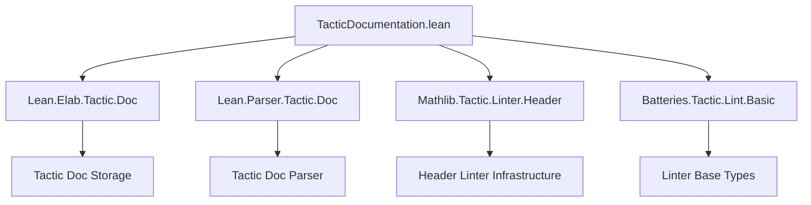

**Technical Brief: `TacticDocumentation.lean`**

---

### 1. **Key Definitions & Theorems**

| Name | Type | Purpose |
|------|------|---------|
| `isNonemptyDoc` | `TacticDoc → Bool` | Checks whether a tactic has a nonempty docstring (`docString.isSome`) or a nonempty `extensionDocs` entry. |
| `tacticDocs` | `Batteries.Tactic.Lint.Linter` | An environment linter (`@[env_linter]`) that verifies all *unique* tactics defined in a module have a nonempty docstring. |

---

### 2. **Naming Conventions**

- **Prefixes**:
  - `is_`: Boolean predicates (`isNonemptyDoc`, `isTactic`).
  - `tacticDocs`: Linter name, follows `*Docs` convention for documentation-related linters.
- **Suffixes**:
  - `Doc`: Used in `TacticDoc`, `docString`, `extensionDocs`, `docMap`, `doc`.
- **Internal vs User Names**:
  - `internalName`: Internal Lean name of the tactic.
  - `userName`: Human-readable name used in error messages.

---

### 3. **Tactic Stack**

- **Core Tactics Used**:
  - `getEnv`: Retrieve the current environment.
  - `getD`: Default fallback for `Option`.
  - `foldl`: Build `docMap`.
  - `return none` / `return some ...`: Standard monadic control flow.
  - `m!"..."`: Macro for string interpolation (used in error message).
- **No heavy tactic automation** (e.g., `aesop`, `ring`, `simp`); this is a *static analysis* linter, not a proof tactic.

---

### 4. **Proof Logic / Execution Flow**

1. **Filter tactics**:
   - Skip non-tactics (`!isTactic`) and alternative/redefined tactics (`alternativeOfTactic.isSome`).
2. **Build doc map**:
   - From `Tactic.Doc.allTacticDocs`, construct a `NameMap` keyed by `internalName`.
3. **Lookup & validate**:
   - Look up the tactic in the map.
   - If found, check `isNonemptyDoc`.
   - If missing or empty, emit error with tactic name.
4. **Error reporting**:
   - Uses `userName` if available; falls back to `tac.toString`.

> **Note**: The linter is *static* and *environment-based* — it inspects the global environment at lint time, not during proof search.

---

### 5. **Imports**

| Import | Role |
|--------|------|
| `Lean.Elab.Tactic.Doc` | Core infrastructure for tactic documentation (parsing, storage). |
| `Lean.Parser.Tactic.Doc` | Parser-level support for docstring annotations. |
| `Mathlib.Tactic.Linter.Header` | Header linter dependency (required for linter registration). |
| `Batteries.Tactic.Lint.Basic` | Base types for linters (`Linter`, `test`, `errorsFound`, etc.). |

> **Note**: `Lean.Elab.Tactic.Doc` is imported *both* `meta` and `public`, indicating it is used at elaboration time and exposed for downstream modules.

---

### 6. **Mermaid Diagrams**

#### **Dependency Graph**


#### **Overview of File Structure**
```mermaid
flowchart LR
  subgraph "Documentation Layer"
    D1[TacticDoc Type]
    D2[allTacticDocs]
    D3[docString / extensionDocs]
  end

  subgraph "Linter Logic"
    L1[isNonemptyDoc]
    L2[tacticDocs]
  end

  subgraph "Environment Inspection"
    E1[getEnv]
    E2[isTactic]
    E3[alternativeOfTactic]
  end

  subgraph "Error Reporting"
    R1[errorsFound / noErrorsFound]
    R2[m!"tactic `{name}` missing..."]
  end

  E1 --> E2
  E2 --> L2
  E3 --> L2
  D2 --> L2
  D3 --> L1
  L1 --> L2
  L2 --> R1
  L2 --> R2
```

---

### 7. **Domain Scope**

- **Purpose**: Enforce documentation hygiene in Mathlib (and downstream libraries using `tacticDocs`).
- **Scope**: *Syntax-level* (parsers/tactics), not term-level definitions or theorems.
- **Target Users**: Library maintainers, contributors, and CI pipelines enforcing docstring standards.

---

### 8. **Key Insight**

This linter is a *static, environment-based* quality gate: it ensures that every *publicly accessible* tactic parser has a docstring, preventing undocumented tactics from entering the codebase. It leverages Lean’s `Tactic.Doc` infrastructure to introspect tactic metadata at elaboration time.

--- 

Let me know if you'd like a formal specification of `isNonemptyDoc` or a test suite sketch.
