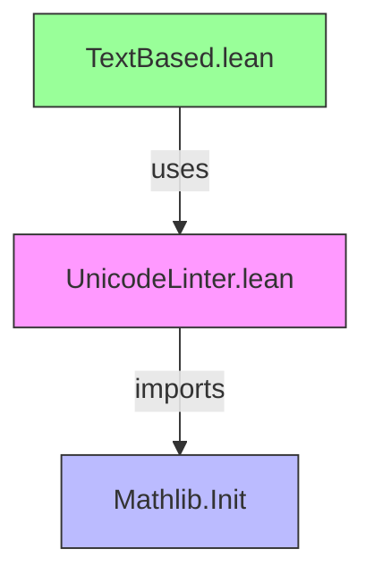

**Technical Brief: `UnicodeLinter.lean`**

---

### 1. **Key Definitions & Theorems**

| Name | Type | Purpose |
|------|------|---------|
| `printCodepointHex` | `Char → String` | Converts a `Char` to its Unicode codepoint in hexadecimal format with `U+` prefix (e.g., `'a'` → `"U+0061"`). |
| `isAllowedCharacter` | `Char → Bool` | Returns `false` only for the non-breaking space `'\u00A0'`; all other characters are allowed. |
| `replaceDisallowed` | `Char → Option String` | Provides a replacement string for disallowed characters: `'\u00A0'` → `" "`; others → `none`. |

*No theorems are stated or proven in this file.*

---

### 2. **Naming Conventions**

- **Prefixes**:
  - `is_`: Predicate naming (e.g., `isAllowedCharacter`).
  - `replace_`: Functions returning optional replacements (e.g., `replaceDisallowed`).
- **Suffixes**:
  - `Hex`: Indicates hexadecimal formatting (`printCodepointHex`).
- **Style**: Descriptive, camelCase, and explicit about behavior (`printCodepointHex`, `replaceDisallowed`).

---

### 3. **Tactic Stack**

- **No tactics used** — this file contains only pure definitions (no proofs or tactic scripts).
- Core Lean operations used: `let`, pattern matching, `String`/`List`/`Nat` operations (`toDigits`, `drop`, `append`, `ofList`).

---

### 4. **Proof Logic**

- **Not applicable** — no proofs or inductive arguments; purely functional definitions.

---

### 5. **Imports**

- `Mathlib.Init`: Provides foundational types and utilities (e.g., `Char`, `String`, `Nat` operations).

---

### 8. **Dependency & Theory Overview**

#### Mermaid Diagram: File Dependencies



#### Mermaid Diagram: Module Overview

```mermaid
graph LR
  subgraph "Mathlib.Linter.TextBased"
    A[UnicodeLinter] -->|defines| B[printCodepointHex]
    A -->|defines| C[isAllowedCharacter]
    A -->|defines| D[replaceDisallowed]
    C -->|blocks| E["'\u00A0'"]
    D -->|replaces| E with " "
  end
  subgraph "External"
    F[TextBased.lean] -->|consumes| A
  end
```

#### Summary

- **Scope**: Provides utility functions for a Unicode linter used in `TextBased.lean`.
- **Domain**: Static analysis of source code for Unicode compliance in Mathlib.
- **Key Insight**: Minimalist design — only one disallowed character (`'\u00A0'`) is explicitly handled; extensible via `replaceDisallowed`.

--- 

*End of Brief.*
