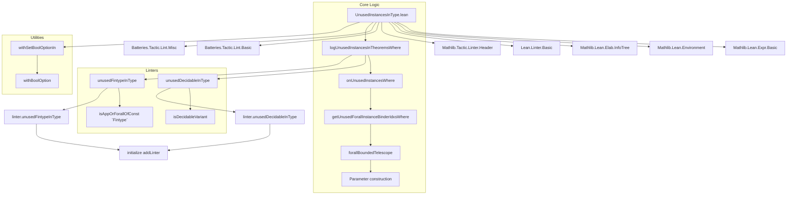
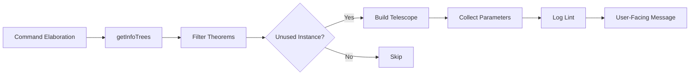

**Technical Brief: `UnusedInstancesInType.lean`**

---

### 1. KEY DEFINITIONS & THEOREMS

| Name | Type / Signature | Purpose |
|------|------------------|---------|
| `Parameter` | `structure` | Stores metadata about an unused instance parameter: `fvar?`, `type?`, and `idx`. Used for logging. |
| `toMessageData Parameter` | `instance` | Formats a `Parameter` as `[type] (#n)` or `parameter n`. |
| `Name.unusedInstancesMsg` | `def` | Constructs a user-facing message listing unused instance parameters for a declaration. |
| `ConstantVal.onUnusedInstancesWhere` | `def` | Scans a declaration’s type for unused instance hypotheses satisfying a predicate `p`, and logs them via `logOnUnused`. |
| `Syntax.logUnusedInstancesInTheoremsWhere` | `def` | Main driver: finds theorems matching filters, checks for unused instances in their types, and invokes a logging callback. |
| `isDecidableVariant` | `def` | Checks if an expression is an application of a `Decidable*` constant (`Decidable`, `DecidablePred`, etc.). |
| `withSetBoolOptionIn` | `partial def` | Workaround for `withSetOptionIn` not working in infotree searches; parses `set_option ... in ...` and sets `Bool` options. |
| `linter.unusedDecidableInType` | `register_option` | Configurable option to enable/disable the `Decidable*` unused-instance linter. |
| `unusedDecidableInType` | `def Linter` | Linter implementation: detects unused `Decidable*` hypotheses and suggests `classical` or `open scoped Classical in`. |
| `linter.unusedFintypeInType` | `register_option` | Configurable option to enable/disable the `Fintype` unused-instance linter. |
| `unusedFintypeInType` | `def Linter` | Linter implementation: detects unused `Fintype` hypotheses and suggests `Finite` + `Fintype.ofFinite`, or removal. |
| `initialize addLinter unusedDecidableInType` | `initialize` | Registers the `unusedDecidableInType` linter with the linter framework. |
| `initialize addLinter unusedFintypeInType` | `initialize` | Registers the `unusedFintypeInType` linter. |

---

### 2. NAMING CONVENTIONS

- **Prefixes**:
  - `unused*InType`: linter names (`unusedDecidableInType`, `unusedFintypeInType`)
  - `onUnused*`: internal helper methods (`onUnusedInstancesWhere`)
  - `is*`: predicate functions (`isDecidableVariant`)
- **Suffixes**:
  - `Msg`: message construction (`unusedInstancesMsg`)
  - `Filter`: predicate filters (`instanceTypeFilter`, `declFilter`)
- **Constants**:
  - Backtick-quoted constants: `` `Decidable ``, `` `Fintype ``, `` `Finite ``, `` `Fintype.ofFinite ``
- **Options**:
  - `linter.<name>`: registered option names (e.g., `linter.unusedDecidableInType`)

---

### 3. TACTIC STACK

| Tactic / Utility | Frequency | Role |
|------------------|-----------|------|
| `forallBoundedTelescope` | High | Extracts telescope of `forall` binders up to a bound. |
| `inferType` | Medium | Infers type of a free variable in telescope. |
| `liftTermElabM` | Medium | Lifts term elaboration into command elaboration. |
| `getInfoTrees`, `getTheorems`, `filter` | High | Infotree traversal and theorem filtering. |
| `logLint` | High | Emits lint warnings. |
| `withBoolOption`, `withSetBoolOptionIn` | Medium | Option manipulation (workaround). |
| `isAppOrForallOfConstP`, `isAppOrForallOfConst` | Medium | Pattern matching on constant applications. |
| `getLinterValue`, `getLinterOptions` | Medium | Linter configuration checks. |
| `getEnv`, `isImportedConst` | Medium | Environment introspection. |

---

### 4. PROOF LOGIC (Linter Execution Flow)

1. **Entry**: `logUnusedInstancesInTheoremsWhere` is invoked with:
   - `instanceTypeFilter`: predicate on `Expr` (e.g., `isDecidableVariant`)
   - `log`: callback to emit diagnostics
   - `declFilter`: optional filter on declarations (e.g., exclude `Decidable.*`)

2. **Infotree traversal**:
   - Collect all theorems (`t.getTheorems`) satisfying `declFilter`.

3. **Per-theorem analysis**:
   - Call `thm.onUnusedInstancesWhere instanceTypeFilter`.
   - Compute indices of unused instance binders via `getUnusedForallInstanceBinderIdxsWhere`.
   - If nonempty:
     - Build telescope up to `maxIdx + 1`.
     - Map indices to `Parameter`s (with `fvar?`, `type?`, `idx`).
     - Call `log t thm unusedParams`.

4. **Logging**:
   - `unusedInstancesMsg` formats the list of parameters.
   - `logLint` emits the message with context-specific suggestions.

5. **Linter registration**:
   - `initialize addLinter` registers the linter in the linter framework.

---

### 5. IMPORTS

| Import | Purpose |
|--------|---------|
| `Mathlib.Lean.Expr.Basic` | Expression utilities (`inferType`, `isAppOrForallOfConstP`, etc.) |
| `Mathlib.Lean.Environment` | Environment introspection (`isImportedConst`, `getEnv`) |
| `Mathlib.Lean.Elab.InfoTree` | Infotree traversal (`getInfoTrees`, `getTheorems`) |
| `Lean.Linter.Basic` | Linter infrastructure (`register_option`, `Linter`, `logLint`) |
| `Mathlib.Tactic.Linter.Header` | Enforces copyright/module header (required) |
| `Batteries.Tactic.Lint.Basic`, `Batteries.Tactic.Lint.Misc` | Linter utilities and extensions |

---

### 6. DEPENDENCY & OVERVIEW DIAGRAM

---

### 7. THEORY SCOPE

- **Domain**: Lean metaprogramming, specifically *linting* for unused type-class instances in theorem types.
- **Scope**: Theorems (`theorem`, `lemma`, `instance` of `Prop`-valued classes) only.
- **Goal**: Detect *type-unused* instance hypotheses (i.e., hypotheses that are type-class instances but not used in the *rest* of the type), and suggest replacements (e.g., `classical`, `Finite`, removal).
- **Limitations**:
  - Does not inspect proof bodies (only types).
  - Does not yet support logging on type signature (see TODO).
  - Only handles `Decidable*` and `Fintype` variants (extensible to others).

---

### 8. FUTURE WORK (from TODOs)

- Log lints on the *type signature* (not whole command).
- Add more linters (e.g., `UnusedInhabitedInType`, `UnusedNonemptyInType`).
- Generate *Try This* suggestions (e.g., `classical` or `open scoped Classical in`).
- Fix `withSetOptionIn` infotree issue ([lean4#11313](https://github.com/leanprover/lean4/pull/11313)).
- Improve `Parameter` to include binder syntax references.

--- 

**End of Technical Brief**
