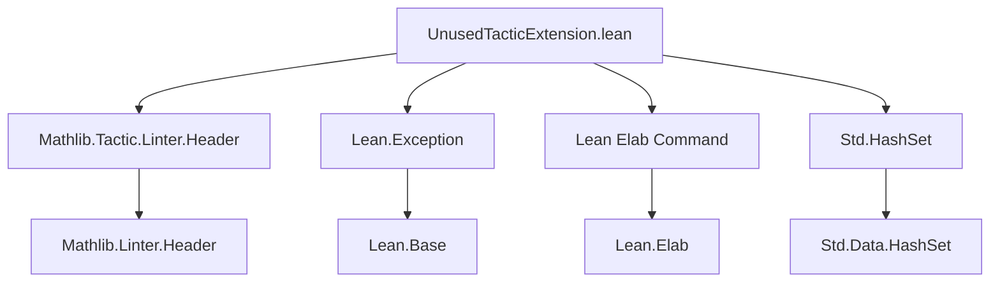
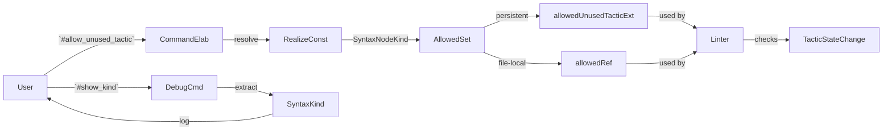

**Technical Brief: `UnusedTacticExtension.lean`**

---

### 1. **Key Definitions & Theorems**

| Name | Type / Signature | Purpose |
|------|------------------|---------|
| `allowedUnusedTacticExt` | `SimplePersistentEnvExtension SyntaxNodeKind (Std.HashSet SyntaxNodeKind)` | Environment extension to store a set of tactic syntax kinds *allowed* to leave tactic state unchanged without triggering the unused tactic linter. |
| `addAllowedUnusedTactic` | `{m : Type → Type} [Monad m] [MonadEnv m] → Std.HashSet SyntaxNodeKind → m Unit` | Adds a `HashSet` of tactic syntax kinds to `allowedUnusedTacticExt`. Used internally and by `#allow_unused_tactic!`. |
| `allowedRef` | `IO.Ref (Std.HashSet SyntaxNodeKind)` | Mutable reference to a *file-local* set of allowed unused tactics (non-persistent). Initialized with default list. |
| `#allow_unused_tactic` | Command syntax: `#allow_unused_tactic (!)? ident*` | User-facing command to dynamically extend the allowed tactics list. With `!`, persists across imports; otherwise, file-local. |
| `#show_kind` | Command syntax: `#show_kind tactic` | Debugging command to print the `SyntaxNodeKind` of a tactic syntax, aiding in identifying correct identifiers for `#allow_unused_tactic`. |

---

### 2. **Naming Conventions**

- **Prefixes / Suffixes**:
  - `allowedUnusedTactic*`: consistently used for extension and related functions.
  - `#allow_unused_tactic`, `#show_kind`: command names follow Lean’s `#`-command convention.
  - `addAllowedUnusedTactic`: follows `add*` pattern for extension-modifying functions.
  - `allowedRef`: `*Ref` suffix for `IO.Ref`-backed mutable state.

- **SyntaxNodeKind identifiers**:
  - Use backtick-quoted Lean identifiers (e.g., `` `by ``, `` `Lean.Parser.Tactic.show ``).
  - Names reflect full qualified paths where applicable (e.g., `Mathlib.Tactic.*`, `Lean.Parser.Tactic.*`).

---

### 3. **Tactic Stack**

- **Core tactics used in implementation**:
  - `liftCoreM`, `modifyEnv`, `stxNodes.foldM`, `mapM`, `realizeGlobalConstNoOverload`
  - `IO.Ref.modify`, `IO.mkRef`
  - `logError`, `logErrorAt`, `Lean.logInfoAt`
- **No user-level tactics** appear in proofs — this is a *metaprogramming* file.

---

### 4. **Proof Logic / Implementation Flow**

- **Extension registration**:
  - `registerSimplePersistentEnvExtension` defines how imported and new entries are merged (`addImportedFn`, `addEntryFn`).
- **Dynamic extension**:
  - `#allow_unused_tactic` parses identifiers, resolves them to `SyntaxNodeKind`s via `realizeGlobalConstNoOverload`, and:
    - If `!` is present: calls `addAllowedUnusedTactic` → persistent extension.
    - Else: updates `allowedRef` → file-local.
- **Debug helper**:
  - `#show_kind` constructs a tactic syntax tree, extracts `.raw.getKind`, and logs it.

---

### 5. **Imports**

| Import | Role |
|--------|------|
| `Mathlib.Tactic.Linter.Header` | Ensures header/linter compliance (required for linter infrastructure). |
| `Lean.Exception` | Provides exception handling (`Lean.Exception.error`) for error reporting. |
| `Lean Elab Command` | Provides elaboration infrastructure for custom commands (`elab`, `command`, `logError`, etc.). |
| `Std.HashSet` | Used for efficient set operations on tactic identifiers. |

---

### 6. **Mermaid Diagrams**

#### **Dependency Graph (File-Level)**

#### **Overview of Data Flow & Architecture**

---

### 7. **Domain Scope**

- **Purpose**: Support for the *unused tactic linter* in Mathlib.
- **Scope**: Metaprogramming infrastructure for *tactic whitelisting* — not part of core logic or mathematics.
- **Key abstraction**: `SyntaxNodeKind` as the canonical identifier for tactic syntax trees.

---

### 8. **Notes**

- The extension is designed to be *extensible* and *user-configurable*.
- The distinction between persistent (`!`) and file-local mode is critical for modular development.
- The `allowedRef` + `allowedUnusedTacticExt` split enables both:
  - **Interactive** (file-local) tuning during development.
  - **Persistent** configuration for library-wide defaults.

--- 

*End of Technical Brief.*
