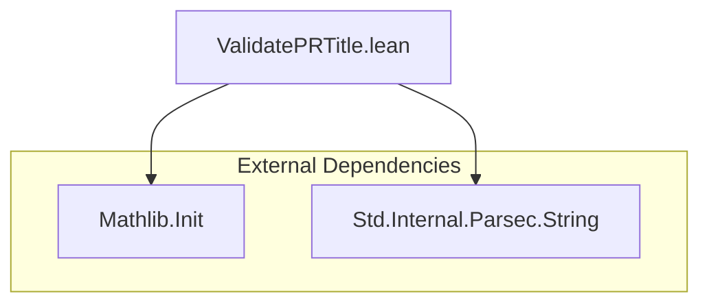

### Technical Brief: `ValidatePRTitle.lean`

---

#### **1. Key Definitions & Theorems**

| Name | Type | Purpose |
|------|------|---------|
| `prTitle` | `Parser (String × Option String)` | Parses PR titles into `(kind, scope?)`, where `kind ∈ {feat, chore, ..., ci}` and `scope? : Option String`. Supports both `kind: title` and `kind(scope): title` formats. |
| `validateTitle` | `String → Array String` | Validates a PR title against mathlib’s commit conventions. Returns a list of error messages (empty if valid). |

> **Note**: No theorems are proven — this is a *validation utility*, not a verification library.

---

#### **2. Naming Conventions**

- **Prefixes**:
  - `prTitle`: short for *Pull Request Title*.
  - `validateTitle`: verb + noun, standard for validation functions.
- **Suffixes**:
  - None prominent; no `is_`, `has_`, or `prop_` used.
- **Internal**:
  - `knownKinds`: descriptive variable name for allowed prefixes.
  - `errors`: mutable accumulator for error messages.

---

#### **3. Tactic Stack**

- **Tactics used in proofs/tests**:
  - `#guard_msgs in #eval Parser.run ...`: not tactics per se, but *Lean’s interactive evaluation + message guard* for deterministic testing.
  - No `simp`, `ring`, `aesop`, or `induction` — this module is purely computational (no proof search).
- **Core logic**:
  - `match` on `Parser.run` result (`Except.ok` / `Except.error`)
  - `for ... do` loops over arrays
  - `Id.run` to sequence monadic actions in `IO`-like context.

---

#### **4. Proof Logic**

- **Not applicable** — this is *not* a proof-carrying module.
- **Execution flow**:
  1. Check for presence of `:` → early error if missing.
  2. Trim leading whitespace and run `prTitle` parser.
  3. If parsing fails → generic format error.
  4. If parsing succeeds:
     - Validate `kind` against `knownKinds`.
     - Check for double spaces, trailing period.
     - Accumulate all violations.
  5. Return list of errors.

---

#### **5. Imports**

| Import | Purpose |
|--------|---------|
| `Mathlib.Init` | Core Lean functionality (e.g., `Prod.mk`, `String`, basic types). |
| `Std.Internal.Parsec.String` | Parser combinators (`pstring`, `skipString`, `any`, `notFollowedBy`, etc.) for building `prTitle`. |

> **Note**: Heavy reliance on `Std.Internal.Parsec.String` — a low-level parser combinator library (not the high-level `Std.Parsec`).

---

#### **6. Dependency Diagram**



---

#### **7. Module Overview Diagram**

```mermaid
flowchart LR
  subgraph "Input"
    I[PR Title String]
  end

  subgraph "Validation Pipeline"
    I -->|Check ':'| C1{Contains ':'?}
    C1 -->|No| E1["error: no colon"]
    C1 -->|Yes| T1[Trim & Run prTitle]
    T1 -->|Parse error| E2["error: invalid format"]
    T1 -->|Success (kind, scope?)| C2{kind ∈ knownKinds?}
    C2 -->|No| E3["error: unknown kind"]
    C2 -->|Yes| C3{Double space?}
    C3 -->|Yes| E4["error: double space"]
    C3 -->|No| C4{Ends with '.'?}
    C4 -->|Yes| E5["error: ends with '.'"]
    C4 -->|No| V[Valid]
  end

  subgraph "Output"
    E1 & E2 & E3 & E4 & E5 & V --> O[Array String]
  end
```

---

#### **8. Theory Scope & Intent**

- **Domain**: Software engineering process automation (specifically, Lean/Leanpkg PR hygiene).
- **Formalization level**: *Operational*, not logical — no axioms, no propositions-as-types.
- **Extensibility**:
  - `TODO`: parse and validate main title and scope (e.g., check scope is a valid module path).
  - `TODO`: enforce present imperative tense (not implemented).
- **Philosophy**: Fail-fast, user-friendly error messages; minimal assumptions about title content beyond syntax.

--- 

✅ **Summary**: A lightweight, self-contained PR title validator using parser combinators — no theorems, no proofs, but robust error reporting for CI integration.
