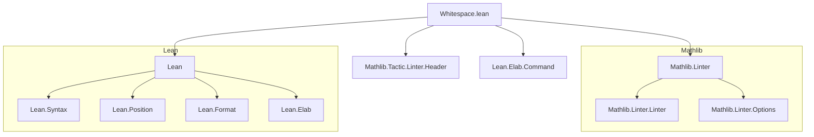
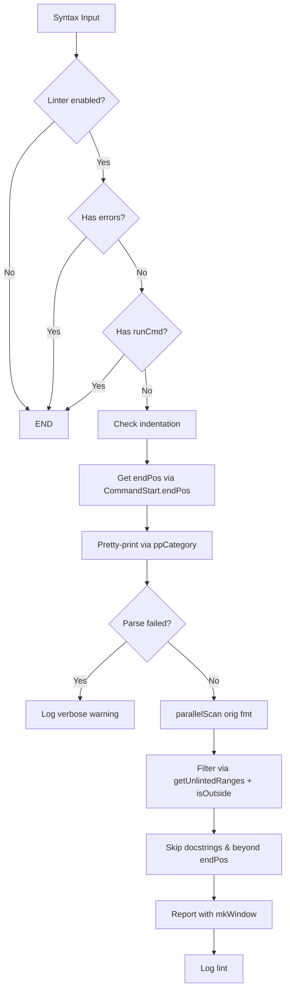

### Technical Brief: `Whitespace.lean` — The `whitespace` Linter for Lean 4

---

#### **1. Key Definitions & Theorems**

| Name | Type / Purpose |
|------|----------------|
| `linter.style.whitespace` | `Option Bool` — Main toggle for enabling the whitespace linter (default: `false`) |
| `linter.style.commandStart` | `Option Bool` — **Deprecated** alias for `linter.style.whitespace` |
| `linter.style.whitespace.verbose` | `Option Bool` — Controls diagnostic output (default: `false`) |
| `CommandStart.endPos` | `Syntax → Option String.Pos.Raw` — Computes the end position up to which formatting is checked (hypotheses + type, or value for simple declarations) |
| `FormatError` | `Structure` — Encodes a formatting discrepancy: source vs. formatted string positions, error message, length, etc. |
| `mkFormatError` | `String → String → String → Nat → FormatError` — Constructs a `FormatError` from mismatched strings and metadata |
| `pushFormatError` | `Array FormatError → FormatError → Array FormatError` — Merges adjacent errors of the same kind (e.g., multiple spaces) |
| `parallelScanAux` | `Array FormatError → String.Slice → String.Slice → Array FormatError` — Core scanning function comparing original vs. pretty-printed syntax, handling comments and whitespace anomalies |
| `parallelScan` | `String → String → Array FormatError` — Wrapper for `parallelScanAux` over full strings |
| `unlintedNodes` | `Array SyntaxNodeKind` — List of syntax node kinds to *ignore* (e.g., subtype/set notation, list cons, strings) |
| `getUnlintedRanges` | `Array SyntaxNodeKind → HashSet Range → Syntax → HashSet Range` — Accumulates ranges of unlinted nodes in a syntax tree |
| `isOutside` | `HashSet Range → Range → Bool` — Checks whether a range is *not* fully contained in any range of the set (used to skip ignored nodes) |
| `mkWindow` | `String → Nat → Nat → String` — Extracts a contextual substring around a mismatch for user-friendly diagnostics |
| `whitespaceLinter` | `Linter` — Main linter implementation: checks command indentation and hypothesis formatting against pretty-printed version |

> **No theorems** are proven in this file — it is a *linter implementation*, not a mathematical theory.

---

#### **2. Naming Conventions**

- **Prefixes**:
  - `linter.style.` — Option names (e.g., `linter.style.whitespace`)
  - `unlinted` — Nodes/syntax to *exclude* from linting
  - `mk*`, `push*`, `get*`, `is*` — Standard functional naming for constructors, accumulators, and predicates
- **Suffixes**:
  - `EndPos`, `StartPos`, `rawEndPos`, `rawStartPos` — Position-related fields
  - `Aux` — Internal helper functions (e.g., `parallelScanAux`)
  - `Verbose` — Options that enable extra diagnostics
- **Kinds**:
  - `FormatError.msg` uses descriptive strings: `"extra space"`, `"remove line break"`, `"missing space"`, `"Oh no! (Unreachable?)"`

---

#### **3. Tactic Stack**

This file is **meta-level** (uses `Lean Elab Command`), so tactics are not used *in proofs*, but in *linter execution*. The core logic uses:

- `do`-notation (`Id.run`, `liftCoreM`, `try ... catch`)
- `match` and `if-let` destructuring
- `Array`/`HashSet` operations: `foldl`, `union`, `insert`, `contains`, `all`
- `String` operations: `dropPrefix?`, `takeWhile`, `dropWhile`, `positions`, `trimAscii`, `sliceFrom`
- `Syntax` traversal: `find?`, `getPos?`, `getTailPos?`, `getRange?`, `getHead?`

No `simp`, `ring`, or `aesop` — this is *not* a proof file.

---

#### **4. Proof Logic**

Not applicable — this is a **linter**, not a theorem prover.

However, the *algorithmic logic* follows:

1. **Early exit** if linter disabled, errors exist, or `runCmd` present.
2. **Indentation check**: if command doesn’t start at column 0 → warning.
3. **Pretty-print comparison**:
   - Parse syntax to `Format` via `PrettyPrinter.ppCategory`.
   - Extract original substring and compare with pretty-printed string using `parallelScan`.
4. **Filter out ignored nodes** (`unlintedNodes`) using `getUnlintedRanges` and `isOutside`.
5. **Skip docstrings** and positions beyond `CommandStart.endPos`.
6. **Report diagnostics** using `mkWindow` to show context.

---

#### **5. Imports**

| Import | Purpose |
|--------|---------|
| `Mathlib.Tactic.Linter.Header` | Required for linter infrastructure (header linter, registration) |
| `Lean` | Core syntax, position, pretty-printer APIs |
| `Elab.Command` | Command elaboration and syntax access |
| `Linter` | Linter infrastructure (`register_option`, `Linter`, `logLint`) |

---

#### **6. Dependency & Theory Overview**

##### **Mermaid Diagram: File Dependencies**

##### **Mermaid Diagram: Linter Workflow**

##### **Theoretical Scope**

- **Domain**: Code formatting hygiene in Lean 4 projects (specifically Mathlib).
- **Formalized Concepts**:
  - Syntax tree traversal and position tracking.
  - String comparison with whitespace-aware heuristics.
  - Comment-aware diffing (handles `/--`, `--`, `-/`).
  - Contextual error reporting.
- **Not Formalized**:
  - No correctness theorems (e.g., “this linter never crashes” or “reports all violations”) — it is a *practical tool*, not a verified system.

---

#### **7. Notes on Design Choices**

- **`parallelScan` is partial and heuristic-based**: It assumes the pretty-printed version is *almost* identical to the source, differing only in whitespace (with exceptions for comments and special syntax).
- **`unlintedNodes` is a curated list**: Reflects known pretty-printer quirks (e.g., `{ a // b }` vs. `{a//b}`).
- **`mkWindow` prioritizes readability**: Shows 4+ characters of context around mismatches.
- **No normalization of whitespace**: Only *differences* are reported — no automatic formatting.

---

#### **8. Summary**

The `whitespace` linter enforces consistent spacing and indentation in Lean 4 code, especially around declarations (`lemma`, `example`, etc.). It compares user-written syntax with Lean’s pretty-printed version, flags deviations (extra/missing spaces, line breaks), and provides actionable diagnostics. Its design reflects real-world trade-offs: robustness over completeness, heuristics over formal guarantees.

It is part of **Mathlib’s style enforcement infrastructure**, ensuring codebase uniformity without requiring manual formatting discipline.
