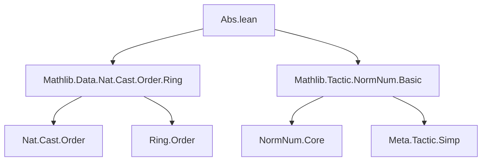

**Technical Brief: `Abs.lean` — `norm_num` Plugin for Absolute Value (`abs`)**

---

### 1. **Key Definitions & Theorems**

| Name | Type / Signature | Purpose |
|------|------------------|---------|
| `isNat_abs_nonneg` | `{α : Type*} [Ring α] [Lattice α] [IsOrderedRing α] → {a : α} {na : ℕ} → IsNat a na → IsNat |a| na` | Proves that if `a` is a nonnegative natural embedding (`IsNat a na`), then `|a| = a` and thus `|a|` is also represented by `na`. |
| `isNat_abs_neg` | Same context as above, but `IsInt a (.negOfNat na) → IsNat |a| na` | Shows that if `a = -na` (as an integer embedding), then `|a| = na` (as a natural embedding). |
| `isNNRat_abs_nonneg` | `{α : Type*} [DivisionRing α] [LinearOrder α] [IsStrictOrderedRing α] → {a : α} {num den : ℕ} → IsNNRat a num den → IsNNRat |a| num den` | Handles absolute value for nonnegative rational embeddings: `|a| = a` when `a ≥ 0`. |
| `isNNRat_abs_neg` | Same context, `IsRat a (.negOfNat num) den → IsNNRat |a| num den` | Handles absolute value for negative rational embeddings: `|a| = -a` when `a < 0`. |
| `evalAbs` | `NormNumExt` | `norm_num` extension tactic that pattern-matches on `|a|`, computes `a` via `derive`, and returns the appropriate normalized form (`isNat`, `isNNRat`, etc.) using the above theorems. |

---

### 2. **Naming Conventions**

- **Theorems**:
  - `isNat_*`: Relate `IsNat` representations (natural numbers embedded in rings).
  - `isNNRat_*`: Relate `IsNNRat` (nonnegative rational embeddings).
  - `abs_*`: Indicate handling of absolute value in different contexts (`nonneg`, `neg`).
- **Tactic/Extension**:
  - `evalAbs`: Follows `norm_num` plugin naming (`eval*`), where `Abs` is the target expression.

---

### 3. **Tactic Stack**

Frequent tactics used in proofs and extension:

| Tactic | Usage |
|--------|-------|
| `rw [pa.out]` | Rewrite using the definition of `IsNat`/`IsInt`/`IsNNRat`. |
| `simp` / `simp only [...]` | Simplify goals using known lemmas (e.g., `abs_neg`, `abs_of_nonneg`, `Int.cast_negOfNat`). |
| `refine ⟨ha1, ...⟩` | Construct proofs for conjunctions (e.g., `IsNNRat` is a pair: positivity + equality). |
| `apply mul_nonneg` | Prove nonnegativity of products (used in rational case). |
| `synthInstanceQ` | Synthesize typeclass instances at meta level (e.g., `Ring`, `IsOrderedRing`). |
| `assumeInstancesCommute` | Ensure synthesized instances commute (required for correctness of `norm_num` extensions). |
| `failure` | Fail tactic branch for unsupported types (e.g., booleans). |

---

### 4. **Proof Logic**

The core logic follows a **case analysis on the normalized form of `a`**:

1. **Pattern match** on `|a|` using `~q(@abs ...)`.
2. **Derive** the normalized representation of `a` via `derive a`.
3. **Branch on the result**:
   - If `a` is a boolean → fail (abs not meaningful).
   - If `a` is `isNat` (i.e., `a ≥ 0`) → use `isNat_abs_nonneg`.
   - If `a` is `isNegNat` (i.e., `a = -n`) → use `isNat_abs_neg`.
   - If `a` is `isNNRat` (i.e., `a ≥ 0`) → use `isNNRat_abs_nonneg`.
   - If `a` is `isNegNNRat` (i.e., `a < 0`) → use `isNNRat_abs_neg`.
4. In each case:
   - Synthesize required typeclass instances.
   - Call `assumeInstancesCommute`.
   - Return a new normalized form with the appropriate theorem applied.

This is a **meta-level case split** on the *semantic* structure of `a`, not syntactic.

---

### 5. **Imports**

| Import | Role |
|--------|------|
| `Mathlib.Data.Nat.Cast.Order.Ring` | Provides `IsNat`, `IsInt`, `IsNNRat`, `IsRat`, and order-theoretic properties of casts. |
| `Mathlib.Tactic.NormNum.Basic` | Provides `NormNumExt`, `derive`, `NormNumResult`, and infrastructure for `norm_num` plugins. |

---

### 6. **Mermaid Diagrams**

#### **Dependency Graph (Module-Level)**



#### **Overview of `evalAbs` Logic Flow**

```mermaid
flowchart TD
  Start[Pattern match |a|] --> Derive[derive a]
  Derive --> Case{Type of a?}
  Case -->|isBool| Fail[Fail]
  Case -->|isNat sα na pa| Thm1[apply isNat_abs_nonneg]
  Case -->|isNegNat sα na pa| Thm2[apply isNat_abs_neg]
  Case -->|isNNRat ...| Thm3[apply isNNRat_abs_nonneg]
  Case -->|isNegNNRat ...| Thm4[apply isNNRat_abs_neg]
  Thm1 --> Return1[Return .isNat ...]
  Thm2 --> Return2[Return .isNat ...]
  Thm3 --> Return3[Return .isNNRat ...]
  Thm4 --> Return4[Return .isNNRat ...]
  Fail --> End[End]
  Return1 --> End
  Return2 --> End
  Return3 --> End
  Return4 --> End
```

#### **Theoretical Scope**

This module extends `norm_num` to handle absolute value in:
- **Ordered rings** (for `abs` on integers/naturals),
- **Strictly ordered division rings** (for rationals).

It connects:
- **Semantic normalization** (`IsNat`, `IsNNRat`) with **syntactic rewriting** (`abs` elimination),
- **Order theory** (`IsOrderedRing`, `IsStrictOrderedRing`) with **algebraic structure** (`Ring`, `DivisionRing`).

---

### 7. **Notable Design Notes**

- The plugin is **typeclass-driven**: it synthesizes instances at meta-level to ensure correctness.
- It distinguishes between:
  - `IsNat` (nonnegative nat embedding),
  - `IsInt` (integer embedding, possibly negative),
  - `IsNNRat` / `IsRat` (rational embeddings).
- The `abs` case for `isNegNNRat` uses `(-qe')` to flip sign in the rational representation.

---

### 8. **Future Work (per TODO)**

- Extend to `mabs`, `norm`, `nnorm`, `enorm` — likely for more exotic normed structures (e.g., `p`-adic, Euclidean, extended reals).

--- 

Let me know if you'd like a formalized dependency graph for the entire `norm_num` plugin ecosystem or a comparison with `norm_num2`.
