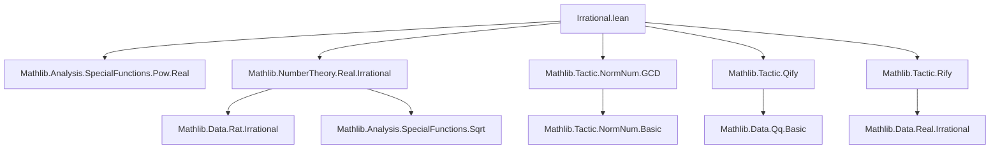
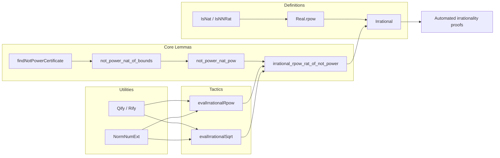

### Technical Brief: `Irrational.lean` Module

---

#### **1. Key Definitions & Theorems**

| Name | Type / Signature | Purpose |
|------|------------------|---------|
| `irrational_rpow_rat_of_not_power` | `{q : ℚ} {a b : ℕ} → (∀ p : ℚ, q ^ a ≠ p ^ b) → 0 < b → 0 ≤ q → Irrational (Real.rpow q (a / b))` | Core lemma: if $q^a$ is not a $b$-th power in ℚ, then $q^{a/b}$ is irrational. |
| `not_power_nat_pow` | `{n p q : ℕ} → p.Coprime q → 0 < q → (∀ m, n ≠ m ^ q) → ∀ m, n ^ p ≠ m ^ q` | If $n$ is not a $q$-th power and $\gcd(p,q)=1$, then $n^p$ is not a $q$-th power. |
| `not_power_nat_of_bounds` | `{n k d : ℕ} → k^d < n ∧ n < (k+1)^d → ∀ m, n ≠ m^d` | Bounding argument: if $n$ lies strictly between two consecutive $d$-th powers, it's not a $d$-th power. |
| `not_power_nat_pow_of_bounds` | `{n k p q : ℕ} → 0 < q → p.Coprime q → k^q < n < (k+1)^q → ∀ m, n^p ≠ m^q` | Combines previous two: bounding implies non-power for exponentiated bases. |
| `eq_of_mul_eq_mul_of_coprime` | `{a b x y : ℕ} → a.Coprime b → x.Coprime y → a·x = b·y → a = y` | Cancellation under coprimality; used to equate numerators/denominators in rational equations. |
| `not_power_rat_of_num` | `{a b d : ℕ} → a.Coprime b → (∀ x, a ≠ x^d) → ∀ q : ℚ, a/b ≠ q^d` | Rational number $a/b$ (in lowest terms) is not a $d$-th power if numerator isn’t. |
| `irrational_rpow_rat_rat_of_num` | `{x y : ℝ} → IsNNRat x → IsNNRat y → coprime numerators/denominators → bounds on numerator → Irrational $x^y$ | Main tactic lemma for rational base & rational exponent. |
| `irrational_rpow_rat_rat_of_den` | Same as above but bounds on denominator | Handles case where numerator *is* a power, but denominator isn’t. |
| `irrational_rpow_nat_rat` | Special case of above when base is natural | Simplified version for natural base. |
| `irrational_sqrt_rat_of_num` / `irrational_sqrt_rat_of_den` | Special case $y = 1/2$ | For square roots of rationals. |
| `irrational_sqrt_nat` | Special case for natural radicand | For $\sqrt{n}$. |
| `NotPowerCertificate` | Structure: `k : ℕ`, proofs $k^n < m$, $m < (k+1)^n$ | Certificate that $m$ is not an $n$-th power. |
| `findNotPowerCertificateCore` | `ℕ → ℕ → Option ℕ` | Binary search to find $k$ such that $k^n < m < (k+1)^n$. |
| `findNotPowerCertificate` | `Q(ℕ) → Q(ℕ) → MetaM (NotPowerCertificate m n)` | Constructs certificate in tactic monad. |
| `evalIrrationalRpow` | `NormNumExt` | `norm_num` extension for `Irrational (x ^ y)` with rational $y$. |
| `evalIrrationalSqrt` | `NormNumExt` | `norm_num` extension for `Irrational (√x)` with rational $x$. |

---

#### **2. Naming Conventions**

- **Prefixes**:
  - `irrational_`: lemmas proving irrationality.
  - `not_power_`: lemmas showing a number is not a perfect power.
  - `eq_of_mul_eq_mul_of_coprime`: cancellation under coprimality.
- **Suffixes**:
  - `_rat`, `_nat`: indicate rational/natural arguments.
  - `_num`, `_den`: refer to numerator/denominator cases.
  - `_of_bounds`: bounding-based proofs.
  - `_aux`: auxiliary lemmas (often intermediate steps).
- **Structure/Function Names**:
  - `NotPowerCertificate`: data structure for certificates.
  - `findNotPowerCertificate*`: search functions.

---

#### **3. Tactic Stack**

Frequent tactics used in proofs and tactic definitions:

| Tactic | Usage |
|--------|-------|
| `simp` / `simp only` | Simplify goals using definitional equalities, especially for `Real.rpow`, `Rat.cast`, `IsNNRat`, `IsNat`. |
| `rify` / `qify` | Convert between real/quantifier-free and rational/quantifier-free representations. |
| `rw` / `apply` / `exact` | Rewriting and applying lemmas. |
| `contrapose!` | Turn implications into contrapositive form. |
| `by_cases` / `rcases` | Case analysis on `0 ≤ q`, parity of exponent, etc. |
| `apply_fun` | Apply function to both sides of equality (e.g., `Nat.factorization`). |
| `congr'` / `ext` | Extensionality for functions/finsupp. |
| `lia` / `linarith` | Linear arithmetic over naturals/integers. |
| `tauto` | Tactic for propositional logic. |
| `conv` | Convolution tactic for targeted rewriting. |
| `failure` / `try` / `catch` | In tactic monad: control flow for fallback logic. |
| `derive` | Synthesize proofs/expressions in `norm_num`. |
| `assumeInstancesCommute` | Ensure commutativity of instances in tactic extension. |

---

#### **4. Proof Logic Flow**

The core proof strategy for irrationality of $x^y$ (with rational $y = p/q$):

1. **Reduction to rational base**: Use `IsNNRat`/`IsNat` to represent $x$ as $a/b$ or $n$.
2. **Normalize exponent**: Ensure $y = p/q$ in lowest terms (via `proveNatGCD`).
3. **Reduce to non-power condition**: Show $(a/b)^p$ is not a $q$-th power in ℚ.
   - If numerator $a$ is not a $q$-th power, use `not_power_rat_of_num`.
   - Else, if denominator $b$ is not a $q$-th power, use `not_power_rat_of_den`.
4. **Prove non-power via bounding**:
   - Use `findNotPowerCertificate` to find $k$ with $k^q < a < (k+1)^q$ (or for $b$).
   - Apply `not_power_nat_of_bounds` and lift to rationals via `not_power_rat_of_num`.
5. **Conclude irrationality** via `irrational_rpow_rat_of_not_power`.

For square roots ($y = 1/2$), same logic applies with $q = 2$, using specialized lemmas.

---

#### **5. Imports**

| Module | Purpose |
|--------|---------|
| `Mathlib.Analysis.SpecialFunctions.Pow.Real` | `Real.rpow`, properties of real exponentiation. |
| `Mathlib.NumberTheory.Real.Irrational` | Core definitions: `Irrational`, `IsNNRat`, `IsNat`. |
| `Mathlib.Tactic.NormNum.GCD` | `proveNatGCD`, normalization of rational representations. |
| `Mathlib.Tactic.Qify` | Convert between `ℚ` and `Q(ℕ)` representations. |
| `Mathlib.Tactic.Rify` | Convert between `ℝ` and `Q(ℕ)` representations. |

---

#### **8. Mermaid Diagrams**

##### **Dependency Graph (Module-Level)**



##### **Overview of Theoretical Flow**



##### **Algorithmic Flow for `evalIrrationalRpow`**

```mermaid
flowchart TD
  Start[Input: Irrational (x ^ y)] --> CheckY[Is y rational?]
  CheckY -->|Yes| NormalizeY[Normalize y = p/q, gcd=1]
  CheckY -->|No| Fail[Fail]
  NormalizeY --> CheckX[Is x nat or rat?]
  CheckX -->|Nat| UseNum[Check numerator bounds]
  CheckX -->|Rat| TryNum[Try numerator bounds]
  TryNum -->|Success| ReturnNum[Return num-based proof]
  TryNum -->|Fail| TryDen[Try denominator bounds]
  TryDen -->|Success| ReturnDen[Return den-based proof]
  TryDen -->|Fail| Fail
  UseNum --> ReturnNum
  ReturnNum & ReturnDen --> Success[Return proof]
```

---

This module implements a **decision procedure** for irrationality of expressions like $x^y$ and $\sqrt{x}$, where $x$ is rational (or natural) and $y$ is rational. It leverages:
- **Number-theoretic properties** (coprimality, prime factorization),
- **Bounding arguments** (binary search for non-$n$-th powers),
- **Lean’s `norm_num` framework** for automation.

The TODO item — *“Disprove `Irrational x` for rational `x`”* — suggests future extension to handle rational inputs directly (currently only irrationality *is* proven, not rationality *refuted*).
