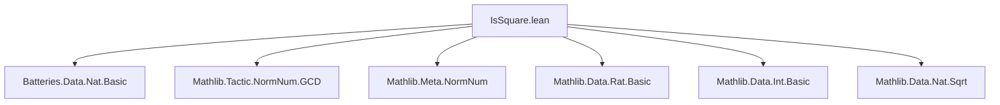
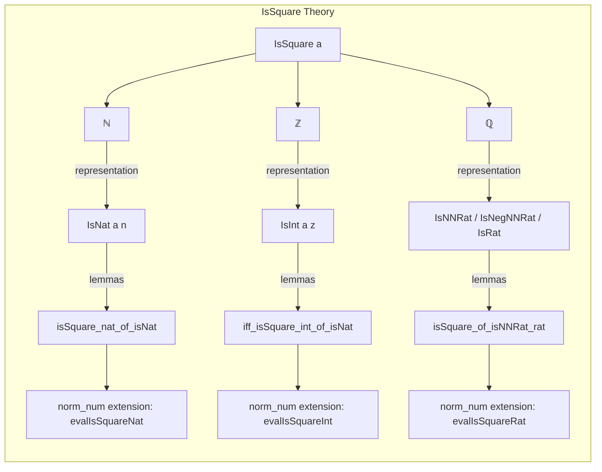
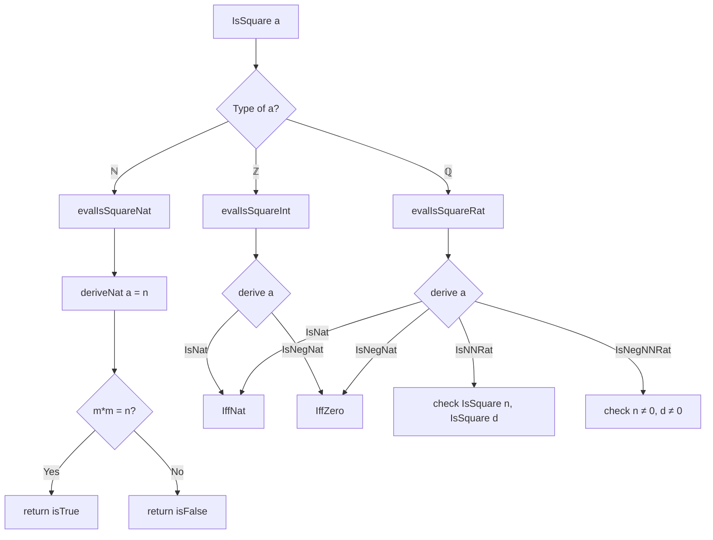

**Technical Brief: `IsSquare.lean` — `norm_num` Extension for `IsSquare`**

---

### 1. **Key Definitions & Theorems**

| Name | Type | Purpose |
|------|------|---------|
| `isSquare_nat_of_isNat` | `∀ a n m : ℕ, IsNat a n → m * m = n → IsSquare a` | Lifts squareness from natural numbers to the abstract `IsSquare` predicate via representation `IsNat`. |
| `not_isSquare_nat_of_isNat` | `∀ a n m k : ℕ, IsNat a n → m * m = k → k < n ≤ k + 2 * m → ¬IsSquare a` | Proves non-squareness by bounding between consecutive squares. |
| `iff_isSquare_int_of_isNat` | `∀ a n, IsNat a n → IsSquare n ↔ IsSquare a` | Equivalence between squareness of a natural and its integer embedding. |
| `iff_isSquare_of_isInt_int` | `∀ a n, IsInt a (.negOfNat n) → (n = 0 ↔ IsSquare a)` | Characterizes squareness of negative integers: only `0` is square. |
| `iff_isSquare_of_isNat_rat` | `∀ a n, IsNat a n → IsSquare n ↔ IsSquare a` | Same as integer case, but for rationals. |
| `iff_isSquare_of_isInt_rat` | `∀ a n, IsInt a (.negOfNat n) → (n = 0 ↔ IsSquare a)` | Negative rationals are square iff numerator is zero. |
| `isSquare_of_isNNRat_rat` | `∀ a n d, IsSquare n → IsSquare d → IsNNRat a n d → IsSquare a` | Positive rational is square iff numerator and denominator are squares. |
| `not_isSquare_of_isNNRat_rat_of_num` | `∀ a n d, ¬IsSquare n → n.Coprime d → IsNNRat a n d → ¬IsSquare a` | If numerator not square and coprime to denominator, rational not square. |
| `not_isSquare_of_isNNRat_rat_of_den` | `∀ a n d, ¬IsSquare d → n.Coprime d → IsNNRat a n d → ¬IsSquare a` | Same as above, but for denominator. |
| `not_isSquare_of_isRat_neg` | `∀ a n d, n ≠ 0 → d ≠ 0 → IsRat a (.negOfNat n) d → ¬IsSquare a` | Negative rationals are never squares. |

---

### 2. **Naming Conventions**

- **Predicate prefixes**: `isSquare_`, `not_isSquare_`, `iff_isSquare_`
- **Representation-based prefixes**:
  - `isNat_`: for `IsNat` representations (natural numbers)
  - `isInt_`, `isNegNat_`: for `IsInt` (integers, negative naturals)
  - `isNNRat_`, `isNegNNRat_`, `isRat_`: for rational representations
- **Suffixes**:
  - `_of_isNat`, `_of_isInt`, `_of_isNNRat_rat_of_num`, etc.: indicate the representation used.
- **Helper naming**:
  - `evalIsSquareNat`, `evalIsSquareInt`, `evalIsSquareRat`: `norm_num` extension functions.

---

### 3. **Tactic Stack**

Frequently used tactics in proofs and extensions:

| Tactic | Usage |
|--------|-------|
| `simp` / `simp only` | Simplifying goals using definitions (`IsSquare`, `IsNat`, `IsInt`, `IsNNRat`, etc.) and arithmetic lemmas. |
| `rw` | Rewriting using equivalences or equalities (e.g., `h.1`, `h.1.trans`, `symm`). |
| `rcases` / `cases` | Decomposing existential or conjunction hypotheses. |
| `subst` | Substituting equal variables. |
| `grind` | Automated solving of arithmetic inequalities (used in `not_isSquare_nat_of_isNat`). |
| `exact`, `refine`, `apply` | Goal-directed proof construction. |
| `deriveBool`, `deriveNat`, `deriveBoolOfIff` | Internal `norm_num` machinery for computing boolean results and lifting to proofs. |
| `assertInstancesCommute` | Ensures correctness of metavariable instantiation in `norm_num` extensions. |
| `contrapose!` | Turning implications into contrapositive form. |
| `calc` | Chain of inequalities (used in `not_isSquare_of_isRat_neg`). |

---

### 4. **Proof Logic**

- **Structure of proofs**:
  - Most proofs follow a *case analysis* on the representation of the input (`IsNat`, `IsInt`, `IsNNRat`, etc.).
  - For positive cases (`IsNat`, `IsNNRat`), squareness reduces to arithmetic on naturals.
  - For negative cases (`IsInt`, `IsNegNNRat`, `IsRat`), squareness is reduced to checking whether the underlying natural is zero.
  - Rational case uses coprimality and prime factorization logic implicitly via `Coprime` and `isSquare_iff`.
- **Core reasoning pattern**:
  - `IsSquare a` is reduced to arithmetic on concrete naturals via representation lemmas.
  - For `ℚ`, squareness is equivalent to numerator and denominator both being squares (after reduction).
  - Non-squareness is proven by bounding or using coprimality + non-squareness of numerator/denominator.

---

### 5. **Imports**

| Import | Purpose |
|--------|---------|
| `Batteries.Data.Nat.Basic` | Basic natural number operations (e.g., `sqrt`, `blt`, `ble`). |
| `Mathlib.Tactic.NormNum.GCD` | Provides `proveNatGCD`, used to compute `gcd n d = 1` for coprimality checks. |
| `Qq`, `Lean`, `NormNumExt` | Meta-level infrastructure for `norm_num` extensions. |

---

### 6. **Mermaid Diagrams**

#### **Dependency Graph (File-Level)**

#### **Theory Overview (Module Scope)**

#### **`norm_num` Extension Flow**

---

### 7. **TODO & Future Work**

- Extend to:
  - `ℚ≥0`, `ℝ≥0`, `ℝ≥0∞`, `ℝ`, `ℂ`, `ZMod n`
  - Likely split into separate files per domain.
- Improve coprimality handling (currently only checks `gcd = 1`).
- Generalize to other fields (e.g., algebraically closed fields).

--- 

**End of Technical Brief**
