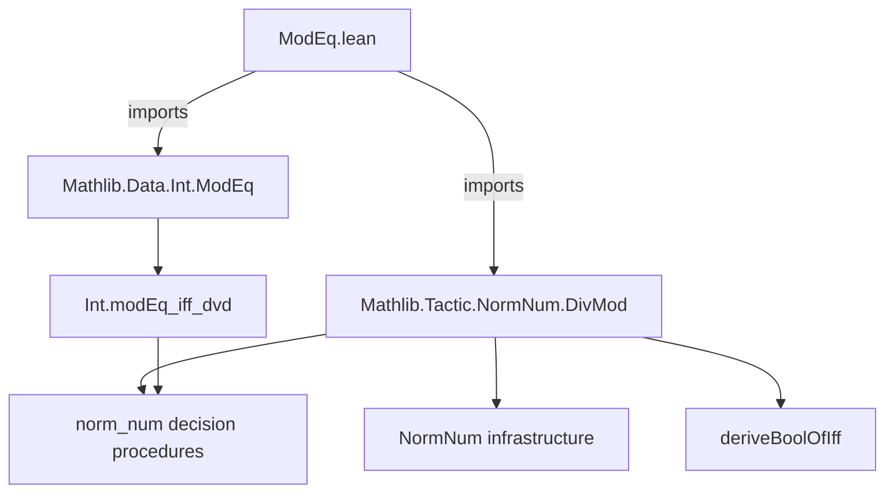
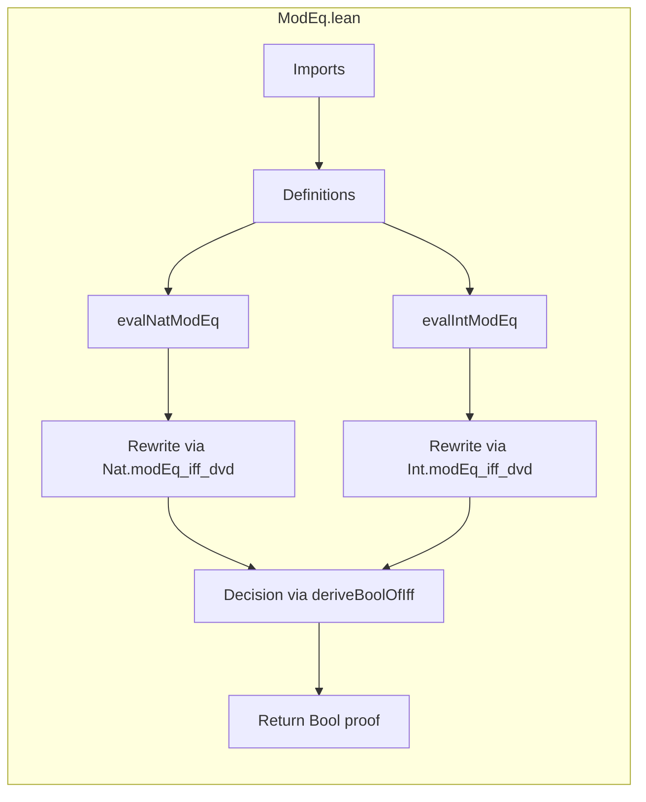

**Technical Brief: `ModEq.lean` (Lean 4 Formalization)**  
*Domain: Automated Reasoning (SMT / `norm_num`) for Modular Arithmetic*

---

### 1. **Key Definitions & Theorems**

| Name | Type | Purpose |
|------|------|---------|
| `evalNatModEq` | `NormNumExt` | `norm_num` extension tactic for `Nat.ModEq`: rewrites `a ≡ b [MOD n]` to `n ∣ (a - b)` and decides it via `deriveBoolOfIff` using `Nat.modEq_iff_dvd.symm`. |
| `evalIntModEq` | `NormNumExt` | `norm_num` extension tactic for `Int.ModEq`: rewrites `a ≡ b [ZMOD n]` to `n ∣ (a - b)` and decides it via `deriveBoolOfIff` using `Int.modEq_iff_dvd.symm`. |
| `Nat.modEq_iff_dvd` | `a ≡ b [MOD n] ↔ n ∣ (a - b)` | Core equivalence used to reduce congruence to divisibility. |
| `Int.modEq_iff_dvd` | `a ≡ b [ZMOD n] ↔ n ∣ (a - b)` | Same as above, but for integers. |

> **Note**: Both tactics only fire when the universe level `u = 0` and the expected type `αP = Prop`, and the goal is syntactically of the form `a ≡ b [MOD n]` or `a ≡ b [ZMOD n]`.

---

### 2. **Naming Conventions**

- **Prefixes**:
  - `eval*`: Standard for `NormNumExt` implementations (e.g., `evalNatModEq`, `evalIntModEq`).
- **Suffixes**:
  - `ModEq`: Denotes modular equivalence (natural or integer).
- **Syntax patterns**:
  - `[MOD _]` for natural numbers (`Nat.ModEq`)
  - `[ZMOD _]` for integers (`Int.ModEq`)

---

### 3. **Tactic Stack**

| Tactic | Role |
|--------|------|
| `match` | Pattern-matching on syntax (`u`, `αP`, `e`) and goal shape. |
| `deriveBoolOfIff` | Converts a propositional equivalence (`↔`) into a boolean decision procedure, returning a `Bool` proof. |
| `q(...)` | Quasi-quotation for constructing syntax trees (e.g., `q($a ≡ $b [MOD $n])`). |
| `failure` | Fallback when pattern doesn’t match. |
| `.ofBoolResult` | Wraps the boolean result into a `NormNumResult`. |

> No `aesop`, `ring`, or `simp_rw` used — relies on `deriveBoolOfIff` + `norm_num` infrastructure.

---

### 4. **Proof Logic**

- **Strategy**: *Reduction + Decision*  
  1. Match goal of the form `a ≡ b [MOD n]` or `a ≡ b [ZMOD n]`.  
  2. Apply `modEq_iff_dvd.symm` to rewrite congruence as divisibility: `n ∣ (a - b)`.  
  3. Use `deriveBoolOfIff` to delegate to `norm_num`’s built-in divisibility decision procedure (`norm_num` already supports `∣`).  
  4. Return the resulting boolean proof as a `NormNumResult`.

- **No induction or case analysis** — purely syntactic + decision-procedure-based.

---

### 5. **Imports**

| Module | Purpose |
|--------|---------|
| `Mathlib.Data.Int.ModEq` | Defines `Int.ModEq`, `Int.modEq_iff_dvd`, etc. |
| `Mathlib.Tactic.NormNum.DivMod` | Provides infrastructure for `norm_num` extensions for division/modulo, including `deriveBoolOfIff`, `NormNumExt`, and `NormNumResult`. |

> **Scope**: Extends `norm_num` to handle modular congruence statements automatically.

---

### 6. **Mermaid Diagrams**

#### **Dependency Graph**

#### **Overview of File Structure**

---

### 7. **Key Insight**

This file exemplifies *lean tactic engineering*:  
- Minimal, focused extension of `norm_num` using *syntactic pattern matching* + *existing decision procedures*.  
- Leverages existing `norm_num` support for divisibility (`∣`) via `modEq_iff_dvd`, avoiding re-implementation.  
- Ensures soundness by relying on proven equivalences (`modEq_iff_dvd`), not ad-hoc computation.

--- 

*End of Technical Brief.*
