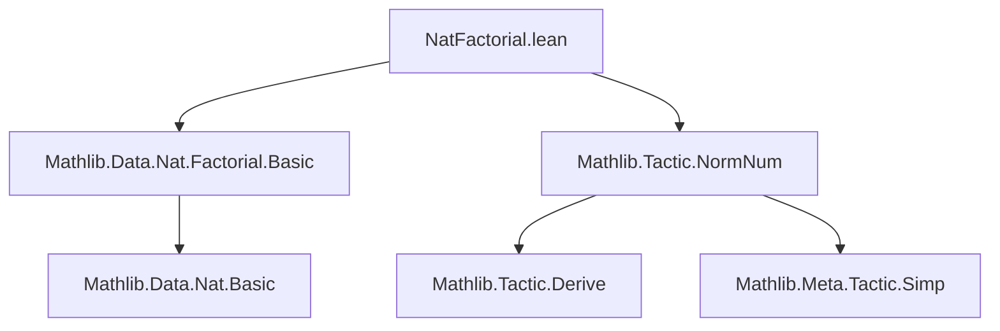

### Technical Brief: `NatFactorial.lean`

---

#### **1. Key Definitions & Theorems**

| Name | Type / Signature | Purpose |
|------|------------------|---------|
| `asc_factorial_aux` | `∀ n l m a b : ℕ, n.ascFactorial l = a → (n + l).ascFactorial m = b → n.ascFactorial (l + m) = a * b` | Core algebraic lemma justifying divide-and-conquer multiplication for `ascFactorial`. |
| `proveAscFactorial` | `ℕ → ℕ → Q(ℕ) → Q(ℕ) → ℕ × Q(ℕ) × Q(... = ...)` | Recursive procedure computing `n.ascFactorial l` and returning value + proof. Uses divide-and-conquer for `l > 50`. |
| `isNat_factorial` | `IsNat n x → (1).ascFactorial x = a → IsNat (n !) a` | Connects `IsNat` representation of `n` to `IsNat` of `n!`, via `1.ascFactorial x = x!`. |
| `evalNatFactorial` | `NormNumExt` | `norm_num` extension to evaluate `n !` by reducing to `1.ascFactorial n`. |
| `isNat_ascFactorial` | `IsNat n x → IsNat l y → x.ascFactorial y = a → IsNat (n.ascFactorial l) a` | Lifts `IsNat`-representations to `ascFactorial` evaluation. |
| `evalNatAscFactorial` | `NormNumExt` | `norm_num` extension for `n.ascFactorial l`. |
| `isNat_descFactorial` | `IsNat n x → IsNat l y → x = z + y → (z + 1).ascFactorial y = a → IsNat (n.descFactorial l) a` | Relates `descFactorial` to `ascFactorial` via shift: $n^{\underline{l}} = (z+1)^{\overline{l}}$ where $n = z + l$. |
| `isNat_descFactorial_zero` | `IsNat n x → IsNat l y → y = z + x + 1 → IsNat (n.descFactorial l) 0` | Handles zero case: if `l > n`, then `n.descFactorial l = 0`. |
| `evalNatDescFactorial` | `NormNumExt` | `norm_num` extension for `n.descFactorial l`, branching on `n ≥ l` or not. |

---

#### **2. Naming Conventions**

- **Prefixes**:
  - `isNat_`: Lemmas connecting `IsNat` (representational correctness) to arithmetic operations.
  - `proveAscFactorial`, `evalNat*`: Computation procedures (`prove*` returns value + proof; `eval*` integrates with `norm_num`).
  - `asc_factorial_`, `ascFactorial`: For ascending factorial $n^{\overline{l}} = n(n+1)\cdots(n+l-1)$.
  - `descFactorial`: For descending factorial $n^{\underline{l}} = n(n-1)\cdots(n-l+1)$.

- **Suffixes**:
  - `_aux`: Auxiliary lemmas (e.g., `asc_factorial_aux`).
  - `_zero`: Special case handling zero result (e.g., `isNat_descFactorial_zero`).
  - `NotZero`/`Zero`: Branching logic in `evalNatDescFactorial`.

---

#### **3. Tactic Stack**

Frequent tactics used in proofs and elaboration:

| Tactic | Usage |
|--------|-------|
| `rw`, `simp`, `simp only` | Rewriting definitions (`ascFactorial_mul_ascFactorial`, `one_ascFactorial`, `add_descFactorial_eq_ascFactorial`). |
| `convert` | Aligning proofs via intermediate equalities (e.g., in `proveAscFactorial`). |
| `symm` | Flipping equality for proof direction. |
| `constructor` | Proving `IsNat` goals (introduction rule). |
| `q(...)` / `q(by ...)` | Quoting Lean expressions and proofs in meta code. |
| `have : ... := ⟨⟩` | Proving trivial `Q(... = ...)` goals using definitional equality. |
| `if ... then ... else ...` | Meta-level branching in `evalNatDescFactorial`. |
| `norm_num` attribute (`@[norm_num ...]`) | Registers extensions for automatic evaluation. |

---

#### **4. Proof Logic**

- **Divide-and-conquer for `ascFactorial`**:
  - Base case: `l ≤ 50` → direct computation.
  - Recursive case: split `l = m + r`, compute `n.ascFactorial m` and `(n+m).ascFactorial r`, combine via `asc_factorial_aux`.

- **`IsNat` reasoning**:
  - All correctness lemmas follow same pattern: `constructor` + `simp [h.out, ← p]`.
  - `IsNat` encodes that a term `x` evaluates to `n` in the model; proofs use definitional equality of `Q(...)` terms.

- **`descFactorial` handling**:
  - If `n ≥ l`: write `n = z + l`, then `n.descFactorial l = (z+1).ascFactorial l`.
  - If `n < l`: result is `0`, via `isNat_descFactorial_zero`.

---

#### **5. Imports**

| Import | Role |
|--------|------|
| `Mathlib.Data.Nat.Factorial.Basic` | Core definitions: `factorial`, `ascFactorial`, `descFactorial`. |
| `Mathlib.Tactic.NormNum` | Infrastructure for `norm_num` extensions (`NormNumExt`, `deriveNat`, `IsNat`, etc.). |
| `Lean`, `Elab.Tactic`, `Meta`, `Qq`, `Mathlib.Meta` | Meta-programming support: quoting, tactic monad, expression manipulation. |

---

#### **6. Mermaid Diagrams**

##### **Dependency Graph (Module Level)**



##### **Overview of Computation Flow**

```mermaid
flowchart LR
  subgraph Input
    I1[n !] I2[n.ascFactorial l] I3[n.descFactorial l]
  end

  subgraph Evaluation
    E1[evalNatFactorial] -->|reduces to| A1[1.ascFactorial n]
    E2[evalNatAscFactorial] -->|direct| A2[n.ascFactorial l]
    E3[evalNatDescFactorial] -->|cases| A3[(n ≥ l)] -->|yes| A4[(z+1).ascFactorial l]
    A3 -->|no| A5[0]
  end

  subgraph Core Logic
    A2 --> P[proveAscFactorial]
    A4 --> P
    P -->|divide & conquer| L[asc_factorial_aux]
  end

  I1 --> E1
  I2 --> E2
  I3 --> E3
```

##### **`proveAscFactorial` Recursion Tree**

```mermaid
tree
  proveAscFactorial n l
    if l ≤ 50 → direct
    else
      m = l / 2
      r = l - m
      ├─ proveAscFactorial n m
      └─ proveAscFactorial (n+m) r
         → combine via asc_factorial_aux
```

---

#### **7. Theory Context**

This module extends Lean’s `norm_num` to *automatically compute* factorial-like expressions at the meta level. It leverages:

- **Divide-and-conquer** to avoid deep recursion and overflow in proof search.
- **`IsNat`** to bridge concrete computation (`ℕ`) and logical representation (`Q(ℕ)`).
- **Algebraic lemmas** (`ascFactorial_mul_ascFactorial`, `add_descFactorial_eq_ascFactorial`) to justify correctness.

It is part of the broader *metaprogramming infrastructure* in Mathlib for efficient numeric simplification, especially important for combinatorial reasoning (e.g., binomial coefficients, permutations).

--- 

✅ **End of Technical Brief**
