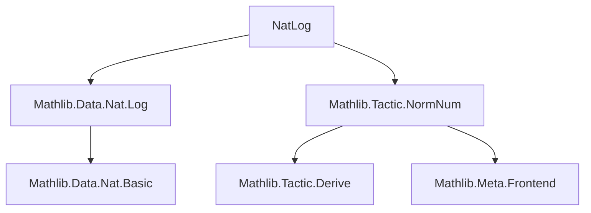

**Technical Brief: `NatLog.lean` Module**

---

### **1. Key Definitions & Theorems**

| Name | Type / Signature | Purpose |
|------|------------------|---------|
| `nat_log_zero` | `∀ n, Nat.log 0 n = 0` | Handles base-0 logarithm (always 0). |
| `nat_log_one` | `∀ n, Nat.log 1 n = 0` | Handles base-1 logarithm (always 0). |
| `nat_log_helper0` | `∀ b n, Nat.blt n b = true → Nat.log b n = 0` | Proves `log_b n = 0` when $n < b$. |
| `nat_log_helper` | `∀ b n k, Nat.ble (b^k) n = true ∧ Nat.blt n (b^(k+1)) = true → Nat.log b n = k` | Core lemma for computing `Nat.log` via bounding powers. |
| `isNat_log` | `IsNat b nb → IsNat n nn → Nat.log nb nn = k → IsNat (Nat.log b n) k` | Lifts equality of `Nat.log` under `IsNat` representations (used for correctness in `norm_num`). |
| `proveNatLog` | `Q(ℕ) → Q(ℕ) → Q(ℕ) × Q(Nat.log eb en = ek)` | Computes `Nat.log eb en` for concrete literals and returns value + proof. |
| `evalNatLog` | `NormNumExt` | `norm_num` extension tactic for `Nat.log`. |
| `nat_clog_zero_left` | `Nat.ble b 1 = true → Nat.clog b n = 0` | Handles bases ≤ 1 (clog = 0). |
| `nat_clog_zero_right` | `Nat.ble n 1 = true → Nat.clog b n = 0` | Handles arguments ≤ 1 (clog = 0). |
| `nat_clog_helper` | `Nat.blt 1 b = true ∧ b^m < n ≤ b^(m+1) → Nat.clog b n = m+1` | Core lemma for `Nat.clog` (ceiling log). |
| `isNat_clog` | Analogous to `isNat_log`, for `Nat.clog`. |
| `proveNatClog` | `Q(ℕ) → Q(ℕ) → Q(ℕ) × Q(Nat.clog eb en = ek)` | Computes `Nat.clog` for literals + proof. |
| `evalNatClog` | `NormNumExt` | `norm_num` extension tactic for `Nat.clog`. |

---

### **2. Naming Conventions**

- **Prefixes**:
  - `nat_log_`, `nat_clog_`: Lemmas specific to `Nat.log` / `Nat.clog`.
  - `isNat_`: Lemmas lifting equalities under `IsNat` (used for correctness in `norm_num`).
- **Suffixes**:
  - `_helper`, `_helper0`: Intermediate lemmas for main computation.
  - `_zero_left`, `_zero_right`: Special cases where base or argument is ≤ 1.
- **Function names**:
  - `proveNatLog`, `proveNatClog`: Compute value + proof for literals.
  - `evalNatLog`, `evalNatClog`: `norm_num` extension definitions.

---

### **3. Tactic Stack**

Frequently used tactics in proofs and metaprogramming:

- `rw` (rewrite with equalities/definitions)
- `simp` / `simp_rw` (simplify using lemmas like `Nat.blt_eq`, `Nat.ble_eq`)
- `lia` (linear integer arithmetic for inequalities)
- `exact`, `reflBoolTrue`, `q(...)`, `mkRawNatLit`, `deriveNat`, `Meta.whnfR` (metaprogramming utilities)
- `match` on `natLit!`, `if ... then ... else ...` (pattern matching on literals)
- `have`, `let` (local proof/definition introduction)

---

### **4. Proof Logic**

- **Structure**:
  - **Case analysis** on base `b` and argument `n` (e.g., `b = 0`, `b = 1`, `n < b`, `n ≤ 1`, etc.).
  - For nontrivial cases, compute `k = Nat.log b n` or `k+1 = Nat.clog b n` using Lean’s built-in `Nat.log`/`Nat.clog`.
  - Use `Nat.blt`/`Nat.ble` to encode comparisons as booleans, then convert to inequalities via `Nat.le_of_ble_eq_true`, `Nat.lt_of_blt_eq_true`.
  - Apply known lemmas (`nat_log_helper`, `nat_clog_helper`) to conclude equality.
- **Metaprogramming flow**:
  - Parse input expressions as `Q(ℕ)` literals.
  - Use `deriveNat` to extract underlying `IsNat` witnesses.
  - Compute result via `proveNatLog`/`proveNatClog`.
  - Wrap result in `IsNat` using `isNat_log`/`isNat_clog`.
  - Return `.isNat` result for `norm_num`.

---

### **5. Imports**

- `Mathlib.Data.Nat.Log`: Core definitions and lemmas for `Nat.log` and `Nat.clog`.
- `Mathlib.Tactic.NormNum`: Infrastructure for `norm_num` extensions (`NormNumExt`, `deriveNat`, `IsNat`, etc.).
- `Qq`, `Lean`, `Elab.Tactic`: Metaprogramming utilities for expression manipulation.

---

### **8. Mermaid Diagrams**

#### **Dependency Graph (Module-Level)**



#### **Overview of `NatLog.lean`**

```mermaid
flowchart LR
  A[Input: Nat.log b n or Nat.clog b n] --> B{Is b,n literals?}
  B -- Yes --> C[Extract b,n as Q(ℕ)]
  C --> D[Case split: b=0/1, n<b, etc.]
  D --> E[Compute k via Nat.log/clog]
  E --> F[Prove equality using helper lemmas]
  F --> G[Wrap in IsNat via isNat_*]
  G --> H[Return .isNat for norm_num]
  B -- No --> I[Fail / delegate]
```

#### **Theory Context**

- **Domain**: Elementary number theory on natural numbers.
- **Purpose**: Enable automatic evaluation of `Nat.log` and `Nat.clog` in `norm_num`.
- **Relation to other theory**:
  - Builds on `Mathlib.Data.Nat.Log`, which defines `Nat.log` (floor log) and `Nat.clog` (ceiling log).
  - Integrates with `norm_num` infrastructure to support *trusted* computation of logarithmic expressions in proofs.
  - Complements `Mathlib.Tactic.NormNum`’s extensibility model.

--- 

**End of Brief**
