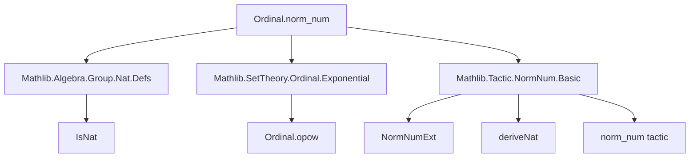
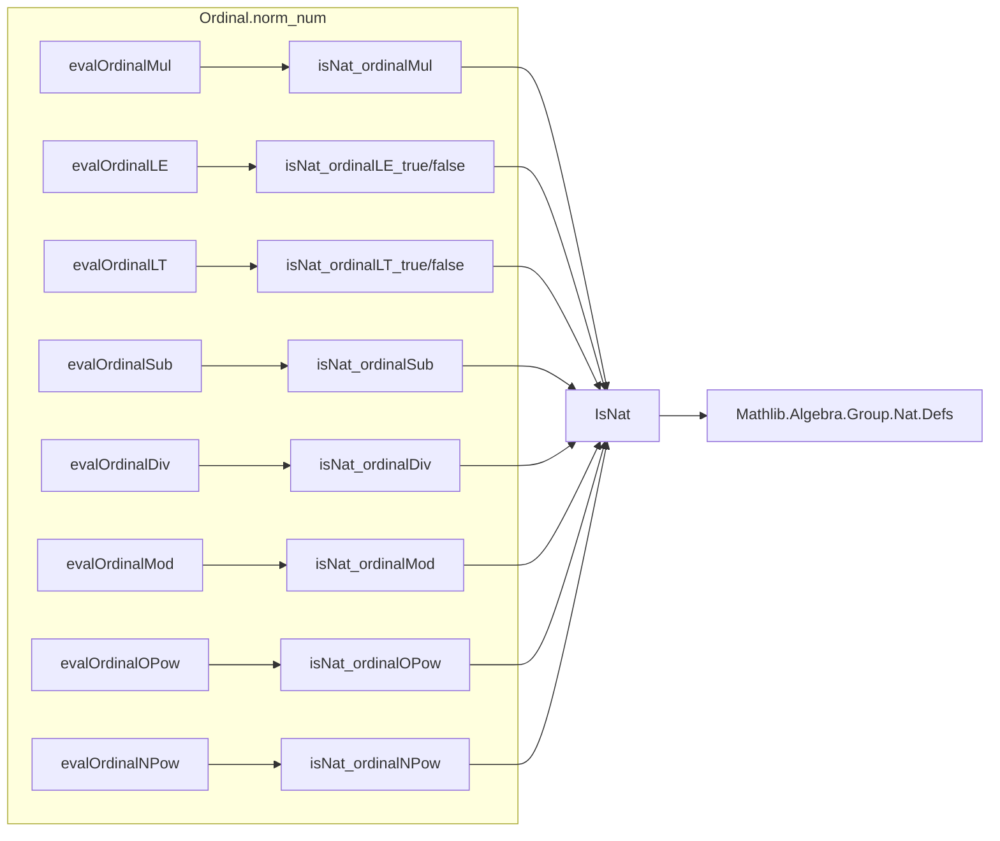

### Technical Brief: `Ordinal.norm_num` Extensions in Lean 4

---

#### **1. Key Definitions & Theorems**

| Name | Type | Purpose |
|------|------|---------|
| `isNat_ordinalMul` | `∀ {a b : Ordinal} {an bn rn : ℕ}, IsNat a an → IsNat b bn → an * bn = rn → IsNat (a * b) rn` | Proves that multiplication of finite ordinals corresponds to natural number multiplication. |
| `isNat_ordinalLE_true` / `isNat_ordinalLE_false` | `IsNat a an → IsNat b bn → decide (an ≤ bn) = b → a ≤ b / ¬a ≤ b` | Links decidability of ≤ on naturals to ≤ on finite ordinals. |
| `isNat_ordinalLT_true` / `isNat_ordinalLT_false` | `IsNat a an → IsNat b bn → decide (an < bn) = b → a < b / ¬a < b` | Same as above for strict inequality. |
| `isNat_ordinalSub` | `IsNat a an → IsNat b bn → an - bn = rn → IsNat (a - b) rn` | Subtraction on finite ordinals matches nat subtraction. |
| `isNat_ordinalDiv` | `IsNat a an → IsNat b bn → an / bn = rn → IsNat (a / b) rn` | Integer division on finite ordinals matches nat division. |
| `isNat_ordinalMod` | `IsNat a an → IsNat b bn → an % bn = rn → IsNat (a % b) rn` | Modulo on finite ordinals matches nat modulo. |
| `isNat_ordinalOPow` | `IsNat a an → IsNat b bn → an ^ bn = rn → IsNat (a ^ b) rn` | Ordinal exponentiation for finite ordinals matches nat exponentiation. |
| `isNat_ordinalNPow` | `IsNat a an → IsNat b bn → an ^ bn = rn → IsNat (a ^ b) rn` | Same as above, but for exponentiation by a *natural number* (not ordinal exponent). |

| Extension | Syntax | Purpose |
|-----------|--------|---------|
| `evalOrdinalMul` | `norm_num` for `*` on `Ordinal` | Computes product of finite ordinals via nat multiplication. |
| `evalOrdinalLE` | `norm_num` for `≤` on `Ordinal` | Decides ≤ between finite ordinals via nat comparison. |
| `evalOrdinalLT` | `norm_num` for `<` on `Ordinal` | Decides < between finite ordinals via nat comparison. |
| `evalOrdinalSub` | `norm_num` for `-` on `Ordinal` | Computes difference of finite ordinals via nat subtraction. |
| `evalOrdinalDiv` | `norm_num` for `/` on `Ordinal` | Computes quotient of finite ordinals via nat division. |
| `evalOrdinalMod` | `norm_num` for `%` on `Ordinal` | Computes remainder of finite ordinals via nat modulo. |
| `evalOrdinalOPow` | `norm_num` for `^` with both args `Ordinal` | Computes ordinal exponentiation for finite ordinals. |
| `evalOrdinalNPow` | `norm_num` for `^` with right arg `ℕ` | Computes natural exponentiation on ordinals. |

---

#### **2. Naming Conventions**

- **Theorems**:
  - Prefix `isNat_ordinal*` → proves that `IsNat (op a b) rn` given `IsNat a an`, `IsNat b bn`, and `an op bn = rn`.
  - Suffix `_true` / `_false` for decision lemmas for `≤`, `<`.
- **Extensions**:
  - Prefix `evalOrdinal*` → `norm_num` extension for `*`, `≤`, `<`, `-`, `/`, `%`, `^`.
  - Suffix `Mul`, `LE`, `LT`, `Sub`, `Div`, `Mod`, `OPow`, `NPow`.

---

#### **3. Tactic Stack**

- `dec` — to extract successor level from universe level.
- `assertLevelDefEqQ u ql(0)` — enforce universe level is `0`.
- `deriveNat` — extracts `⟨n, h⟩` where `h : IsNat a n`.
- `mkRawNatLit` — constructs raw natural literal `Q(ℕ)`.
- `q(...)` — quotes Lean expressions.
- `pure (.isNat ...)` / `.isTrue ...` / `.isFalse ...` — returns normalized result.
- `of_decide_eq_true` / `of_decide_eq_false` — extracts proof from `decide = true/false`.
- `Nat.cast_le.mpr`, `Nat.cast_lt.mpr`, etc. — lift nat comparisons to ordinals.

---

#### **4. Proof Logic**

- **Structure**:
  1. **Universe handling**: Ensure level is `succ u'`, then work in `Ordinal.{u'}`.
  2. **Pattern match** on expression shape (e.g., `a * b`, `a ≤ b`).
  3. **Derive naturals**: Use `deriveNat` to get `an`, `bn` with proofs `pa : IsNat a an`, `pb : IsNat b bn`.
  4. **Compute nat op**: `rn := an op bn`.
  5. **Prove correctness**: Apply corresponding `isNat_ordinal*` lemma.
  6. **Return result**: Wrap in `.isNat`, `.isTrue`, or `.isFalse`.

- **Key logical principle**: For finite ordinals, all arithmetic operations coincide with natural number operations. This is formalized via `IsNat` and used to delegate computation to `norm_num`.

---

#### **5. Imports**

| Import | Role |
|--------|------|
| `Mathlib.Algebra.Group.Nat.Defs` | Provides `IsNat` and basic nat-related infrastructure. |
| `Mathlib.SetTheory.Ordinal.Exponential` | Provides ordinal exponentiation definitions (`opow`). |
| `Mathlib.Tactic.NormNum.Basic` | Provides `NormNumExt`, `deriveNat`, and `norm_num` infrastructure. |

---

#### **6. Mermaid Diagrams**

##### **Dependency Graph**

##### **Overview of File Structure**

---

#### **7. Summary**

This module extends `norm_num` to support arithmetic and order on *finite ordinals* (i.e., natural numbers viewed as ordinals), by:
- Leveraging `IsNat` to connect ordinal expressions to natural numbers.
- Defining custom `NormNumExt` instances for `*`, `≤`, `<`, `-`, `/`, `%`, `^`.
- Proving correctness via lemmas like `isNat_ordinal*`, which show that operations on finite ordinals match nat operations.

It addresses the lack of semiring structure on ordinals (e.g., no right distributivity), which prevents reuse of default `norm_num` extensions.

--- 

Let me know if you'd like a formalized dependency graph in Lean or a proof sketch for `isNat_ordinalOPow`.
