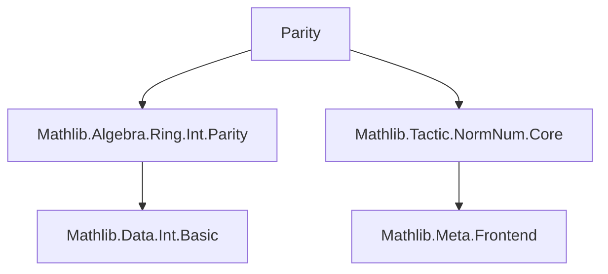
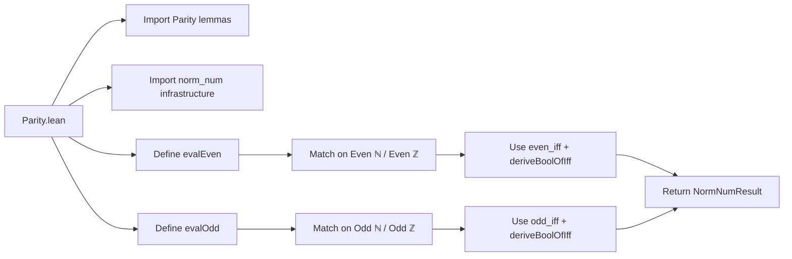
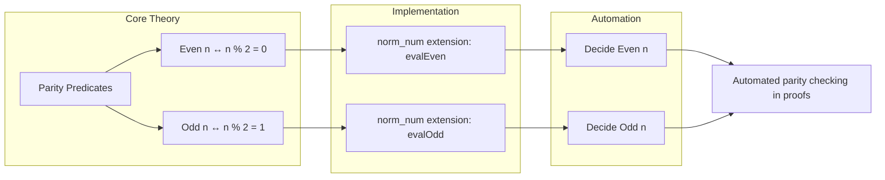

**Technical Brief: `Parity.lean` (Lean 4)**  
*Domain: Formalized Number Theory — Parity Decidability via `norm_num`*

---

### 1. Key Definitions & Theorems

| Name | Type | Purpose |
|------|------|---------|
| `evalEven` | `NormNumExt` | Implements a `norm_num` extension to decide `Even n` for `n : ℕ` or `n : ℤ` by reducing to `n % 2 = 0`. |
| `evalOdd` | `NormNumExt` | Implements a `norm_num` extension to decide `Odd n` for `n : ℕ` or `n : ℤ` by reducing to `n % 2 = 1`. |
| `Nat.even_iff` | `Even n ↔ n % 2 = 0` | Characterization of even natural numbers (from `Mathlib.Algebra.Ring.Int.Parity`). |
| `Int.even_iff` | `Even n ↔ n % 2 = 0` | Characterization of even integers. |
| `Nat.odd_iff` | `Odd n ↔ n % 2 = 1` | Characterization of odd natural numbers. |
| `Int.odd_iff` | `Odd n ↔ n % 2 = 1` | Characterization of odd integers. |

> *Note:* The `Odd` predicate is defined as `Odd n := Even (n + 1)` in standard libraries, but here the `odd_iff` lemmas directly relate to `n % 2 = 1`.

---

### 2. Naming Conventions

- **Prefixes**: `eval` for `NormNumExt` implementations (`evalEven`, `evalOdd`).
- **Suffixes**: None beyond standard Lean naming (`even`, `odd`, `iff`).
- **Pattern**: `eval[Predicate]` for `norm_num` extensions; predicate names match Lean’s standard `Even`/`Odd` predicates.

---

### 3. Tactic Stack

| Tactic | Usage |
|--------|-------|
| `assertInstancesCommute` | Ensures typeclass instances (e.g., `Decidable`) commute with reduction — critical for correctness of `norm_num` extensions. |
| `deriveBoolOfIff` | Core helper: converts a boolean decision procedure (`a % 2 = 0` or `a % 2 = 1`) into a propositional proof via an `iff` lemma. |
| `q(...)` / `~q(...)` | Quasi-quoting syntax for constructing and matching Lean expressions at the meta level. |
| `return .ofBoolResult r` | Wraps the boolean result into a `NormNumResult`, signaling successful normalization. |

---

### 4. Proof Logic / Execution Flow

1. **Pattern match** on the input expression `u` (the term being normalized), `αP` (the target type), and `e` (the expression structure).
2. For `Even`/`Odd` over `ℕ` or `ℤ`, extract the argument `a`.
3. **Assert instance compatibility** (`assertInstancesCommute`) to ensure decidability and consistency.
4. Use `deriveBoolOfIff` to:
   - Compute `a % 2 =? 0` or `a % 2 =? 1` (via `norm_num`’s internal arithmetic normalization),
   - Prove equivalence to `Even a` or `Odd a` using `even_iff`/`odd_iff`,
   - Return a `NormNumResult` with the boolean witness.
5. Fail for unsupported cases.

> *Key insight:* The logic is *purely computational* — no induction or case analysis on `a` is needed; it leverages `norm_num`’s arithmetic normalization and the `iff` lemmas to bridge syntax and semantics.

---

### 5. Imports & Dependencies

| Import | Role |
|--------|------|
| `Mathlib.Algebra.Ring.Int.Parity` | Provides `Even`/`Odd` definitions and `even_iff`/`odd_iff` lemmas for `ℕ` and `ℤ`. |
| `Mathlib.Tactic.NormNum.Core` | Core infrastructure for `norm_num` extensions (`NormNumExt`, `deriveBoolOfIff`, etc.). |

> *Note:* The `shake: keep (Qq dependency)` comment indicates `Qq` (quasi-quoting) is required at runtime — likely for extensibility or future metaprogramming.

---

### 6. Mermaid Diagrams

#### Dependency Graph (Module-Level)

#### Overview of `Parity.lean` Structure

#### Theoretical Context

---

### Summary

This file extends Lean’s `norm_num` tactic with *decision procedures* for parity (`Even`, `Odd`) over `ℕ` and `ℤ`. It leverages existing algebraic lemmas (`even_iff`, `odd_iff`) and meta-programming to reduce parity queries to modular arithmetic normalization. The design is minimal, efficient, and follows Lean’s `norm_num` extension pattern precisely — a canonical example of *computational reflection* in Lean 4.
