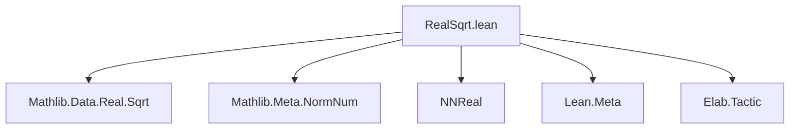
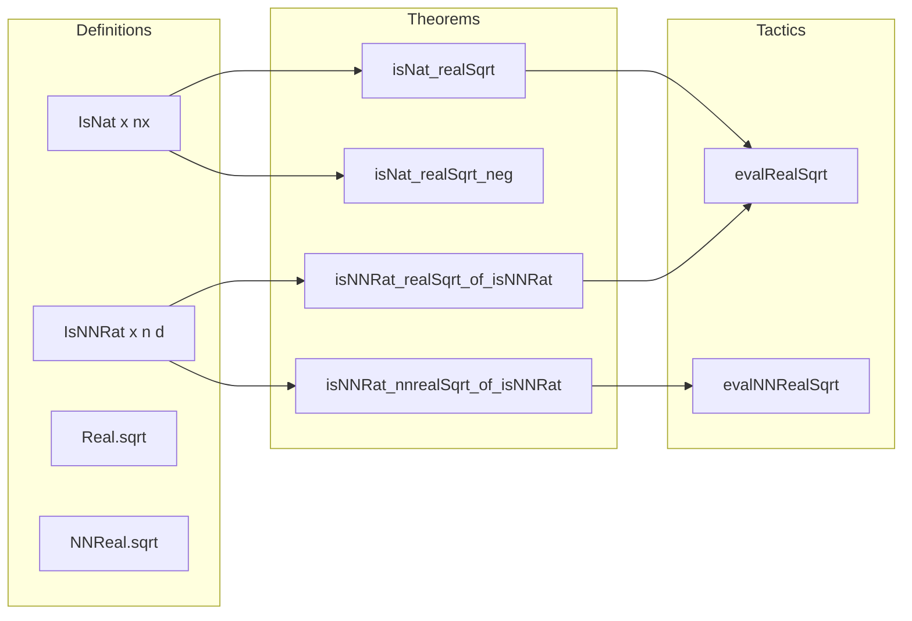
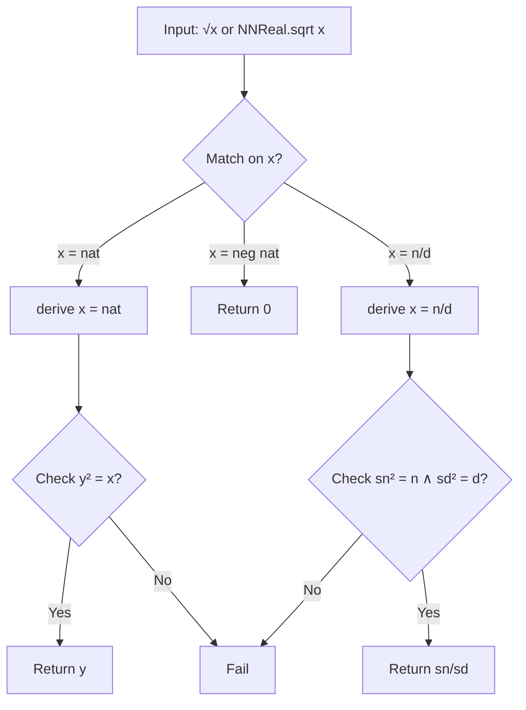

### Technical Brief: `RealSqrt.lean`

---

#### **1. Key Definitions & Theorems**

| Name | Type | Purpose |
|------|------|---------|
| `isNat_realSqrt` | `∀ {x : ℝ} {nx ny : ℕ}, IsNat x nx → ny * ny = nx → IsNat √x ny` | Shows that if $x$ is a natural number $n_x$ and $n_y^2 = n_x$, then $\sqrt{x}$ is the natural number $n_y$. |
| `isNat_nnrealSqrt` | `∀ {x : ℝ≥0} {nx ny : ℕ}, IsNat x nx → ny * ny = nx → IsNat (NNReal.sqrt x) ny` | Analogous to above, but for `NNReal.sqrt`. |
| `isNNRat_nnrealSqrt_of_isNNRat` | `∀ {x : ℝ≥0} {n sn d sd : ℕ}, sn² = n → sd² = d → IsNNRat x n d → IsNNRat (NNReal.sqrt x) sn sd` | Shows that square root of a nonnegative rational (represented as `n/d`) is `sn/sd` when both numerator and denominator are perfect squares. |
| `isNat_realSqrt_neg` | `∀ {x : ℝ} {nx : ℕ}, IsInt x (-nx) → IsNat √x 0` | Handles negative reals: $\sqrt{x} = 0$ when $x < 0$. |
| `isNat_realSqrt_of_isRat_negOfNat` | `∀ {x : ℝ} {num denom : ℕ}, IsRat x (-num)/denom → IsNat √x 0` | Handles negative rational inputs to `Real.sqrt`. |
| `isNNRat_realSqrt_of_isNNRat` | `∀ {x : ℝ} {n sn d sd : ℕ}, sn² = n → sd² = d → IsNNRat x n d → IsNNRat √x sn sd` | Same as `isNNRat_nnrealSqrt_of_isNNRat`, but for `Real.sqrt` on real numbers. |
| `evalRealSqrt` | `NormNumExt` | `norm_num` extension tactic to evaluate `Real.sqrt` on concrete numeric expressions. |
| `evalNNRealSqrt` | `NormNumExt` | `norm_num` extension tactic to evaluate `NNReal.sqrt`. |

---

#### **2. Naming Conventions**

- **Prefixes**:
  - `isNat_...`: Proves that a square root is a natural number (i.e., integer square root).
  - `isNNRat_...`: Proves that a square root is a nonnegative rational.
  - `eval...`: Tactics implementing `norm_num` extensions.
- **Suffixes**:
  - `_neg`: For cases where input is negative (→ result is 0).
  - `_of_isRat_negOfNat`, `_of_isNNRat`: For rational/NNRat inputs.
  - `_nnreal`: For `NNReal.sqrt` variants.

---

#### **3. Tactic Stack**

Frequently used tactics in proofs and tactic definitions:

- `simp [*, ← ...]`: Simplification with rewriting of square identities.
- `obtain ⟨_, rfl⟩ := h`: Destructure existential/eqv classes.
- `refine ⟨?_, ?out⟩`: Construct pair values for `IsNNRat`.
- `apply invertibleOfNonzero`: Prove invertibility of nonzero rationals.
- `rw [← mul_self_ne_zero, ← Nat.cast_mul, hd]`: Rewriting using algebraic identities.
- `exact Invertible.ne_zero _`: Use invertibility to get nonzero.
- `unless ... do failure`: Guard in tactic monad for correctness checks.
- `mkRawNatLit`, `q(...)`: Quoting/constructing syntax for Lean’s metaprogramming.
- `assumeInstancesCommute`: Ensures compatibility with type class instances.

---

#### **4. Proof Logic**

- **Structure**: Most proofs follow a pattern:
  1. Extract representation of input (e.g., `IsNat x nx`, `IsNNRat x n d`).
  2. Use algebraic facts: if $n = s_n^2$, $d = s_d^2$, then $\sqrt{n/d} = s_n/s_d$.
  3. Prove denominator nonzero (via `invertibleOfNonzero`).
  4. Simplify using `Real.sqrt_mul` or `NNReal.sqrt_mul`.
- **Case analysis**:
  - Positive/natural inputs → square root is natural.
  - Negative inputs → square root is 0.
  - Rational/NNRat inputs → square root is rational/NNRat if numerator and denominator are perfect squares.

---

#### **5. Imports**

- `Mathlib.Data.Real.Sqrt`: Core definitions of `Real.sqrt`.
- `Mathlib.Meta.NormNum`: Infrastructure for `norm_num` extensions.
- `NNReal`: Nonnegative reals.
- `Lean`, `Lean.Meta`, `Elab.Tactic`, `Qq`, `Q(ℕ)`, etc.: Metaprogramming infrastructure.

---

#### **8. Mermaid Diagrams**

##### **Dependency Graph (Module Level)**

##### **Overview of Theoretical Flow**

##### **Tactic Evaluation Flow**

---

This module provides a *complete* `norm_num`-based decision procedure for evaluating square roots of concrete rational and natural numbers (and their nonnegative real embeddings), with correctness proofs for all cases.
