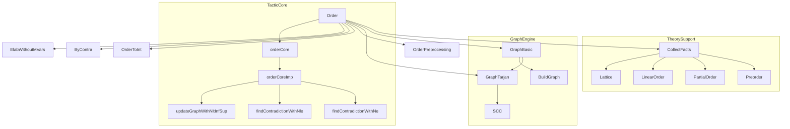
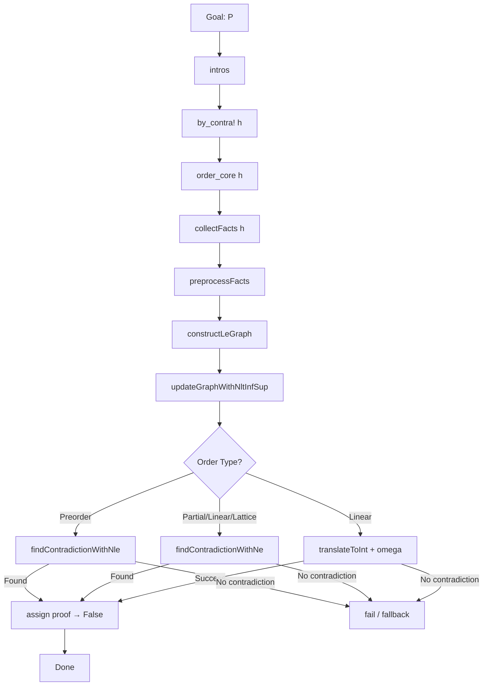

### Technical Brief: `Order.lean` — Decision Procedure for Ordered Structures in Lean 4

---

#### **1. Key Definitions & Theorems**

| Name | Type / Signature | Purpose |
|------|------------------|---------|
| `findContradictionWithNe` | `Graph → Array AtomicFact → AtomM (Option Expr)` | Finds a contradiction from a `≠`-fact where `lhs` and `rhs` lie in the same SCC of the `≤`-graph, using `le_antisymm`. |
| `findContradictionWithNle` | `Graph → Array AtomicFact → AtomM (Option Expr)` | Finds a contradiction from a `¬(x ≤ y)`-fact when `y` is reachable from `x` in the `≤`-graph. |
| `updateGraphWithNltInfSup` | `Graph → Array AtomicFact → AtomM Graph` | Expands the `≤`-graph using:  • `¬(x < y)` ⇒ add `(y, x)` if `x ≤* y`  • `sup`/`inf` facts ⇒ add edges via `sup_le` / `le_inf`. |
| `orderCoreImp` | `Bool → Array Expr → Expr → MVarId → AtomM Unit` | Core implementation: collects facts, preprocesses, builds/expands `≤`-graph, searches for contradictions. |
| `orderCore` | `Bool → Array Expr → Expr → MVarId → MetaM Unit` | Wrapper of `orderCoreImp` in `MetaM`. |
| `order` macro | `tactic` | High-level tactic: negates goal, applies `order_core`. |
| `order_core` syntax | `tactic` | Entry point: runs `orderCore` on collected facts and negated goal. |

---

#### **2. Naming Conventions**

- **Prefixes**:
  - `findContradictionWith*`: Functions that search for contradictions using specific fact types (`ne`, `nle`, `nlt`).
  - `updateGraphWith*`: Functions that augment the `≤`-graph using structural or logical facts.
  - `preprocessFacts`: Normalizes facts per theory (e.g., `Preorder`, `PartialOrder`).
  - `collectFacts`, `replaceBotTop`, `translateToInt`: Preprocessing helpers.

- **Suffixes**:
  - `Graph`: Refers to the `≤`-graph data structure.
  - `SCC`: Strongly Connected Components (used in `findSCCs`, `findContradictionWithNe`).
  - `Inf`/`Sup`: Lattice operations (`isInf`, `isSup` facts).
  - `Nlt`, `Nle`, `Ne`: Negated relational facts.

- **AtomicFact variants**:
  - `.eq`, `.ne`, `.le`, `.nle`, `.lt`, `.nlt`, `.isInf`, `.isSup`: Pattern-matched constructors.

---

#### **3. Tactic Stack**

| Tactic / Utility | Frequency / Role |
|------------------|------------------|
| `by_contra!` | Used in `order` macro to negate goal. |
| `intros` | Intro step before negation. |
| `collectFacts` | Core preprocessing (via `Mathlib.Tactic.Order.CollectFacts`). |
| `preprocessFacts` | Theory-specific rewriting (e.g., `x < y ↦ x ≤ y ∧ x ≠ y`). |
| `Graph.constructLeGraph` | Builds initial `≤`-graph from `≤`-facts. |
| `updateGraphWithNltInfSup` | Iteratively adds edges using `¬(x < y)` and lattice ops. |
| `findSCCs` / `buildTransitiveLeProof` | SCC detection and path proofs (via `Mathlib.Tactic.Order.Graph.Tarjan`). |
| `mkAppM` / `mkApp` | Construct proofs (e.g., `le_antisymm`, `sup_le`). |
| `Omega.omega` | Fallback for linear orders (when `order` fails). |
| `trace[order]` | Diagnostic tracing (via `registerTraceClass`). |

---

#### **4. Proof Logic Flow**

The `order` tactic follows a **refutation-based decision procedure**:

1. **Negate goal** → goal becomes `False`.
2. **Collect atomic facts** from hypotheses and goal.
3. **Preprocess facts** per order type:
   - `Preorder`: expand `<`, `=`, drop `≠`.
   - `PartialOrder`: expand `<`, `=`, split `¬(≤)`.
   - `LinearOrder`: expand `<`, `=`, `¬(≤)`, `¬(<)`.
   - `Lattice`: add lattice inequalities (`x ≤ x ⊔ y`, etc.).
4. **Build `≤`-graph** from `≤`-facts.
5. **Expand graph**:
   - Add `(y, x)` for `¬(x < y)` if `x ≤* y`.
   - Add edges for `⊔`, `⊓` using lattice lemmas.
6. **Search for contradiction**:
   - For `Preorder`: `¬(x ≤ y)` + `x ≤* y`.
   - For `PartialOrder`/`LinearOrder`: `x ≠ y` + `x` and `y` in same SCC.
7. **Fallback**: For linear orders, call `omega` on translated integer facts.

**Correctness** relies on:
- Soundness of preprocessing (equisatisfiability).
- Graph-based model construction (SCCs for partial orders, components for preorders).
- Lattice properties (`sup_le`, `le_inf`) ensuring closure under joins/meets.

---

#### **5. Imports**

| Module | Purpose |
|--------|---------|
| `Mathlib.Tactic.Order.CollectFacts` | Fact collection and normalization. |
| `Mathlib.Tactic.Order.Graph.Basic` | Graph data structure and basic operations. |
| `Mathlib.Tactic.Order.Graph.Tarjan` | SCC computation (Tarjan’s algorithm). |
| `Mathlib.Tactic.Order.Preprocessing` | Theory-specific preprocessing. |
| `Mathlib.Tactic.Order.ToInt` | Translation to `ℤ` for linear orders (fallback to `omega`). |
| `Mathlib.Tactic.ByContra` | `by_contra!` tactic. |
| `Mathlib.Util.ElabWithoutMVars` | Term elaboration without introducing new metavariables. |

---

#### **6. Mermaid Diagrams**

##### **Dependency Graph (Module-Level)**

##### **Overview of `order` Tactic Workflow**

---

#### **7. Notes on Completeness & Limitations**

- **Preorder**: Not fully decidable (cannot handle `=`/`≠` chains alone), but complete modulo `cc`.
- **Partial/Linear Order**: Fully decidable via SCC-based model construction.
- **Lattice**: Decidable due to closure under `⊔`, `⊓` during graph expansion.
- **`⊤`, `⊥`**: Handled by adding universal edges `(x, ⊤)`, `(⊥, x)`.

---

#### **8. Key Theoretical Insights**

- **Model construction**:
  - Preorders → quotient by `=`-components, ordered by reachability.
  - Partial orders → SCCs of `≤`-graph, ordered by reachability.
  - Linear orders → topological sort of SCCs.
- **Soundness** relies on:
  - Equivalence of original and preprocessed facts.
  - Graph expansion preserving satisfiability.
  - SCC-based antisymmetry for partial orders.

--- 

This module implements a **robust, theory-aware decision procedure** for ordered algebraic structures, integrating graph algorithms, proof construction, and fallback automation (`omega`).
