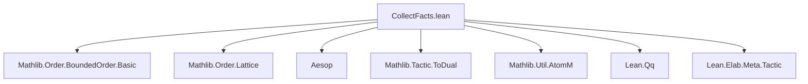
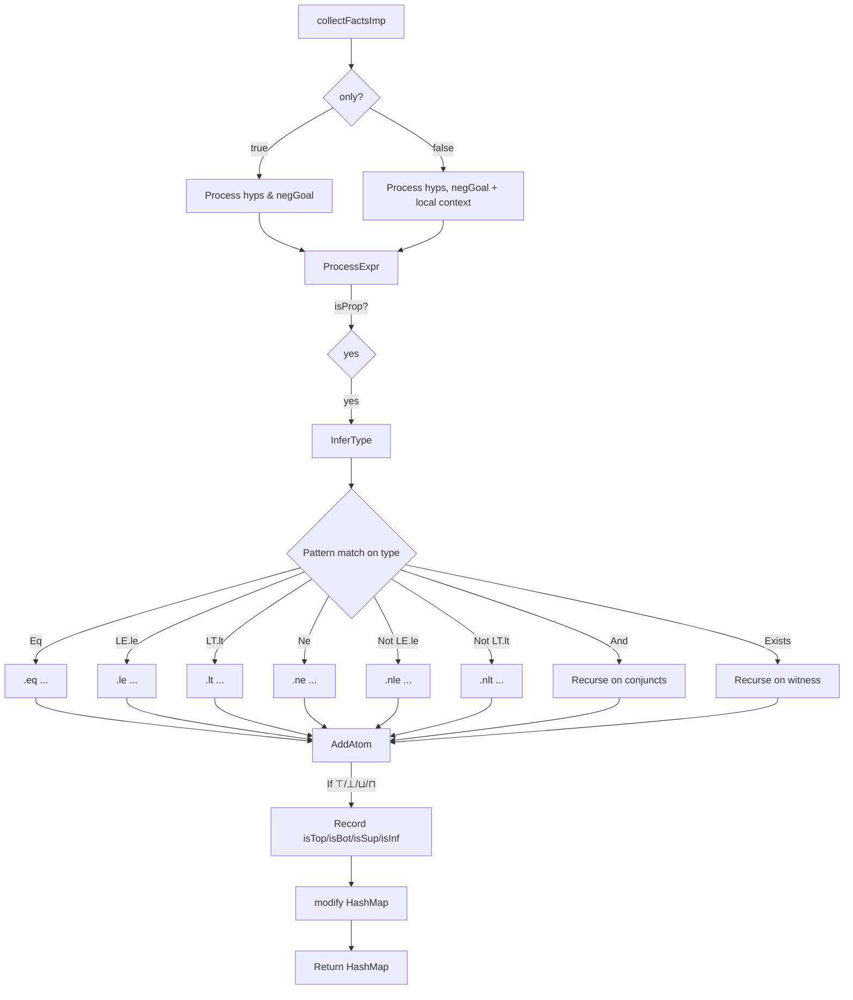

### Technical Brief: `CollectFacts.lean`

---

#### **1. Key Definitions & Theorems**

| Name | Type / Signature | Purpose |
|------|------------------|---------|
| `AtomicFact` | `inductive` | Represents atomic relational facts about terms: equality (`eq`), inequality (`ne`, `nle`, `nlt`), order (`le`, `lt`), top/bottom elements (`isTop`, `isBot`), and lattice operations (`isInf`, `isSup`). Each stores indices and a proof term. |
| `CollectFactsState` | `abbrev` = `Std.HashMap Expr (Array AtomicFact)` | State type mapping each type `α` to an array of atomic facts about terms of that type. |
| `CollectFactsM` | `abbrev` = `StateT CollectFactsState AtomM` | Monad stack for fact collection: maintains state (`CollectFactsState`) and uses `AtomM` for fresh variable generation. |
| `addType` | `def` | Registers a type in the state (up to definitional equality), avoiding duplicates. Returns a canonical representative. |
| `addFact` | `def` | Appends an `AtomicFact` to the array associated with a registered type. |
| `addAtom` | `partial def` | Registers a term as an atom (assigns index), and if it's `⊤`, `⊥`, `⊔`, or `⊓`, records the corresponding structural fact recursively. |
| `collectFactsImp` | `partial def` | Core implementation: traverses hypotheses and goal, extracts atomic facts via pattern matching on types (e.g., `Eq`, `LE.le`, `LT.lt`, `Ne`, `Not`, `And`, `Exists`). |
| `collectFacts` | `def` | Public interface: runs `collectFactsImp` in `AtomM`, returning a map of types to atomic facts. |

> **Note**: No theorems are proven here—this is a *tactic infrastructure* module for *fact extraction*, not a source of mathematical theorems.

---

#### **2. Naming Conventions**

- **Prefixes**:
  - `isTop`, `isBot`, `isInf`, `isSup`: indicate structural properties (top, bottom, infimum, supremum).
  - `nle`, `nlt`, `ne`: negated relations (`¬ ≤`, `¬ <`, `≠`).
  - `add*`: functions that *add* entries to the state (`addType`, `addFact`, `addAtom`).
- **Suffixes**:
  - `Imp`: internal implementation (`collectFactsImp`).
  - No suffix for public wrappers (`collectFacts`).
- **Pattern-matching syntax**:
  - Uses `~q(...)` for quasiquoted patterns (e.g., `~q(@LE.le ...)`).
  - Uses `q(...)` for quoting expressions (e.g., `q(And.left $expr)`).

---

#### **3. Tactic Stack**

- **Core tactics used**:
  - `aesop`: imported for general automation (though not directly used *in this file*).
  - `simp`, `ring`, `linarith`, etc.: *not used* here—this is a low-level extraction utility.
- **Key monadic operations**:
  - `do`-notation with `←`, `let`, `match`.
  - `modify`, `get`, `put`, `pure`.
  - `synthInstance?`: typeclass inference for `Preorder`.
  - `isProp`: checks if a type is a proposition.
  - `inferType`, `inferTypeQ`: type inference.
  - `AtomM.containsThenAddQ`: manages atom indexing.

---

#### **4. Proof Logic / Logical Flow**

This file does **not** prove theorems—it *collects facts* for use by the `order` tactic. The logical flow is:

1. **Input**: hypotheses (`hyps`), negated goal (`negGoal`), and flag `only?`.
2. **Type registration**:
   - For each expression, infer its type.
   - If it’s a proposition, register its type via `addType`.
3. **Atom registration**:
   - Terms (e.g., `x`, `y`, `x ⊔ y`) are registered as atoms via `addAtom`.
   - Structural terms (`⊤`, `⊥`, `⊔`, `⊓`) trigger recording of `isTop`, `isBot`, `isSup`, `isInf`.
4. **Fact extraction**:
   - Pattern-match on the *type* of the expression (e.g., `@Eq`, `@LE.le`, `Not (@LE.le ...)`, `And`, `Exists`).
   - For relational propositions, record the corresponding `AtomicFact`.
5. **Output**: A map `Expr → Array AtomicFact`, where each key is a type, and values are facts about terms of that type.

> **Example**: From `h : x ≤ y`, it extracts `.le xIdx yIdx h`.

---

#### **5. Imports**

| Import | Purpose |
|--------|---------|
| `Mathlib.Order.BoundedOrder.Basic` | Provides `Top`, `Bot`, bounded order structures. |
| `Mathlib.Order.Lattice` | Provides `SemilatticeSup`, `SemilatticeInf`, `⊔`, `⊓`. |
| `Aesop` | General automation (imported but not directly used here). |
| `Mathlib.Tactic.ToDual` | For duality tactics (likely for future use). |
| `Mathlib.Util.AtomM` | Provides `AtomM` for generating fresh atom indices. |
| `Qq`, `Lean.*`, `Elab.*`, `Meta.*`, `Tactic.*` | Lean metaprogramming infrastructure. |

> **Shake comments** (`-- shake: keep`) indicate dependencies required by the build system.

---

#### **6. Mermaid Diagrams**

##### **Dependency Graph (Module-Level)**



##### **Data Flow (Fact Collection)**

```mermaid
flowchart LR
  Input[Hypotheses & Goal] --> ProcessExpr
  ProcessExpr -->|Type = Eq/LE/LT/Ne/Not/And| Extract[Extract AtomicFact]
  ProcessExpr -->|Term = ⊤/⊥/⊔/⊓| AddAtom[addAtom]
  AddAtom -->|Recurses| AddAtom
  Extract -->|Stores| State[CollectFactsState: Expr → Array AtomicFact]
  State --> Output[HashMap Expr (Array AtomicFact)]
```

##### **Overview of `CollectFactsM` Flow**



---

#### **7. Summary**

- **Purpose**: Low-level fact extraction for the `order` tactic—*not* a theory file.
- **Core idea**: Treat terms as *atoms*, track relations and lattice structure via indices.
- **Design pattern**: Stateful monadic traversal with quasiquoting and typeclass inference.
- **Role in larger system**: Enables the `order` tactic to reason about preorders/lattices by aggregating relational facts.

This file is foundational for automated order/lattice reasoning in Lean’s `mathlib`.
