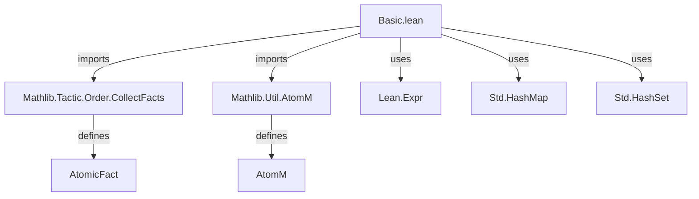
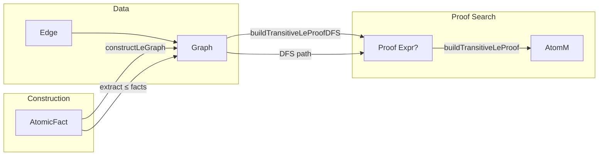

**Technical Brief: `Basic.lean` — Graphs for the `order` Tactic**

---

### 1. **Key Definitions & Theorems**

| Name | Type / Signature | Purpose |
|------|------------------|---------|
| `Edge` | `structure` with fields `src : Nat`, `dst : Nat`, `proof : Expr` | Represents a directed edge in a ≤-graph, storing indices of source/destination atoms and a proof term of the form `atoms[src] ≤ atoms[dst]`. |
| `Graph` | `abbrev Graph := Std.HashMap Nat (Array Edge)` | A directed graph where vertices are natural numbers (atom indices), and adjacency lists store outgoing edges. |
| `addEdge` | `Graph → Edge → Graph` | Adds an edge to the graph, updating the adjacency list for its source vertex. |
| `constructLeGraph` | `Array AtomicFact → MetaM Graph` | Builds a ≤-graph from an array of atomic facts, extracting only `≤`-facts and ignoring others. |
| `DFSState` | `structure` with field `visited : Std.HashSet Nat` | Encapsulates the state of a depth-first search (DFS), tracking visited vertices. |
| `buildTransitiveLeProofDFS` | `Graph → Nat → Nat → Expr → StateT DFSState MetaM (Option Expr)` | DFS traversal to construct a transitivity chain proving `atoms[s] ≤ atoms[t]`, if such a path exists. |
| `buildTransitiveLeProof` | `Graph → Nat → Nat → AtomM (Option Expr)` | Public wrapper: uses DFS to find and construct a proof of `s ≤ t` via transitivity in the ≤-graph. |

> **Note**: No named theorems are proven here; this is a *tactic infrastructure* module.

---

### 2. **Naming Conventions**

- **Prefixes**:
  - `build*`: Functions that construct proofs or data structures (e.g., `buildTransitiveLeProof`).
  - `is_`, `has_`, `mem_`, etc., are *not* used here — this is a low-level implementation module.
- **Suffixes**:
  - `DFS`: Indicates depth-first search variant (`buildTransitiveLeProofDFS`).
  - `Graph`: Namespace `Graph` groups graph-specific operations.
- **Structure naming**:
  - `Edge`, `DFSState`: Concrete data structures.
  - `Graph`: Abbreviation for a standard map type.

---

### 3. **Tactic Stack**

Frequent tactics & combinators used in this file:

| Tactic / Combinator | Role |
|---------------------|------|
| `do` / `←` / `match` | Monadic binding and pattern matching in `MetaM`/`AtomM`. |
| `modify` | Updates DFS state (`visited` set). |
| `mkAppM` | Constructs application terms (e.g., `le_refl`, `le_trans`). |
| `get` / `← get` | Retrieves the current `AtomM` context (e.g., `atoms` array). |
| `run'` | Executes a `StateT` computation and extracts result. |
| `if let` / `if !` | Pattern-matching guards and negated checks. |
| `continue` | Skips to next edge in DFS loop. |

No high-level tactics like `simp`, `ring`, or `linarith` appear — this is purely *metaprogramming infrastructure*.

---

### 4. **Proof Logic**

The proof construction follows a **standard transitivity search** pattern:

1. **Input**: A ≤-graph `g`, source vertex `s`, target vertex `t`.
2. **DFS traversal**:
   - Mark current vertex `v` as visited.
   - If `v == t`, return `le_refl tExpr`.
   - For each outgoing edge `v → u`:
     - If `u` unvisited, recursively search for `u → t`.
     - If successful, compose proof: `le_trans (v ≤ u) (u ≤ t)`.
3. **Failure handling**: Returns `none` if no path exists.

This mirrors the classic *path-finding → proof synthesis* strategy used in automated order provers (e.g., `linarith`, `omega`, but specialized for ≤-graphs).

---

### 5. **Imports**

| Import | Purpose |
|--------|---------|
| `Mathlib.Tactic.Order.CollectFacts` | Provides `AtomicFact` type and utilities for collecting order facts. |
| `Mathlib.Util.AtomM` | Defines the `AtomM` monad — a reader monad over atom context (e.g., `atoms : Array Expr`). |
| `Lean.Expr`, `Meta` | Core Lean metaprogramming utilities (e.g., `Expr`, `mkAppM`). |
| `Std.HashMap`, `Std.HashSet` | Efficient hash-based collections (from `Std` library). |

---

### 6. **Mermaid Diagrams**

#### **Dependency Graph (Module-Level)**



#### **Overview of `Basic.lean` Module**



#### **Data Flow in `buildTransitiveLeProof`**

```mermaid
flowchart TD
  S[Input: s, t] --> G[Graph g]
  G -->|DFS from s| V[Visited set]
  V -->|if s = t| R[le_refl]
  V -->|edge s→u| U[Recursively search u→t]
  U -->|pf found| T[le_trans (s≤u) (u≤t)]
  U -->|no path| N[none]
  R -->|return| P[Some proof]
  T --> P
  N -->|return| P
```

---

### Summary

This module provides the **core graph representation and transitivity search engine** for the `order` tactic. It is *purely metaprogramming infrastructure*, with no user-facing lemmas, but enables automated reasoning about ordered structures via ≤-graph traversal. The design is minimal, functional, and optimized for correctness in proof construction.
