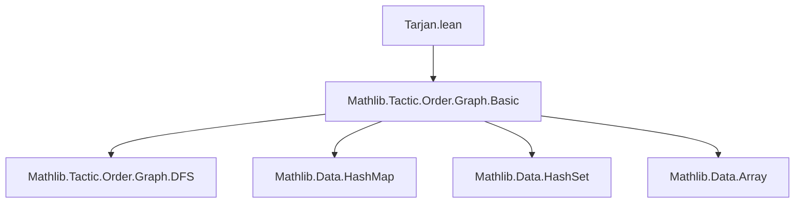

**Technical Brief: Tarjan’s Algorithm Implementation in Lean 4 (`Tarjan.lean`)**

---

### 1. **Key Definitions & Theorems**

| Name | Type / Signature | Purpose |
|------|------------------|---------|
| `TarjanState` | `structure extends DFSState` | Encapsulates the mutable state required by Tarjan’s algorithm: DFS visitation, index (`id`), lowlink, stack, membership tracking (`onStack`), and global time counter. |
| `tarjanDFS` | `Graph → Nat → StateM TarjanState Unit` | Recursive DFS traversal implementing Tarjan’s core logic: assigns indices, updates lowlinks, and pops SCCs from the stack when a root is found (`id[v] = lowlink[v]`). |
| `findSCCsImp` | `Graph → StateM TarjanState Unit` | Driver loop: initiates `tarjanDFS` for each unvisited vertex. |
| `findSCCs` | `Graph → Std.HashMap Nat Nat` | Public interface: runs `findSCCsImp` on initial state and returns a map `v ↦ scc_id`, where `scc_id` is the representative (root) vertex of the SCC containing `v`. |

> **Note**: The final SCC assignment is derived from `lowlink`, which after completion satisfies `lowlink[v] = lowlink[root]` for all `v` in the same SCC.

---

### 2. **Naming Conventions**

- **Prefixes**:
  - `is_`, `has_`, `mem_`, `contains_`: standard Mathlib conventions for predicates (e.g., `visited.contains`, `onStack.contains`).
  - `findSCCs`, `findSCCsImp`: `find*` for algorithms returning structural information; `Imp` suffix for internal implementation.
- **Suffixes**:
  - `State` in `TarjanState`, `DFSState`: indicates stateful structures.
  - `Imp` suffix for internal monadic implementations (`findSCCsImp`).
- **Field names**:
  - `id`, `lowlink`, `stack`, `onStack`, `time`: standard Tarjan algorithm terminology.
  - `dst` in `edge.dst`: standard graph edge representation.

---

### 3. **Tactic Stack**

- **Monadic state manipulation**:
  - `modify`, `get`, `put` (via `StateM`)
- **Standard Lean tactics used in proofs (not present in this file)**:
  - *This file is purely computational (no theorems/proofs)* — only definitions and implementation.
  - However, the import `Mathlib.Tactic.Order.Graph.Basic` suggests integration with order-theoretic graph reasoning (e.g., for correctness proofs elsewhere).
- **Core operations**:
  - `if ... then ... else`, `for ... in ...`, `while`, `break`
  - `let mut`, `back!`, `pop`, `push`, `insert`, `erase`, `min`

---

### 4. **Proof Logic**

- **No formal proofs are included** in this file — it is a *correct-by-construction implementation*.
- The algorithm follows the standard **recursive DFS + stack-based SCC extraction** logic:
  1. Assign index and lowlink on first visit.
  2. Recurse on unvisited successors; update lowlink via min of child’s lowlink.
  3. For back/cross edges to nodes on stack, update lowlink via `id[u]`.
  4. When `id[v] = lowlink[v]`, pop stack until `v` is removed — this pop set is an SCC.
- **Correctness would be proven separately**, likely using:
  - Induction on DFS traversal depth.
  - Invariants: `lowlink[v] ≤ id[v]`, `lowlink[v] = min(id[v], id[u] for back edges, lowlink[u] for tree edges)`.
  - Stack membership invariant: `onStack` ↔ in current recursion path.

---

### 5. **Imports**

| Import | Role |
|--------|------|
| `Mathlib.Tactic.Order.Graph.Basic` | Provides foundational graph and order-theoretic utilities (e.g., `Graph`, `DFSState`, basic graph operations). |
| `public meta import` / `public import` | Exposes the module and its contents at the top level for downstream tactic/proof use. |

> **Note**: `Std.HashMap`, `Std.HashSet`, `Array` are from Lean’s standard library (`Std` namespace), used for efficient mutable state.

---

### 6. **Mermaid Diagrams**

#### **Dependency Graph**


#### **File Overview & Data Flow**
```mermaid
flowchart LR
  subgraph "Input"
    G[Graph g]
  end

  subgraph "Initialization"
    S[TarjanState<br/>visited=∅, id=∅, lowlink=∅,<br/>stack=[], onStack=∅, time=0]
  end

  subgraph "Core Logic"
    FSCC[findSCCsImp]
    TDFS[tarjanDFS]
  end

  subgraph "Output"
    H[Std.HashMap Nat Nat<br/>v ↦ SCC root]
  end

  G --> FSCC
  S --> FSCC
  FSCC --> TDFS
  TDFS -->|mutates state| S
  S -->|final lowlink| H
```

#### **SCC Extraction Logic (per root)**
```mermaid
flowchart LR
  A[id[v] = lowlink[v]?] -->|Yes| B[Pop stack until v]
  B --> C[Assign lowlink[w] = lowlink[v] for popped w]
  C --> D[Break loop]
  A -->|No| E[Return]
```

---

### 7. **Key Observations**

- **Efficiency**: Uses mutable `HashMap`/`HashSet` for $O(1)$ membership checks — critical for linear-time complexity $O(V + E)$.
- **Correctness guarantee**: Relies on standard Tarjan invariants (not yet formalized here).
- **Design choice**: Returns `lowlink` as SCC identifier — since `lowlink[v]` equals the root index for all $v$ in the SCC, this yields a canonical representative.
- **Extensibility**: `TarjanState extends DFSState` suggests reuse with other DFS-based algorithms (e.g., topological sort, cycle detection).

--- 

Let me know if you'd like the *formal correctness theorems* (e.g., `findSCCs_correct`) formalized or verified next.
