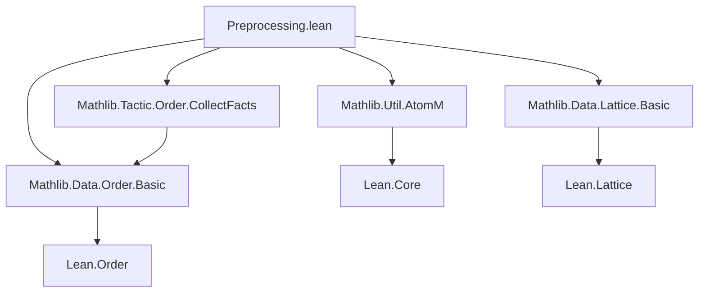
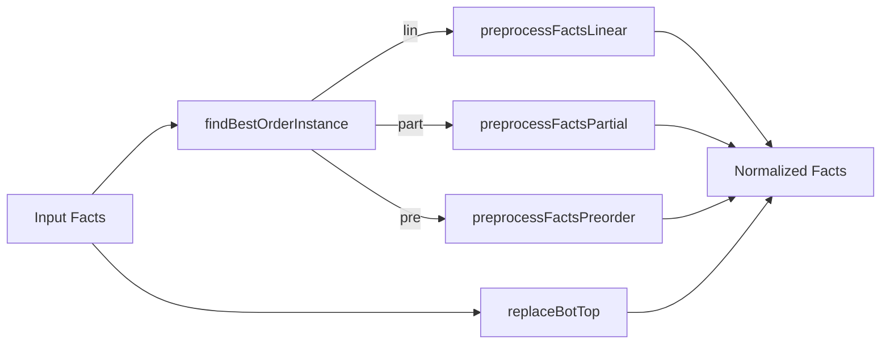

**Technical Brief: `Preprocessing.lean` — Facts Preprocessing for the `order` Tactic**

---

### 1. KEY DEFINITIONS & THEOREMS

| Name | Type / Signature | Purpose |
|------|------------------|---------|
| `not_lt_of_not_le` | `{α : Type u} [Preorder α] → ¬(x ≤ y) → ¬(x < y)` | Derives non-strict inequality failure from strict inequality failure in preorders. |
| `le_of_not_lt_le` | `{α : Type u} [Preorder α] → ¬(x < y) → x ≤ y → y ≤ x` | Converts non-strict inequality + negated strict inequality into reversed inequality. |
| `OrderType` | `inductive` with constructors `.lin`, `.part`, `.pre` | Encodes supported order types: linear, partial, preorder. |
| `findBestOrderInstance` | `Expr → MetaM (Option OrderType)` | Synthesizes the strongest available order instance on a type (preferring `lin > part > pre`). |
| `replaceBotTop` | `Array AtomicFact → AtomM (Array AtomicFact)` | Expands facts of the form `x = ⊤` / `x = ⊥` into universal upper/lower bound facts `y ≤ x` / `x ≤ y`. |
| `preprocessFactsPreorder` | `Array AtomicFact → MetaM (Array AtomicFact)` | Normalizes facts for preorders: expands `<`, `=`; discards `≠`. |
| `preprocessFactsPartial` | `Array AtomicFact → AtomM (Array AtomicFact)` | Normalizes facts for partial orders: expands `<`, `≰`, `=`; adds lattice bounds for `⊔`, `⊓`. |
| `preprocessFactsLinear` | `Array AtomicFact → AtomM (Array AtomicFact)` | Normalizes facts for linear orders: expands `<`, `≰`, `≮`, `=`; adds lattice bounds for `⊔`, `⊓`. |
| `preprocessFacts` | `Array AtomicFact → OrderType → AtomM (Array AtomicFact)` | Dispatches preprocessing based on `OrderType`. |

---

### 2. NAMING CONVENTIONS

- **Prefixes**:
  - `preprocessFacts*`: preprocessing functions for specific order types.
  - `findBest*`: heuristic selection of strongest available instance.
  - `replace*`: transformation of special constants (`⊤`, `⊥`) into relational facts.
- **Suffixes**:
  - `*Of*`: derivation from one relation to another (e.g., `le_of_lt`, `ne_of_not_le`).
  - `*Of*`: logical implication direction (e.g., `not_lt_of_not_le`).
- **AtomicFact constructors**:
  - `.lt`, `.le`, `.nle`, `.nlt`, `.eq`, `.ne`, `.isBot`, `.isTop`, `.isSup`, `.isInf` — all lowercase, dot-prefixed.

---

### 3. TACTIC STACK

- **Core tactics used**:
  - `synthInstance?`: typeclass synthesis for order instances.
  - `mkAppM`, `mkAppOptM`: term construction with metavariables.
  - `inferType`, `isDefEq`, `withReducible`: type introspection and definitional equality checks.
  - `do`-notation for monadic composition in `MetaM` / `AtomM`.
- **No explicit use of `simp`, `rw`, `aesop`, `ring`** — preprocessing is *purely constructive*, relying on Lean’s metaprogramming API.

---

### 4. PROOF LOGIC

- **Structure**:
  1. **Type analysis**: `findBestOrderInstance` synthesizes the strongest order on a type.
  2. **Fact normalization**:
     - For each fact, pattern-match on its constructor.
     - Replace or decompose into equivalent facts using order-theoretic lemmas.
     - Preserve lattice structure facts (e.g., `isSup`, `isInf`) while adding derived bounds.
  3. **Bot/Top expansion**:
     - For `x = ⊤`, add `y ≤ x` for all `y` of same type.
     - For `x = ⊥`, add `x ≤ y` for all `y`.
  4. **Filtering**: discard `≠` facts in preorder preprocessing (since `≠` is not primitive there).

- **Logical flow**:
  - *Inductive case analysis* on `AtomicFact`.
  - *Dependent case analysis* on `OrderType`.
  - *Metavariable generation* for proofs of derived facts.

---

### 5. IMPORTS & DEPENDENCIES

| Import | Role |
|--------|------|
| `Mathlib.Tactic.Order.CollectFacts` | Provides `AtomicFact` and fact collection infrastructure. |
| `Mathlib.Util.AtomM` | Provides `AtomM` monad for stateful manipulation of `atoms`. |
| `Lean.Expr`, `Lean.Meta` | Core metaprogramming utilities. |
| `Preorder`, `PartialOrder`, `LinearOrder` | Typeclasses used in lemmas and instance synthesis. |
| `bot_le`, `le_top`, `le_of_lt`, `not_le_of_gt`, `ne_of_lt`, etc. | Standard order-theoretic lemmas from Mathlib. |

---

### 6. MERMAID DIAGRAMS

#### Dependency Graph (Module-Level)



#### Overview of Preprocessing Pipeline



#### Fact Transformation Logic (Linear Order Example)

```mermaid
flowchart LR
  .lt x y p --> .ne x y (ne_of_lt p)
  .lt x y p --> .le x y (le_of_lt p)
  .nle x y p --> .ne x y (ne_of_not_le p)
  .nle x y p --> .le y x (le_of_not_ge p)
  .nlt x y p --> .le y x (le_of_not_gt p)
  .eq x y p --> .le x y (le_of_eq p)
  .eq x y p --> .le y x (ge_of_eq p)
  .isSup x y s --> .le x s (le_sup_left)
  .isSup x y s --> .le y s (le_sup_right)
  .isInf x y i --> .le i x (inf_le_left)
  .isInf x y i --> .le i y (inf_le_right)
```

---

### 7. THEORY SCOPE

- **Domain**: Ordered algebraic structures (preorders, partial orders, linear orders) with optional lattice operations (`⊔`, `⊓`) and top/bottom elements.
- **Goal**: Prepare facts for the `order` tactic by reducing all relational facts to a canonical set of `≤`, `≠`, and lattice bounds.
- **Key Theoretical Tools**:
  - Monotonicity and antisymmetry in preorders.
  - Equivalence of `x < y ↔ x ≤ y ∧ x ≠ y` in partial orders.
  - Totality in linear orders (`x ≤ y ∨ y ≤ x`).
  - Lattice identities: `x ≤ x ⊔ y`, `x ⊓ y ≤ x`, etc.

--- 

This file is a *metaprogramming preprocessing layer* for the `order` tactic, ensuring uniform input format regardless of original fact representation.
