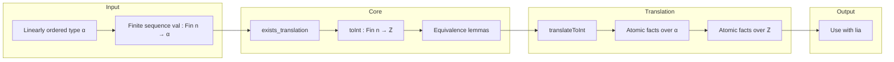

### Technical Brief: `ToInt.lean` — Translation of Linear Orders to ℤ

---

#### **1. Key Definitions & Theorems**

| Name | Type / Signature | Purpose |
|------|------------------|---------|
| `exists_translation` | `∃ tr : Fin n → ℤ, ∀ i j, val i ≤ val j ↔ tr i ≤ tr j` | Guarantees existence of an order-embedding of a finite sequence in `α` into `ℤ`. Used to define `toInt`. |
| `toInt` | `Fin n → ℤ` (noncomputable def) | Concrete translation function obtained via ` Classical.choose` from `exists_translation`. |
| `toInt_le_toInt` | `toInt i ≤ toInt j ↔ val i ≤ val j` | Core equivalence: preserves ≤. |
| `toInt_lt_toInt` | `toInt i < toInt j ↔ val i < val j` | Preserves < (derived from `toInt_le_toInt`). |
| `toInt_eq_toInt` | `toInt i = toInt j ↔ val i = val j` | Preserves equality (via antisymmetry). |
| `toInt_ne_toInt` | `toInt i ≠ toInt j ↔ val i ≠ val j` | Preserves inequality (negation of equality). |
| `toInt_nle_toInt` | `¬toInt i ≤ toInt j ↔ ¬val i ≤ val j` | Preserves negated ≤ (i.e., >). |
| `toInt_nlt_toInt` | `¬toInt i < toInt j ↔ ¬val i < val j` | Preserves negated < (i.e., ≥). |
| `toInt_sup_toInt_eq_toInt` | `toInt i ⊔ toInt j = toInt k ↔ val i ⊔ val j = val k` | Preserves lattice sup (⊔) under translation. |
| `toInt_inf_toInt_eq_toInt` | `toInt i ⊓ toInt j = toInt k ↔ val i ⊓ val j = val k` | Preserves lattice inf (⊓) under translation. |
| `mkFinFun` | `Array Q(α) → MetaM (Fin n → α)` | Constructs a dependent function `Fin n → α` from an array of terms, defeq to indexing. |
| `translateToInt` | `(type, inst, facts) ↦ AtomM (HashMap ℕ ℤ, Array AtomicFact)` | Translates atomic facts over a linearly ordered type into equivalent facts over ℤ, using `toInt`. Filters out `.isBot`/`.isTop`. |

---

#### **2. Naming Conventions**

- **Prefixes**:
  - `toInt_`: all lemmas about the translation function.
  - `mkFinFun`: construction of finite-indexed functions from arrays.
  - `translateToInt`: main translation pipeline.
- **Suffixes**:
  - `_le_toInt`, `_lt_toInt`, `_eq_toInt`, `_ne_toInt`, `_nle_toInt`, `_nlt_toInt`: pattern for equivalence lemmas.
  - `_sup_toInt_eq_toInt`, `_inf_toInt_eq_toInt`: for lattice operations.
- **Internal naming**:
  - `val`, `li`, `sli`, `this`, `hi`, `hj`: internal proof variables (convention in constructive choice proofs).
  - `idxToAtom`, `toFinUnsafe`, `curr`: stateful loop variables in `translateToInt`.

---

#### **3. Tactic Stack**

- **Core tactics**:
  - `simp`, `rw`, `conv`, `refine`, `contrapose!`, `simpa`
  - `generalize_proofs` (for proof irrelevance in dependent contexts)
  - `by_cases`, `apply`, `exact`
- **Meta-level**:
  - `q(...)`, `mkNatLit`, `inferType`, `isDefEq`, `RArray`, `toExpr`, `mkFinFun`
  - `withReducible`, `←`, `mpr` (modus ponens reverse)
- **Proof automation**:
  - `aesop` not used here (manual proof engineering).
  - `ring`/`linarith` not needed — reasoning is purely order-theoretic.

---

#### **4. Proof Logic**

- **`exists_translation` proof sketch**:
  1. Convert `val : Fin n → α` to list `li`.
  2. Sort `li` to `sli` (via `mergeSort`).
  3. For each `i`, pick index `j` such that `sli[j] = val i` (uses `Perms.mem_iff` and `get_of_mem`).
  4. Define `tr i := sli[j]` (as integer index via `Int.ofNat`).
  5. Show `val i ≤ val j ↔ tr i ≤ tr j` using pairwise property of `mergeSort` and antisymmetry.
- **`translateToInt` logic**:
  - Collect atoms of the target type `type`.
  - Build `finFun : Fin n → α` via `mkFinFun`.
  - For each atomic fact, rewrite using lemmas like `toInt_le_toInt.mpr`.
  - For sup/inf facts, introduce fresh integer variables and equate via `toInt_sup_toInt_eq_toInt`.
  - Skip `.isBot`, `.isTop` (assumed filtered earlier).

---

#### **5. Imports & Dependencies**

| Import | Role |
|--------|------|
| `Batteries.Data.List` | List operations, `mergeSort`, `get_of_mem`, `Perms`. |
| `Batteries.Tactic.GeneralizeProofs` | `generalize_proofs` for proof management. |
| `Mathlib.Tactic.Order.CollectFacts` | Fact representation (`AtomicFact`, `.le`, `.isSup`, etc.). |
| `Mathlib.Util.AtomM` | Monadic context for tactic-level state (`HashMap`, `Array`, `AtomM`). |
| `Mathlib.Util.Qq` | Quotation machinery (`q(...)`, `Q(...)`, `MetaM`). |
| `Mathlib.Data.Int.Lattice` | Implicit: `⊔`, `⊓`, `max`, `min`, `le_antisymm`, etc. |
| `Mathlib.Data.Fin.Basic` | `Fin`, `Fin.getElem`, `Fin.elim0`. |

---

#### **6. Mermaid Diagrams**

##### **Dependency Graph (High-Level)**

```mermaid
graph TD
  A[LinearOrder α] --> B[exists_translation]
  B --> C[toInt def]
  C --> D[toInt_le_toInt etc.]
  D --> E[translateToInt]
  E --> F[AtomicFact → ℤ facts]
  F --> G[lia / grind (future)]
  
  H[Batteries.Data.List] --> B
  I[Batteries.Tactic.GeneralizeProofs] --> B
  J[Mathlib.Tactic.Order.CollectFacts] --> E
  K[Mathlib.Util.AtomM] --> E
  L[Mathlib.Util.Qq] --> E
```

##### **Overview of `ToInt.lean` Flow**



---

#### **7. Notes & Future Work**

- **Completeness**: The core algorithm is complete for linear orders with `<`, `≤`, but not with `⊔`, `⊓` (NP-hard). Hence, reduction to `lia` is pragmatic.
- **TODO**: Migrate to `grind` when ready — implies `translateToInt` is a temporary bridge to `lia`.
- **Noncomputability**: `toInt` is noncomputable due to `Classical.choose`; intended for *proof* use, not computation.

--- 

This file is a key component of the `order` tactic’s preprocessing pipeline, enabling reuse of `lia`’s powerful integer arithmetic solver for order-theoretic problems.
