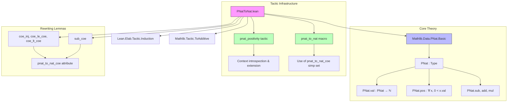

**Technical Brief: `PNatToNat.lean`**

---

### 1. KEY DEFINITIONS & THEOREMS

| Name | Type / Signature | Purpose |
|------|------------------|---------|
| `pnat_positivity` | `tactic` | Adds hypotheses `0 < (↑x : ℕ)` for each `x : PNat` in the local context. |
| `coe_inj` | `m n : PNat → (m = n) ↔ ((m : ℕ) = (n : ℕ))` | Injectivity of coercion `↑ : PNat → ℕ`. |
| `coe_le_coe` | `m n : PNat → (m ≤ n) ↔ ((m : ℕ) ≤ (n : ℕ))` | Preservation of `≤` under coercion. |
| `coe_lt_coe` | `m n : PNat → (m < n) ↔ ((m : ℕ) < (n : ℕ))` | Preservation of `<` under coercion. |
| `sub_coe` | `a b : PNat → ((a - b : PNat) : ℕ) = a.val - 1 - b.val + 1` | Describes subtraction in `PNat` via `Nat` arithmetic (offset by 1). |
| `pnat_to_nat` | `tactic` | Main tactic: adds positivity facts and rewrites goals using `pnat_to_nat_coe` simp set. |
| `pnat_to_nat_coe` | `simp` attribute | Marks lemmas for use in rewriting `PNat` expressions to `Nat`. |

---

### 2. NAMING CONVENTIONS

- **Attribute tag**: `pnat_to_nat_coe` — used to tag lemmas about coercion behavior.
- **Tactic name**: `pnat_to_nat`, `pnat_positivity` — descriptive, action-oriented, with `pnat_` prefix.
- **Lemma names**: `coe_*` — standard Lean convention for coercion-related lemmas.
- **`_root_` usage**: e.g., `_root_.PNat.coe_lt_coe` — disambiguates from local definitions.

---

### 3. TACTIC STACK

| Tactic | Frequency / Role |
|--------|------------------|
| `withMainContext` | Core — ensures tactic runs in main context. |
| `getLCtx`, `foldlM`, `inferTypeQ`, `assert`, `intro1P`, `setGoals` | Used in `pnat_positivity` to introspect and extend context. |
| `isDefEq` | Checks if positivity hypothesis already exists. |
| `focus`, `simp only [pnat_to_nat_coe] at *` | In `pnat_to_nat` macro: focuses on subgoals, then rewrites all goals using the `pnat_to_nat_coe` simp set. |
| `cases`, `simp only`, `split_ifs`, `lia` | In `sub_coe` proof: structural induction on `PNat.mk`, simplification, case split, linear arithmetic. |

---

### 4. PROOF LOGIC

- **`pnat_positivity` logic**:
  1. Iterate over local context declarations.
  2. For each declaration `x : PNat`, infer its type and confirm it is `PNat`.
  3. Construct proof term `PNat.pos x` (i.e., `0 < x.val`) using `q(...)`.
  4. Check if `0 < x.val` already exists; if not, assert and introduce it.
  5. Return updated goal state.

- **`sub_coe` logic**:
  1. `cases a` and `cases b`: reduce to canonical forms `⟨a', ha⟩`, `⟨b', hb⟩`.
  2. Simplify using `PNat.mk_coe`, `PNat.sub_coe`, and `coe_lt_coe`.
  3. `split_ifs`: handle conditional definitions in `PNat.sub`.
  4. `lia`: solve resulting arithmetic goals.

- **`pnat_to_nat` tactic logic**:
  1. Run `pnat_positivity` to ensure all `PNat`s are known positive.
  2. `simp only [pnat_to_nat_coe] at *`: rewrite all goals using tagged lemmas to eliminate `PNat` operations.

---

### 5. IMPORTS

| Import | Role |
|--------|------|
| `Lean.Elab.Tactic.Induction` | For tactic elaboration infrastructure. |
| `Mathlib.Data.PNat.Basic` | Core `PNat` definitions (`PNat`, `val`, `coe`, `sub`, `add`, `mul`, `lt`, `le`). |
| `Mathlib.Tactic.ToAdditive` | Enables additive notation support (not directly used here, but imported for compatibility). |

---

### 6. DEPENDENCY & OVERVIEW DIAGRAM



#### Overview of File Purpose

This file implements a **domain-specific tactic** (`pnat_to_nat`) for automating reasoning about positive natural numbers (`PNat`) by embedding them into `ℕ`. It ensures positivity of all `PNat` variables and rewrites arithmetic expressions using coercion lemmas tagged with `pnat_to_nat_coe`. The tactic is designed for use with automated solvers like `lia`, enabling seamless translation of `PNat`-based goals into `Nat` arithmetic.

---

### 7. USAGE EXAMPLE (not in source, but illustrative)

```lean
example (x y : PNat) (h : x + y > 1) : (x : ℕ) + (y : ℕ) > 1 := by
  pnat_to_nat  -- adds 0 < x.val, 0 < y.val; rewrites goal to Nat
  linarith      -- or `lia`
```

---

Let me know if you'd like a formal dependency graph for the entire `Mathlib` or a comparison with similar tactics (e.g., `int_to_nat`).
