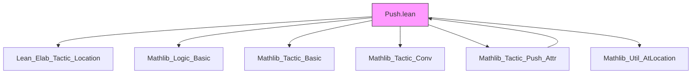
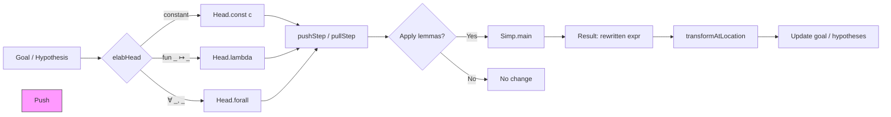

**Technical Brief: `Push.lean` Module — `push`, `push_neg`, and `pull` Tactics**

---

### 1. KEY DEFINITIONS & THEOREMS

| Name | Type / Signature | Purpose |
|------|------------------|---------|
| `Config` | `structure` | Configuration for `push`/`push_neg`: `distrib : Bool` controls whether `¬(p ∧ q)` rewrites to `¬p ∨ ¬q` (`true`) or `p → ¬q` (`false`). |
| `pushNegBuiltin cfg : Simp.Simproc` | `Config → Simp.Simproc` | Custom simplification procedure for `¬`-pushing: handles `¬(p ∧ q)` and `¬∀ x, s x` with binder preservation. |
| `pushStep head cfg : Simp.Simproc` | `Head → Config → Simp.Simproc` | Applies `@[push]` lemmas via `Simp.rewrite?`, falls back to `pushNegBuiltin` if goal is a negation. |
| `pushCore head cfg disch? tgt` | `Head → Config → Option Simp.Discharge → Expr → MetaM Simp.Result` | Core engine for `push`: runs `Simp.main` with custom `pre` step. |
| `pullStep head : Simp.Simproc` | `Head → Simp.Simproc` | Applies lemmas tagged `@[push ←]` (i.e., reverse direction of `push` lemmas) to pull constants toward head. |
| `pullCore head tgt disch?` | `Head → Expr → Option Simp.Discharge → MetaM Simp.Result` | Core engine for `pull`: runs `Simp.main` with custom `post` step. |
| `elabHead : Term → TermElabM Head` | Elaborates tactic argument to `Head` (`.const`, `.lambda`, `.forall`). |
| `push`, `push_neg`, `pull` | `TacticM Unit` | Main tactic entrypoints. `push_neg` = `push Not`. |
| `pushSimpConfig` | `Simp.Config` | Simplifier config used: `zeta := false`, `proj := false`. |
| `not_and_eq`, `not_and_or_eq`, `not_forall_eq` | `Prop` equalities | Core definitional lemmas for negation normal form. |
| `not_iff`, `not_exists` | `↔` theorems | Tagged with `@[push]` for rewriting negated connectives. |
| `forall_*`, `exists_*`, `and_*`, `or_*` | `↔` theorems | Tagged `@[push]` to push quantifiers/connectives inward. |
| `forall_and_left`, `forall_and_right` | Tagged `@[push low]` | Lower priority for `pull` to avoid interference. |

---

### 2. NAMING CONVENTIONS

- **Attribute tags**:  
  - `@[push]` — lemmas of the form `c … = … (c …)` (push inward).  
  - `@[push ←]` — lemmas of the form `… (c …) = c …` (pull outward).  
  - `@[push low]` — lower-priority push lemmas (used in `pull` context).  
- **Theorem names**:  
  - `not_*`, `forall_*`, `exists_*`, `and_*`, `or_*` — standard logical equivalences.  
  - `*_eq` suffix for definitional equalities (e.g., `not_and_eq`).  
- **Tactic names**:  
  - `push`, `push_neg`, `pull` — main tactics.  
  - `pushFun`, `pullFun` — simproc variants for `simp`.  
- **Command macros**:  
  - `#push`, `#push_neg`, `#pull`, `#push_discr_tree` — introspection/debug commands.

---

### 3. TACTIC STACK

Frequent tactics used in implementation:

| Tactic | Role |
|--------|------|
| `Simp.main` | Core simplifier engine for both `push` and `pull`. |
| `Simp.rewrite?` | Applies `@[push]` lemmas from environment. |
| `whnf`, `mkAppM`, `mkNot`, `forallE`, `lam` | Low-level `Expr` manipulation. |
| `withRef`, `withTheReader`, `tacticToDischarge`, `expandLocation` | Elaboration & location handling. |
| `liftMacroM`, `expandMacros`, `resolveId?` | Term elaboration (especially for `elabHead`). |
| `getSimpCongrTheorems`, `getEnv`, `pushExt.getState`, `pullExt.getState` | Environment & attribute access. |
| `insertionSort`, `getMatchWithExtra`, `tryTheoremWithExtraArgs?` | Candidate filtering & priority for `pull`. |

---

### 4. PROOF LOGIC & REWRITING STRATEGY

- **`push` logic**:  
  1. Normalize target (`whnf`).  
  2. Extract head (`Head.ofExpr?`).  
  3. Match head to `push` lemmas (via `pushExt.getState`).  
  4. Apply matching lemmas repeatedly (`Simp.Step.visit` to allow rewrites like `¬¬¬p → ¬p → p`).  
  5. If no match, check if expression is a negation → delegate to `pushNegBuiltin`.  
  6. `pushNegBuiltin` handles:  
     - `¬(p ∧ q)` → `p → ¬q` or `¬p ∨ ¬q` (configurable).  
     - `¬∀ x, s x` → `∃ x, ¬s x` (preserves binder name).  

- **`pull` logic**:  
  1. Retrieve all lemmas tagged `@[push ←]`.  
  2. Filter candidates whose *head* matches the target constant.  
  3. Sort by priority (higher = more specific).  
  4. Try applying each candidate with extra args (e.g., `funext`, `Pi.*_def`).  
  5. Rewrites of the form `… (c …) = c …` move `c` toward head.  

- **Discharge handling**: Optional `disch?` parameter allows custom discharger for side conditions of `@[push]` lemmas.

---

### 5. IMPORTS & DEPENDENCIES

| Module | Role |
|--------|------|
| `Lean.Elab.Tactic.Location` | Location handling (`at l`, `at *`, etc.). |
| `Mathlib.Logic.Basic` | Basic logic (e.g., `not_and`, `not_forall`). |
| `Mathlib.Tactic.Basic` | Core tactic infrastructure. |
| `Mathlib.Tactic.Conv` | Conv tactic support (`conv` mode). |
| `Mathlib.Tactic.Push.Attr` | Attribute `push` definition (likely in separate file). |
| `Mathlib.Util.AtLocation` | `transformAtLocation`, `atLocation` utilities. |

---

### 6. DEPENDENCY & OVERVIEW DIAGRAMS

#### 📦 Module Dependency Graph (Mermaid)

#### 🧠 Overview of `push`/`pull` Workflow (Mermaid)

#### 📚 Theory Scope

- **Logical normal forms**: Pushing `¬`, `∀`, `∃`, `∧`, `∨` inward/outward.
- **Set-theoretic & functional reasoning**: e.g., `x ∈ A ∪ Bᶜ`, `fun x ↦ f x ^ 2`.
- **Interactive & automated use**: Tactics + `conv` mode + `#push` introspection.
- **Extensibility**: Via `@[push]` / `@[push ←]` attributes.

---

### 7. EXAMPLES (from docstring)

- `push _ ∈ _` on `x ∈ {y} ∪ zᶜ` → `x = y ∨ ¬ x ∈ z`
- `push_neg` on `¬∀ ε > 0, ∃ δ > 0, δ < ε` → `∃ ε > 0, ∀ δ > 0, ε ≤ δ`
- `pull fun _ ↦ _` on `f ^ 2 + 5` → `fun x ↦ f x ^ 2 + 5`
- `push (disch := positivity) Real.log` rewrites `log (a * b ^ 2)` using `log_mul`.

---

### 8. TODO & KNOWN LIMITATIONS

- Binder names in `∀`/`∃` are preserved in `push_neg`, but `simp`-based lemmas may not.
- `pull` currently reuses `@[push ←]` lemmas; no dedicated `@[pull]` attribute yet.
- `#push`/`#pull` in `conv` mode does not error on no change (same as `simp`).
- `Nat.not_nonneg_iff_eq_zero` commented out due to breaking proofs.

--- 

**End of Technical Brief**
