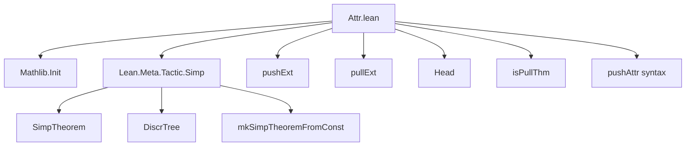
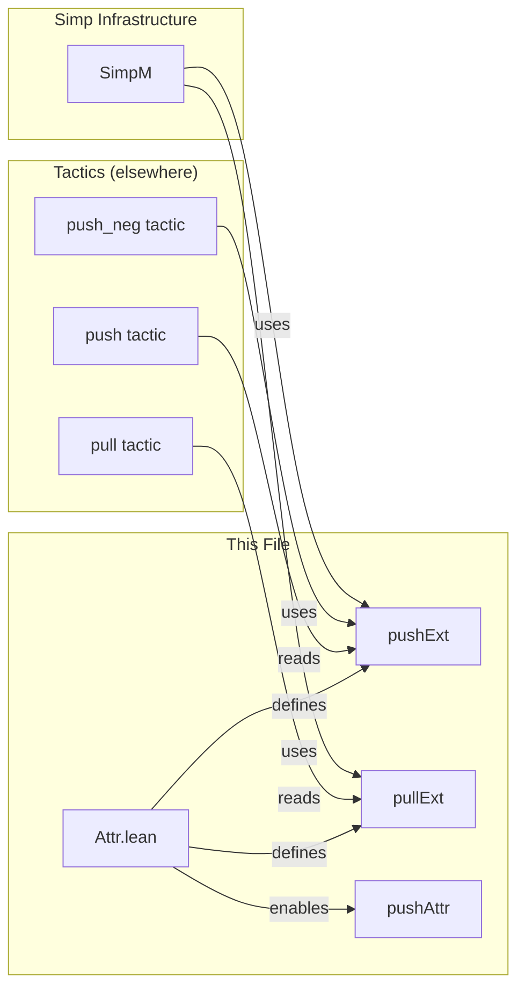

### Technical Brief: `Attr.lean` — `@[push]` Attribute for `push`, `push_neg`, and `pull` Tactics

---

#### **1. Key Definitions & Theorems**

| Name | Type / Signature | Purpose |
|------|------------------|---------|
| `Head` | `inductive Head` | Represents possible heads of expressions: `.const c`, `.lambda`, `.forall`. Used to identify where a constant or binder occurs at the top level. |
| `Head.toString` | `Head → String` | Converts a `Head` to a human-readable string (e.g., `"fun"`, `"Forall"`). |
| `Head.ofExpr?` | `Expr → Option Head` | Extracts the head constructor of an expression (if any). |
| `pushExt` | `SimpleScopedEnvExtension SimpTheorem (DiscrTree SimpTheorem)` | Environment extension storing lemmas tagged with `@[push]`, indexed by their keys for fast lookup. |
| `isPullThm` | `Name → Bool → MetaM (Option Head)` | Checks whether a theorem is suitable for the `pull` tactic: i.e., whether it has the form `x = f ...` where `f` is *not* the head of `x`, but occurs deeper. Returns the head if so. |
| `containsHead` | `Expr → Head → Bool` | Helper for `isPullThm`. Checks if a given `Head` occurs anywhere in an expression (with special handling for lambdas/forall). |
| `PullTheorem` | `SimpTheorem × Head` | A pair of a simp theorem and the head it should be matched against for `pull`. |
| `pullExt` | `SimpleScopedEnvExtension PullTheorem (DiscrTree PullTheorem)` | Environment extension storing `pull`-suitable theorems, indexed by their `SimpTheorem` keys. |
| `pushAttr` | Syntax definition | Custom attribute syntax: `push`, `push ←`, `push only`, `push [priority]`, etc. |
| `registerBuiltinAttribute` | `initialize` block | Registers the `pushAttr` builtin attribute and defines its behavior: adds to `pushExt`, and conditionally adds reverse direction to `pullExt`. |

---

#### **2. Naming Conventions**

- **Prefixes**:
  - `pushExt`, `pullExt`: Environment extensions for `push` and `pull`.
  - `isPullThm`: Predicate naming (`is_`) for checking suitability.
  - `ofExpr?`: Suffix `?` indicates partial function returning `Option`.
- **Suffixes**:
  - `Ext`: For environment extensions.
  - `Theorem`: For theorem wrappers (`PullTheorem`, `SimpTheorem`).
- **Case**:
  - `Head` (capitalized) for inductive type.
  - `pushAttr` (camelCase) for syntax/attribute name.

---

#### **3. Tactic Stack**

- **Core tactics used in implementation**:
  - `forallTelescope`: To decompose dependent function types.
  - `getConstInfo`: To retrieve declaration info.
  - `mkSimpTheoremFromConst`: To construct `SimpTheorem`s from constants.
  - `withExporting`: To ensure visibility of aux decls.
  - `throwError`: For user-facing diagnostics.
- **Meta-level utilities**:
  - `MetaM.run'`: To run `MetaM` actions in `initialize`.
  - `DiscrTree`: For efficient key-based lookup of simp theorems.
  - `containsConst`, `find?`, `matches`: From `Expr` API.

No user-facing tactics (`push`, `pull`, `push_neg`) are defined here — only the infrastructure to support them.

---

#### **4. Proof Logic / Implementation Flow**

The `pushAttr` attribute handler follows this logic:

1. **Parse syntax** to determine:
   - `inv`: Whether to reverse direction (`←` or `<-`).
   - `isOnly`: Whether to skip automatic `pull` tagging (`only`).
   - `prio`: Optional priority.

2. **Generate `SimpTheorem`** for the declared constant using `mkSimpTheoremFromConst`.

3. **Add to `pushExt`** unconditionally.

4. **If not `isOnly`**, check if the theorem is suitable for `pull`:
   - Extract lhs/rhs of equality/iff.
   - Swap if `inv`.
   - Get head of rhs (`f`).
   - Check if `f` occurs in lhs but is *not* the head of lhs (`isPullThm`).
   - If yes, generate `SimpTheorem` (again, possibly reversed) and add `(thm, head)` to `pullExt`.

The `isPullThm` logic:
- Uses `Head.ofExpr?` to get head of rhs.
- Uses `containsHead` to check if head appears in lhs.
- Special cases:
  - `.lambda`: Always `true` (since `pull fun ↦ _` applies to any term).
  - `.forall`: Checks if `forallE` appears anywhere.

---

#### **5. Imports**

| Import | Purpose |
|--------|---------|
| `Mathlib.Init` | Core Lean + Mathlib initialization (e.g., `Expr`, `Name`, `MetaM`). |
| `Lean.Meta.Tactic.Simp` | Provides `SimpTheorem`, `DiscrTree`, `mkSimpTheoremFromConst`, etc. |

No tactic definitions are imported — only the *infrastructure* needed to tag and store theorems.

---

#### **8. Mermaid Diagrams**

##### **Dependency Graph**



##### **Overview of File Structure**

```mermaid
flowchart LR
  subgraph "Core Types"
    H[Head] -->|ofExpr?| E[Expr]
  end

  subgraph "Environment Extensions"
    PE[pushExt] -->|stores| ST[SimpTheorem]
    PLE[pullExt] -->|stores| PT[PullTheorem = SimpTheorem × Head]
  end

  subgraph "Attribute Logic"
    SA[pushAttr syntax] -->|parsed by| AL[add logic]
    AL -->|adds to| PE
    AL -->|checks via| IPT[isPullThm]
    IPT -->|if true| PLE
  end

  subgraph "User-facing"
    U[User writes: @[push] ...] --> SA
    U -->|uses| TAC[push/push_neg/pull tactics]
  end

  TAC -->|reads| PE
  TAC -->|reads| PLE
```

##### **Relationship to Related Theory**



---

### Summary

This file provides the **infrastructure layer** for the `push`, `push_neg`, and `pull` tactics by:
- Defining `Head` to classify expression heads,
- Registering scoped environment extensions (`pushExt`, `pullExt`) to store tagged lemmas,
- Implementing `isPullThm` to detect reverse-direction lemmas,
- Defining the `@[push]` attribute and its semantics (including `←`, `only`, priority).

It does **not** implement the tactics themselves — those live in separate tactic files — but ensures the lemmas are correctly registered and indexed for efficient use by those tactics.
