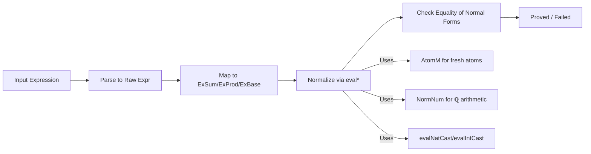
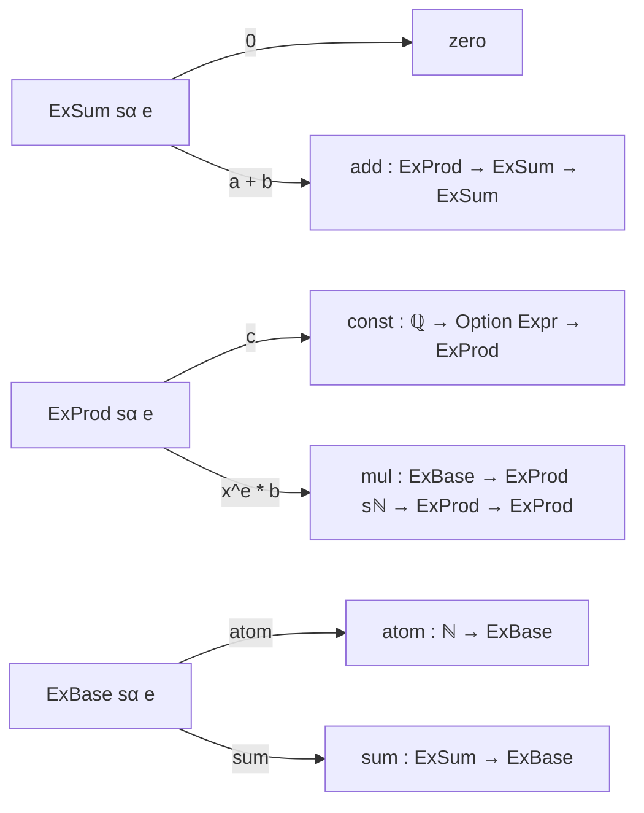

Here's a structured technical brief based on the provided `Common.lean` file:

---

### **Technical Brief: `ring` Tactic Implementation in Lean 4**

#### **1. Key Definitions & Theorems**

| Name | Type / Signature | Purpose |
|------|------------------|---------|
| `ExBase`, `ExProd`, `ExSum` | Mutual inductive families over `CommSemiring α` | Normalized representations of ring expressions: bases (atoms/sums), monomials, and polynomials. Enforce associativity/distributivity via structure. |
| `ExBase.eq`, `ExProd.eq`, `ExSum.eq` | `→ Bool` | Heterogeneous equality checks for normalized forms (used in normalization & overlap detection). |
| `ExBase.cmp`, `ExProd.cmp`, `ExSum.cmp` | `→ Ordering` | Heterogeneous total order on normalized expressions (used for canonical ordering of summands/monomials). |
| `Result` | `Structure` | Stores normalized expression `expr`, its representation `val : E expr`, and proof `proof : e = expr`. |
| `evalAddOverlap` | `ExProd → ExProd → OptionT MetaM (Overlap …)` | Attempts to combine two monomials into one (e.g., `xy + 2xy = 3xy`) or detect cancellation (`xy + -xy = 0`). |
| `evalAdd`, `evalMul`, `evalMul₁`, `evalMul` | `ExSum / ExProd → … → MetaM (Result …)` | Core normalization functions for addition and multiplication of polynomials/monomials. |
| `evalNSMul`, `evalZSMul` | `ExSum sℕ / sℤ → ExSum sα → AtomM (Result …)` | Scalar multiplication by `ℕ` or `ℤ`, with special handling for `α = ℕ` or `α = ℤ`. |
| `evalNeg`, `evalNegProd` | `ExSum / ExProd → … → MetaM (Result …)` | Negation of polynomials/monomials (requires `CommRing α`). |
| `evalSub` | `ExSum → ExSum → MetaM (Result …)` | Subtraction via `a - b = a + (-b)`. |
| `evalPow` (partial, not shown in snippet) | — | Handles exponentiation: `a ^ n`, where `n : ℕ`. Uses `ExBase.toProd` and exponent ring `sℕ`. |
| `add_overlap_pf`, `mul_pp_pf_overlap`, `neg_one_mul`, etc. | `theorem`s | Proof lemmas used to construct correctness proofs in `Result.proof`. |

---

#### **2. Naming Conventions**

- **Prefixes**:
  - `eval*`: Meta-level normalization functions (e.g., `evalAdd`, `evalMul`, `evalNeg`).
  - `mk*`: Constructors for normalized expressions (e.g., `ExProd.mkNat`, `ExProd.mkNNRat`).
  - `cast`: Type coercion between `Ex*` families (e.g., `ExBase.cast`).
  - `to*`: Embedding functions (e.g., `ExBase.toProd`, `ExProd.toSum`).
- **Suffixes**:
  - `pf`: Proof-related helper lemmas (e.g., `add_pf_zero_add`, `mul_pf_left`).
  - `Overlap`: Overlap detection logic (`evalAddOverlap`, `Overlap` inductive).
- **Type family naming**:
  - `sℕ`, `sℤ`: Typed references to `CommSemiring ℕ`, `CommSemiring ℤ`.
  - `Ex* sα e`: Family parameterized by typed semiring `sα` and expression `e`.

---

#### **3. Tactic Stack**

- **Meta-level tactics**:
  - `AtomM`: For managing fresh atom identifiers (via `addAtomQ`).
  - `OptionT MetaM`: For partiality (e.g., `evalAddOverlap`).
  - `MetaM`: Core tactic monad.
- **Core proof automation**:
  - `simp`, `rw`, `subst_vars`: Used in proof lemmas (`*pf` theorems).
  - `guard`, `isDefEq`: For structural equality checks (e.g., comparing bases in `evalMulProd`).
  - `assumeInstancesCommute`: Ensures instance compatibility during coercion.
- **Normalization drivers**:
  - `partial def eval*`: Recursive normalization functions (partial to speed compilation).
  - `Result.ofRawRat`, `toRatNZ`, `toRawEq`: Helpers for rational arithmetic.

---

#### **4. Proof Logic**

- **Normalization strategy**:
  1. Parse input expression into raw syntax.
  2. Recursively map to `ExSum`/`ExProd`/`ExBase`, applying associativity/commutativity via inductive structure.
  3. Normalize via `eval*` functions (e.g., `evalAdd`, `evalMul`), which:
     - Combine like monomials (`evalAddOverlap`).
     - Sort terms using `cmp`.
     - Push coercions (`evalNatCast`, `evalIntCast`).
  4. Return `Result` with normalized term + correctness proof.
- **Inductive structure enforces normal form**:
  - `ExSum` = sum of `ExProd` (no nested sums).
  - `ExProd` = monomial: `x^e * c * rest` (no nested products).
  - `ExBase` = atom or sum of monomials (no nested bases).
- **Proofs are built compositionally**:
  - Each `eval*` returns a `Result` with a proof term constructed via `q(...)` and lemmas like `add_pf_add_overlap`.

---

#### **5. Imports & Dependencies**

| Import | Purpose |
|--------|---------|
| `Mathlib.Util.AtomM` | Atom management (fresh identifiers for uninterpreted subexpressions). |
| `Mathlib.Algebra.Order.Ring.Unbundled.Rat` | Rational numbers as a `CommSemiring`. |
| `Mathlib.Tactic.NormNum.Inv`, `Mathlib.Tactic.NormNum.Pow`, `Mathlib.Tactic.NormNum.Result` | Numerical normalization utilities (e.g., rational arithmetic, power evaluation). |

---

#### **6. Mermaid Diagrams**

##### **Dependency Graph (Core Components)**

```mermaid
graph TD
  A[Common.lean] --> B[Mathlib.Util.AtomM]
  A --> C[Mathlib.Algebra.Order.Ring.Unbundled.Rat]
  A --> D[Mathlib.Tactic.NormNum.*]
  
  A --> E[ExBase/ExProd/ExSum]
  A --> F[eval* normalization functions]
  A --> G[Result structure]
  
  E --> H[eq/cmp for ordering/equality]
  F --> I[Proof lemmas (*_pf)]
  G --> I
```

##### **Overview of `ring` Tactic Workflow**



##### **Expression Hierarchy**



---

#### **7. Key Caveats & Limitations**

- **Division not supported**: `a / a = 1` fails (division not part of ring language).
- **Subtraction only in rings**: Requires `CommRing α`; not valid in `CommSemiring`.
- **No power-of-power simplification**: `2^n * 2^n = 4^n` not simplified (only `x^a * x^b = x^(a+b)`).
- **Atoms are equivalence classes**: Up to definitional equality; `ring1` vs `ring_nf` differ in atom normalization.

---

#### **8. Theory Scope**

- **Domain**: Commutative (semi)rings with `ℕ`-scalar multiplication and exponentiation.
- **Expressive power**:
  - Supports rational coefficients (via `NNRat.rawCast`, `Rat.rawCast`).
  - Handles variable exponents (e.g., `2 * 2^n * b = b * 2^(n+1)`).
- **Meta-level normalization**: All simplifications happen at the meta level; proofs are constructed at the base level.

--- 

This file is the foundational infrastructure for the `ring` and `ring_nf` tactics in Mathlib, enabling automated reasoning in commutative rings with exponentiation and rational coefficients.
