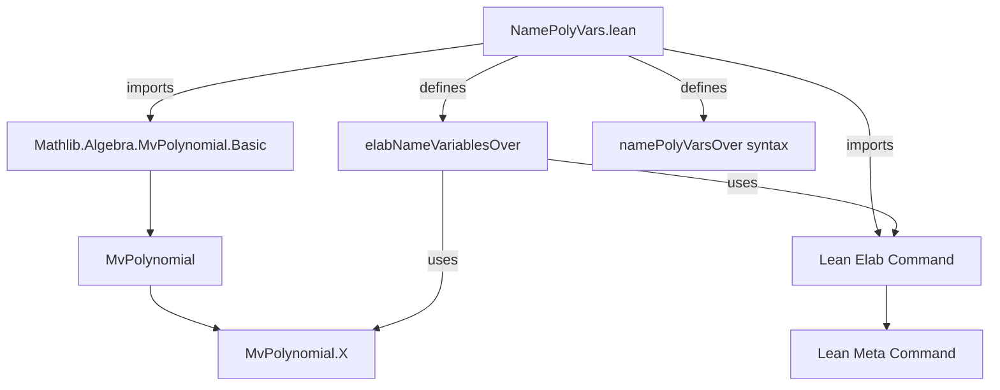
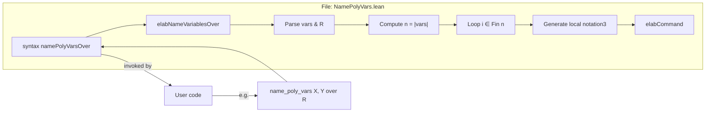

**Technical Brief: `NamePolyVars.lean`**

---

### 1. **Key Definitions & Theorems**

| Name | Type / Syntax | Purpose |
|------|---------------|---------|
| `namePolyVarsOver` | Syntax rule: `"name_poly_vars" (ppSpace ident),+ " over " term : command` | Declares a custom command syntax for naming multivariate polynomial variables over a base ring `R`. |
| `elabNameVariablesOver` | `CommandElab` | Elaborator for `name_poly_vars ... over ...`; generates `local notation3` declarations for each variable as `MvPolynomial.X` applied to a `Fin n` index. |
| `MvPolynomial.X` | `Π (σ : Type u) [DecidableEq σ] (i : σ), MvPolynomial σ R` | Standard constructor for the `i`-th variable in `MvPolynomial σ R`. Here specialized to `σ := Fin n`. |

> **No theorems** are proven in this file — it is purely a *tactic/meta-programming* module.

---

### 2. **Naming Conventions**

- **Command prefix**: `name_poly_vars` — descriptive, imperative, action-oriented.
- **Syntax identifier**: `namePolyVarsOver` — camelCase, matches command name + suffix `Over` to indicate the `over R` clause.
- **Internal variable naming**: `var.getId` → stringified via `s!"{var.getId}"` → used as the *notation identifier* in `local notation3`.
- **Indexing**: Uses `Fin n` (via `quote idx : Fin $sizeStx`) to ensure type-correct indices.

---

### 3. **Tactic Stack**

- **Core tactics/macros used**:
  - `quote` — to embed Lean AST terms (e.g., `size`, `idx`, `var`).
  - `elabCommand` — to execute generated `local notation3` commands.
  - `TSyntax` / `TSyntax` constructors (`$(...)`) — for AST construction.
  - `getElems`, `size`, iteration over range `[:size]` — standard `List`/`Array` operations on syntax lists.

- **No proof tactics** (`simp`, `ring`, `aesop`, etc.) appear — this is *purely elaboration-time* code.

---

### 4. **Proof Logic / Elaboration Logic**

The elaborator follows a deterministic, *compile-time* transformation:

1. Parse syntax: `name_poly_vars X, Y, Z over R`.
2. Extract variable names (`[X, Y, Z]`) and ring term `R`.
3. Compute `n = length(vars)`.
4. For each index `i ∈ [0, n-1]`:
   - Construct `idx : Fin n` (via `quote i` and type annotation).
   - Generate a `local notation3` command:
     ```lean
     local notation3 X_i:str => MvPolynomial.X (R := R) (σ := Fin n) idx
     ```
   - Elaborate and register this notation locally.

> **No induction, case analysis, or proof search** — this is *metaprogramming*, not proof scripting.

---

### 5. **Imports**

| Import | Purpose |
|--------|---------|
| `Mathlib.Algebra.MvPolynomial.Basic` | Provides `MvPolynomial.X`, the core variable constructor. Required for type-correct usage of `MvPolynomial.X (σ := Fin n)`. |
| `Lean Elab Command` | Provides `CommandElab`, syntax parsing (`syntax`), and elaboration utilities (`elabCommand`, `quote`, etc.). |

> No other dependencies — minimal footprint.

---

### 6. **Mermaid Diagrams**

#### **Dependency Graph**


#### **Overview of File Structure**


---

### 7. **Usage Example (from docstring)**

```lean
variable (R : Type) [CommRing R]

name_poly_vars X, Y, Z over R

#check Y -- Y : MvPolynomial (Fin 3) R
```

After elaboration, `Y` is a *local notation* for `MvPolynomial.X R (σ := Fin 3) 1`.

---

### 8. **Design Notes**

- **Local scope**: Notions are `local`, avoiding global namespace pollution.
- **Type safety**: Indices are typed as `Fin n`, preventing out-of-bounds errors at the *type level*.
- **Extensibility**: Could be generalized to arbitrary `σ` (not just `Fin n`) — but currently restricted to finite `Fin n` for simplicity and usability.
- **No runtime overhead**: Entirely compile-time metaprogramming.

--- 

✅ *End of technical brief.*
