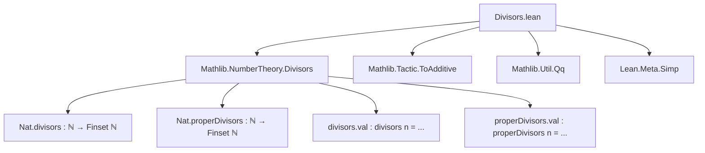
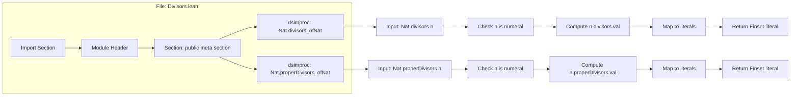

**Technical Brief: `Divisors.lean` (Lean 4)**  
*Domain: Number Theory (Divisors), Formalization of Computation with Simprocs*

---

### 1. **Key Definitions & Theorems**

| Name | Type / Signature | Purpose |
|------|------------------|---------|
| `Nat.divisors_ofNat` | `dsimproc_decl` | Computes `Nat.divisors n` for concrete numerals `n` by evaluating `n.divisors.val` and converting to a `Finset ℕ` literal. |
| `Nat.properDivisors_ofNat` | `dsimproc_decl` | Computes `Nat.properDivisors n` for concrete numerals `n`, returning the proper divisors as a `Finset ℕ` literal. |

> **Note**: These are *simprocs* (simplification procedures), not theorems. They operate at the metaprogramming level to reduce expressions during simplification.

---

### 2. **Naming Conventions**

- **Prefix**: `Nat.` — indicates module scope (`Nat` namespace).
- **Suffix**: `_ofNat` — indicates the procedure is specialized for *numeral inputs* (`n : ℕ` given as a concrete natural number).
- **Pattern**: `X_ofNat` — used consistently for simprocs that evaluate `X` on numerals.

---

### 3. **Tactic Stack**

| Tactic / Metaprogramming Construct | Usage |
|------------------------------------|-------|
| `fromExpr?` | Pattern-matching on expression structure (e.g., extracting argument of `Nat.divisors _`). |
| `isAppOfArity` | Checking that the expression is an application of the expected constant with correct arity. |
| `mkSetLiteralQ` | Constructing a `Q(Finset ℕ)` from a list of numerals (used to produce set literals like `{1, 2, 3, 6}`). |
| `mkNatLit` | Constructing a `Expr` representing a natural number literal. |
| `unsafe ... .map mkNatLit` | Mapping over internal representation of `divisors.val`/`properDivisors.val` to convert to `Expr` literals. |
| `return .done / .continue` | Control flow in simproc: `.done` for successful reduction, `.continue` to skip. |

> *No high-level tactics* (`simp`, `ring`, `aesop`) are used — this is pure metaprogramming.

---

### 4. **Proof Logic / Computation Flow**

The simprocs follow a deterministic *evaluation* logic (not proof search):

1. **Pattern match**: Check that the input term is of the form `Nat.divisors _` (or `Nat.properDivisors _`) with exactly one argument.
2. **Extract numeral**: Use `fromExpr?` to extract the argument `n` and verify it is a numeral.
3. **Compute**: Use the *runtime* `n.divisors.val` / `n.properDivisors.val` (from `Mathlib.NumberTheory.Divisors`) — these are already proven correct and computed efficiently.
4. **Convert to literal**: Map each element of the list to a `Expr` natural literal, then wrap in `mkSetLiteralQ` to produce a `Finset` literal.
5. **Return**: Yield the simplified expression (`.done`) or skip (`.continue`).

> This is *computational simplification*, not inductive proof.

---

### 5. **Imports**

| Import | Role |
|--------|------|
| `Mathlib.NumberTheory.Divisors` | Provides definitions `Nat.divisors`, `Nat.properDivisors`, and their computational content (`divisors.val`, `properDivisors.val`). |
| `Mathlib.Tactic.ToAdditive` | (Unused here, but imported for consistency in number-theoretic modules.) |
| `Mathlib.Util.Qq` | Provides `Qq` (quasi-quotation) infrastructure: `q(...)`, `mkNatLit`, `mkSetLiteralQ`. |
| `Lean Meta Simp` | Core metaprogramming support: `dsimproc_decl`, `Meta`, `Simp`. |

---

### 8. **Mermaid Diagrams**

#### **Dependency Graph (Module-Level)**



#### **Overview of File Structure**



#### **Integration with Simplifier**

```mermaid
flowchart LR
  S[Goal: Nat.divisors 6] --> SIMP[Simp tactic]
  SIMP --> PROC1[Nat.divisors_ofNat]
  PROC1 --> EVAL[Evaluate 6.divisors.val]
  EVAL --> LIT[{1, 2, 3, 6}]
  LIT --> RED[Reduction: S = {1, 2, 3, 6}]
```

---

### Summary

This file implements *efficient, compile-time simplification* of divisor-related expressions for concrete naturals. It leverages Lean’s metaprogramming to bridge runtime computation (from `Mathlib.NumberTheory.Divisors`) with the simplifier, enabling automatic evaluation like:

```lean
example : Nat.divisors 6 = {1, 2, 3, 6} := by simp  -- ✅
example : Nat.properDivisors 12 = {1, 2, 3, 4, 6} := by simp  -- ✅
```

No theorems are proved here — only *procedural automation* for simplification.
