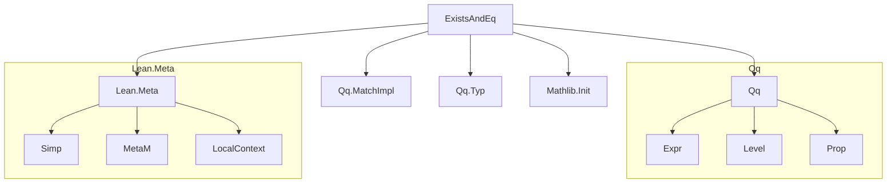
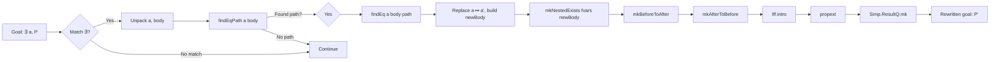

### Technical Brief: `ExistsAndEq.lean`

---

#### **1. Key Definitions & Theorems**

| Name | Type / Signature | Purpose |
|------|------------------|---------|
| `GoTo` | `inductive GoTo | left | right` | Tracks path direction (`left`/`right`) through conjunctions in expression tree. |
| `Path` | `abbrev Path := List GoTo` | Encodes traversal path to equality subterm `a = a'` or `a' = a`. |
| `VarQ` | `abbrev VarQ := (u : Level) × (α : Q(Sort u)) × Q($α)` | Qq-fied representation of bound variables (for existential elimination/introduction). |
| `HypQ` | `abbrev HypQ := (P : Q(Prop)) × Q($P)` | Qq-fied hypothesis (proposition + proof term). |
| `findEqPath` | `a : Q(α) → P : Q(Prop) → MetaM (Option Path)` | Fast pre-check: finds path to a subterm `a = a'` or `a' = a` where `a'` is independent of `a`. |
| `findEq` | `a : Q(α) → P : Q(Prop) → Path → MetaM (List VarQ × LocalContext × Q(Prop) × Q(α))` | Extracts equality witness `a'`, collects bound variables along path, and returns simplified body. |
| `mkNestedExists` | `List VarQ → Q(Prop) → MetaM Q(Prop)` | Constructs nested existential quantifier from list of bound variables. |
| `withNestedExistsElim` | `List VarQ → Q(P) → (Q(body) → MetaM Q(goal)) → MetaM Q(goal)` | Eliminates nested existentials to apply a continuation on the body. |
| `mkAfterToBefore` | `a' : Q(α) → newBody : Q(Prop) → List VarQ → Path → MetaM (P' → ∃ a, p a)` | Constructs proof of implication *from* simplified form *to* original goal. |
| `mkBeforeToAfter` | `a' : Q(α) → newBody : Q(Prop) → List VarQ → Path → MetaM ((∃ a, p a) → P')` | Constructs proof of implication *from* original goal *to* simplified form. |
| `withExistsElimAlongPath` | `h : Q(P) → List VarQ → Path → ((a = a') → List HypQ → MetaM Q(goal)) → MetaM Q(goal)` | Eliminates existentials and conjunctions along a path, collecting hypotheses. |
| `withNestedExistsIntro` | `List VarQ → MetaM Q(body) → MetaM Q(P)` | Introduces nested existentials from a body proof. |
| `existsAndEq` | `simproc ↓ existsAndEq (Exists _)` | Main simproc: rewrites `∃ a, P` to equivalent `P'` when `P` uniquely determines `a`. |

---

#### **2. Naming Conventions**

- **Prefixes**:
  - `find*`: Search functions (`findEqPath`, `findEq`)
  - `mk*`: Construction functions (`mkNestedExists`, `mkAfterToBefore`, `mkBeforeToAfter`)
  - `with*`: Continuation-passing helpers (`withNestedExistsElim`, `withExistsElimAlongPath`, `withNestedExistsIntro`)
- **Suffixes**:
  - `Path`: Functions dealing with path traversal (`findEqPath`)
  - `Imp`: Internal helper variants (`withExistsElimAlongPathImp`)
  - `Q`: Qq-fied versions of standard types (`VarQ`, `HypQ`)
- **Case style**: `camelCase` for functions, `PascalCase` for inductives (`GoTo`), `snake_case` for simproc name (`existsAndEq`).

---

#### **3. Tactic Stack**

Frequently used tactics and utilities:
- `match_expr`, `lambdaBoundedTelescope`: For introspection and destructuring expressions.
- `withLocalDeclQ`, `withNewMCtxDepth`: For introducing local assumptions and managing metavariable contexts.
- `replace`, `exact`, `rfl`, `congrArg`: Basic proof automation.
- `mkLambdaFVars`, `mkLambdaQ`: Lambda abstraction over free variables.
- `Exists.elim`, `Exists.intro`, `And.intro`, `And.left`, `And.right`: Intro/elim for `Exists` and `And`.
- `propext`, `Iff.intro`: For equivalence proofs.
- `assertUnreachable`: Custom error reporting for internal invariants.
- `pure`, `do`, `let _ := ...`: Lean 4 monadic control flow.

---

#### **4. Proof Logic**

The core logic follows this structure:

1. **Pattern match** on goal `∃ a, P`.
2. **Search** for a subterm `a = a'` or `a' = a` in `P` where `a'` is independent of `a`, using `findEqPath`.
3. **Traverse** `P` along the found path with `findEq`, collecting:
   - Bound variables (`fvars`) from nested `Exists` along the path.
   - Local context (`lctx`) needed for `a'`.
   - Simplified body `newBody` where `a` is replaced by `a'`.
4. **Construct two implications**:
   - `mkBeforeToAfter`: `∃ a, P → P'` (original → simplified)
   - `mkAfterToBefore`: `P' → ∃ a, P` (simplified → original)
5. **Combine** into equivalence via `propext (Iff.intro ...)`, then apply `Simp.ResultQ.mk`.

The internal traversal (`go` inside `findEq`, `mkAfterToBefore`, `mkBeforeToAfter`) proceeds by:
- **Case analysis** on expression structure (`Eq`, `And`, `Exists`).
- **Path-driven branching** at `And` nodes.
- **Variable substitution** using `replaceFVar`.
- **Equality reasoning** via `Eq.mp`, `congrArg`, and symmetry.

---

#### **5. Imports**

| Import | Purpose |
|--------|---------|
| `Mathlib.Init` | Core Lean + Mathlib initialization. |
| `Qq`, `Qq.MatchImpl`, `Qq.Typ` | Quasi-quotation and expression manipulation utilities. |
| `Lean Meta` | Meta-programming infrastructure (e.g., `MetaM`, `Simp.ResultQ`). |

---

#### **6. Mermaid Diagrams**

##### **Dependency Graph (Module Scope)**

##### **Overview of `existsAndEq` Simproc Flow**

##### **High-Level Theory Context**

This module belongs to a **simplifier infrastructure** for *quantifier elimination* in propositional logic with equality. It complements standard `simp` rules by:

- Recognizing *uniquely determined* existentially quantified variables.
- Substituting them and moving dependencies outward.
- Preserving logical equivalence via bidirectional implication proofs.

It fits into a broader theory of **symbolic reasoning over dependent types**, where:
- `Qq` enables safe metaprogramming over expressions.
- `Exists.elim`/`Exists.intro` encode standard logic rules.
- Path-based traversal supports *nested* quantifier handling.

---

#### **7. Example Rewriting**

Input:  
`∃ a, p a ∧ ∃ b, a = f b ∧ q b`

Output:  
`∃ b, p (f b) ∧ q b`

Proof equivalence:  
`∃ a, p a ∧ ∃ b, a = f b ∧ q b ↔ ∃ b, p (f b) ∧ q b`

The simproc:
- Finds `a = f b` in body.
- Replaces `a` with `f b`.
- Moves `∃ b` outside.
- Constructs equivalence proof using `mkBeforeToAfter` and `mkAfterToBefore`.

--- 

Let me know if you'd like a formal specification of the correctness theorem or a test suite sketch.
