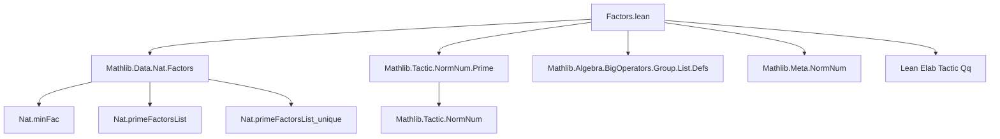
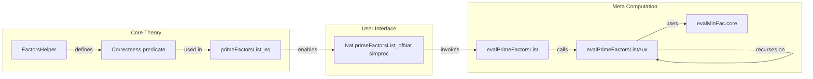

### Technical Brief: `Factors.lean` — Simproc for `Nat.primeFactorsList`

---

#### **1. Key Definitions & Theorems**

| Name | Type / Signature | Purpose |
|------|------------------|---------|
| `FactorsHelper n p l` | `Prop` | A helper predicate asserting that `l` is a sorted list of primes (≥ `p`) whose product is `n`. Formally: `p.Prime → (p :: l).IsChain (· ≤ ·) ∧ (∀ a ∈ l, Nat.Prime a) ∧ l.prod = n`. |
| `FactorsHelper.nil` | `FactorsHelper 1 a []` | Base case: empty list factors `1`, vacuously satisfying all conditions. |
| `FactorsHelper.cons_of_le` | `FactorsHelper m b l → a ≤ b → minFac b = b → FactorsHelper n a (b :: l)` | Extend factor list by `b` if `a ≤ b`, `b` is prime (`minFac b = b`), and `b * m = n`. |
| `FactorsHelper.cons` | Variant of `cons_of_le` using `Nat.blt a b` (i.e., `a < b`) and `IsNat (minFac b) b`. |
| `FactorsHelper.singleton` | `FactorsHelper n a [n]` when `a < n` and `n` is prime (`minFac n = n`). |
| `FactorsHelper.cons_self` | `FactorsHelper n a (a :: l)` when `a` divides `n` and `a` is prime. |
| `FactorsHelper.singleton_self` | `FactorsHelper a a [a]` — base case when `a` is prime and we start factoring at `a`. |
| `FactorsHelper.primeFactorsList_eq` | `FactorsHelper n 2 l → primeFactorsList n = l` | Uniqueness: if `l` satisfies the helper for `p = 2`, then `l` must be the canonical `primeFactorsList n`. |
| `evalPrimeFactorsListAux` | `MetaM (l × FactorsHelper n a l)` | Meta-level recursive procedure to compute a witness list `l` and proof `FactorsHelper n a l` for given numerals `n`, `a`. |
| `evalPrimeFactorsList` | `MetaM (l × primeFactorsList n = l)` | Top-level evaluator: given `n`, returns `(primeFactorsList n, proof)`. Handles `0`, `1`, and recursive case via `evalPrimeFactorsListAux`. |
| `simproc Nat.primeFactorsList_ofNat` | `Simproc` | Registers a simplification procedure for `Nat.primeFactorsList (OfNat.ofNat n)`; uses `evalPrimeFactorsList` to reduce to a concrete list. |

---

#### **2. Naming Conventions**

- **Prefixes**:
  - `FactorsHelper.*`: Predicate-based helper theorems.
  - `eval*`: Meta-level evaluation procedures (e.g., `evalPrimeFactorsListAux`, `evalMinFac.core`).
  - `isNat_*`, `IsNat`: Proof terms witnessing that an expression equals a literal numeral.
- **Suffixes**:
  - `_self`: Special case where the factor equals the lower bound `a`.
  - `_singleton`, `_cons`, `_nil`: Structural cases for list construction.
- **Variables**:
  - `n`, `m`: Target number and cofactor.
  - `a`, `b`: Lower bound and current factor candidate.
  - `l`: Accumulated factor list.
  - `e*`, `h*`: Expression (`Expr`) and proof variables in meta code.

---

#### **3. Tactic Stack**

Frequently used tactics in proofs and meta code:

| Tactic | Usage |
|--------|-------|
| `aesop`, `lia` | For arithmetic reasoning (e.g., `lt_of_le_of_ne'`, `minFac_le`). |
| `simp`, `rw`, `congr'` | Simplifying products, equalities, and rewriting definitions (`List.prod_cons`, `minFac_dvd`, etc.). |
| `exact`, `assumption`, `intro` | Standard proof assembly. |
| `have`, `let` | Local proof declarations and definitions (especially in `eval*` functions). |
| `q(...)`, `mkRawNatLit`, `q(Eq.refl _)` | Meta-level term construction (Lean metaprogramming). |
| `evalMinFac.core` | Meta procedure to compute and prove `minFac n = b`. |
| `assertInstancesCommute` | Ensures consistency between meta and object-level computations. |

---

#### **4. Proof Logic**

The logical flow is **inductive on `n`**, with case analysis on:
- Whether `n = 0` or `n = 1` (base cases).
- Whether `minFac n = n` (i.e., `n` is prime) → singleton list.
- Whether `minFac n < n` → recurse on `n / minFac n`, prepending `minFac n`.

Each recursive step:
1. Computes `b := minFac n`.
2. Proves `b` is prime (`minFac b = b`).
3. Uses `IsNat` proofs to connect meta numerals to object terms.
4. Builds `FactorsHelper n a (b :: l)` from `FactorsHelper m b l` via `cons`/`cons_of_le`.
5. Finally, applies `primeFactorsList_eq` to conclude `primeFactorsList n = l`.

The meta procedure mirrors this structure, constructing both the list and its correctness proof in one pass.

---

#### **5. Imports & Dependencies**

| Import | Role |
|--------|------|
| `Mathlib.Data.Nat.Factors` | Core definitions: `primeFactorsList`, `minFac`, `primeFactorsList_unique`, etc. |
| `Mathlib.Tactic.NormNum.Prime` | Provides `evalMinFac.core` for meta-level prime factor extraction. |
| `Mathlib.Algebra.BigOperators.Group.List.Defs` | For `List.prod`, `List.IsChain`, `List.forall_mem_nil`, etc. |
| `Mathlib.Meta.NormNum`, `Lean Elab Tactic Qq` | Meta-programming infrastructure for simprocs and term construction. |

---

#### **6. Mermaid Diagrams**

##### **Dependency Graph (Module-Level)**

##### **Overview of `Factors.lean` Structure**

---

#### **7. Summary**

This file implements a **meta-level simproc** to compute and prove the prime factorization of a natural number `n`, returning a *sorted list of primes* whose product is `n`. It leverages:
- `minFac` to extract the smallest prime factor,
- `FactorsHelper` as a correctness predicate,
- `primeFactorsList_unique` to equate any such list with `primeFactorsList n`.

The implementation is carefully designed to keep the proof term small (only containing numerals in the list), and integrates with Lean’s `norm_num` ecosystem via `IsNat` and `evalMinFac.core`.

It is a canonical example of **trusted meta-programming**: correctness is guaranteed by theorems like `primeFactorsList_eq`, while efficiency comes from compile-time evaluation.
