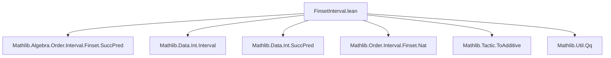
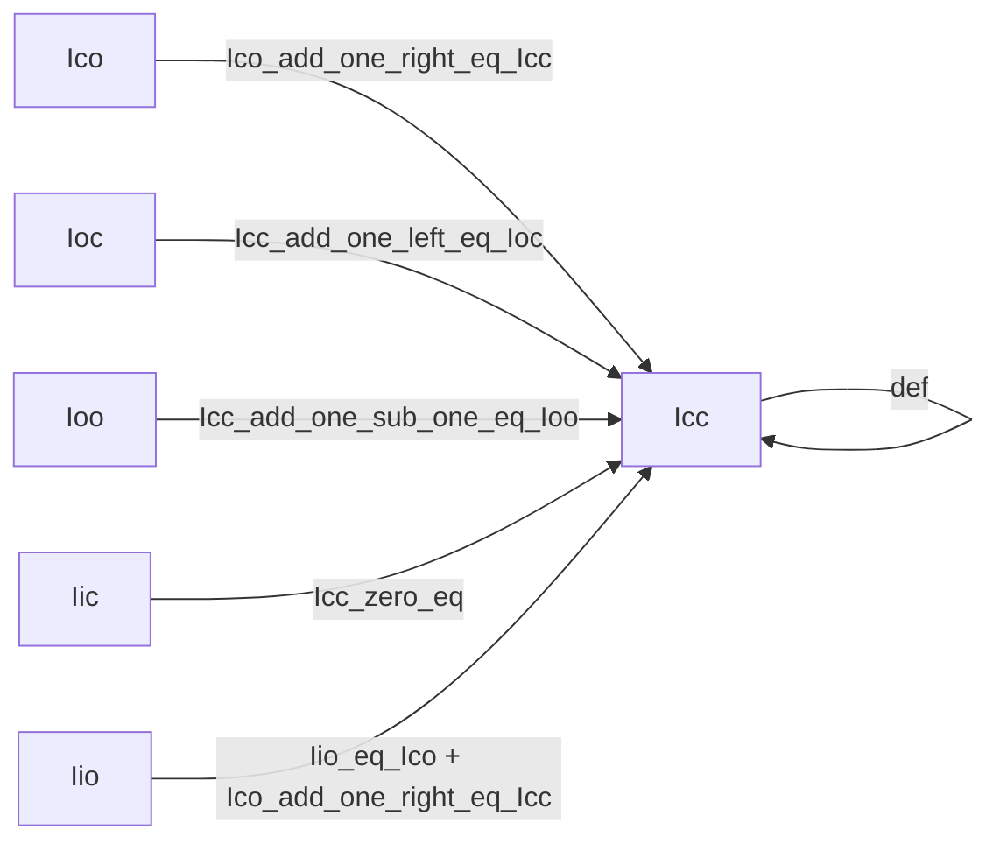

### Technical Brief: `FinsetInterval.lean`

---

#### **1. Key Definitions & Theorems**

| Name | Type / Signature | Purpose |
|------|------------------|---------|
| `evalFinsetIccNat` | `ℕ → ℕ → Q(ℕ) → Q(ℕ) → MetaM (Q(Finset ℕ) × Q(Icc _ _ = _))` | Computes closed interval `[m, n]` over `ℕ` for numerals, returning a finite set term and a proof. |
| `evalFinsetIccInt` | `ℤ → ℤ → Q(ℤ) → Q(ℤ) → MetaM (Q(Finset ℤ) × Q(Icc _ _ = _))` | Same as above, but for `ℤ`. Handles signed numerals. |
| `Icc_eq_empty_of_lt` | `n < m → Icc m n = ∅` | Proves empty interval when lower bound exceeds upper bound. |
| `Icc_eq_insert_of_Icc_succ_eq` | `m ≤ n → Icc (m + 1) n = s → Icc m n = insert m s` | Recursive definition of `Icc` via insertion of lower bound. |
| `Ico_succ_eq_of_Icc_eq` | `Icc m n = s → Ico m (n + 1) = s` | Relates half-open interval `Ico` to closed `Icc`. |
| `Ioc_eq_of_Icc_succ_eq` | `Icc (m + 1) n = s → Ioc m n = s` | Relates `Ioc` to `Icc`. |
| `Ioo_eq_of_Icc_succ_pred_eq` | `Icc (m + 1) (n - 1) = s → Ioo m n = s` | Relates open interval `Ioo` to `Icc`. |
| `Iic_eq_of_Icc_zero_eq` | `Icc 0 n = s → Iic n = s` | Relates upper-closed interval `Iic` to `Icc`. |
| `Iio_succ_eq_of_Icc_zero_eq` | `Icc 0 n = s → Iio (n + 1) = s` | Relates strictly upper-bounded `Iio` to `Icc`. |
| `Ico_zero` | `Ico m 0 = ∅` | Base case for `Ico` when upper bound is zero. |
| `Iio_zero` | `Iio 0 = ∅` | Base case for `Iio` at zero. |

**Simprocs (Meta-level):**
| Name | Target | Description |
|------|--------|-------------|
| `Icc_ofNat_ofNat` | `Icc _ _` | Computes `Icc` for numerals in `ℕ` or `ℤ`. |
| `Ico_ofNat_ofNat` | `Ico _ _` | Computes `Ico` using reduction to `Icc`. |
| `Ioc_ofNat_ofNat` | `Ioc _ _` | Computes `Ioc` using reduction to `Icc`. |
| `Ioo_ofNat_ofNat` | `Ioo _ _` | Computes `Ioo` using reduction to `Icc`. |
| `Iic_ofNat` | `Iic _` | Computes `Iic` via `Icc 0 n`. |
| `Iio_ofNat` | `Iio _` | Computes `Iio` via `Icc 0 n`. |

---

#### **2. Naming Conventions**

- **Prefixes:**
  - `Icc_`, `Ico_`, `Ioc_`, `Ioo_`, `Iic_`, `Iio_`: Interval type prefixes.
  - `evalFinsetIcc*`: Evaluation functions for simprocs.
- **Suffixes:**
  - `_ofNat_ofNat`: Simprocs for natural/integer literals.
  - `_eq_of_*`: Equational lemmas linking interval variants.
  - `_of_*`: Reduction lemmas (e.g., `Ico_succ_eq_of_Icc_eq`).
- **Internal helpers:**
  - `insert_Icc_add_one_left_eq_Icc`, `Icc_add_one_left_eq_Ioc`, `Icc_sub_one_right_eq_Ico`, etc.: Structural lemmas from `Mathlib.Order.Interval.Finset.Nat` and `SuccPred`.

---

#### **3. Tactic Stack**

- **Core tactics used:**
  - `simp`, `rw`, `refl`, `exact`, `mkNatLitQ`, `mkIntLitQ`, `mkDecideProofQ`
  - `q(...)`, `q($...)`: Quotation machinery (`Qq`).
  - `match`, `do`, `←`, `let ... ←`: Monadic binding in `MetaM`.
- **Decision procedures:**
  - `decide` via `mkDecideProofQ` for `≤`, `<`, `=`.
- **Meta-level helpers:**
  - `em.nat?`, `en.int?`: Pattern matching on literal numerals.
  - `q(Eq.refl true)`: Constructing trivial equalities.

---

#### **4. Proof Logic**

- **Recursive decomposition of intervals:**
  - **Base case:** `m = n ⇒ Icc m n = {m}` (handled separately to avoid `insert m ∅`).
  - **Recursive case:** `m < n ⇒ Icc m n = insert m (Icc (m + 1) n)`.
  - **Empty case:** `n < m ⇒ Icc m n = ∅`.
- **Reduction strategy:**
  - All other interval types (`Ico`, `Ioc`, `Ioo`, `Iic`, `Iio`) are reduced to `Icc` using lemmas.
  - For `Ico m n`, reduce to `Icc m (n - 1)` (or `Icc m (n + 1)` depending on direction).
  - For `Ioo m n`, reduce to `Icc (m + 1) (n - 1)`.
- **Induction is implicit** in the recursive `evalFinsetIcc*` functions.

---

#### **5. Imports**

| Module | Purpose |
|--------|---------|
| `Mathlib.Algebra.Order.Interval.Finset.SuccPred` | Lemmas about `succ`/`pred` in intervals. |
| `Mathlib.Data.Int.Interval` | Interval definitions for `ℤ`. |
| `Mathlib.Data.Int.SuccPred` | Successor/predecessor on `ℤ`. |
| `Mathlib.Order.Interval.Finset.Nat` | Interval definitions and lemmas for `ℕ`. |
| `Mathlib.Tactic.ToAdditive` | For additive variants of multiplicative lemmas. |
| `Mathlib.Util.Qq` | Quotation and meta-programming utilities. |

---

#### **8. Mermaid Diagrams**

##### **Dependency Graph (Module-Level)**



##### **Interval Reduction Overview**



##### **Simproc Evaluation Flow**

```mermaid
graph TD
  Start[Simproc triggered on Icc a b] --> CheckType{Type?}
  CheckType -->|ℕ| EvalNat[evalFinsetIccNat]
  CheckType -->|ℤ| EvalInt[evalFinsetIccInt]
  EvalNat --> Compare{m = n?}
  Compare -->|Yes| Singleton[{m}]
  Compare -->|No| Less{m < n?}
  Less -->|Yes| Insert[insert m (Icc (m+1) n)]
  Less -->|No| Empty[∅]
  EvalInt --> SameLogic
```

---

### Summary

This file implements **efficient simprocs** for evaluating finite intervals (`Icc`, `Ico`, `Ioc`, `Ioo`, `Iic`, `Iio`) over numerals in `ℕ` and `ℤ`. It leverages recursive structural lemmas to reduce all interval types to `Icc`, then computes the result via a meta-level evaluator. The design avoids simp explosion by making simprocs *non-simp* by default, and includes performance warnings about `Finset.insert_eq_of_mem`. The code is highly structured, with clear separation between `ℕ` and `ℤ` handling due to differing numeral representations.
