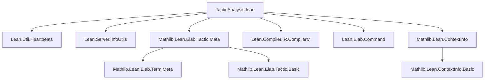
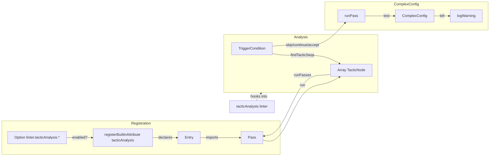

### Technical Brief: `TacticAnalysis.lean`

---

#### **1. Key Definitions & Theorems**

| Name | Type | Purpose |
|------|------|---------|
| `TacticNode` | `structure` | Represents a single tactic in a tactic sequence, with context info, tactic info, and a `mayFail` flag. |
| `TacticNode.runTacticCode` | `abbrev` | Convenience wrapper for executing tactic code in the context of a `TacticNode`. |
| `Config` | `structure` | Low-level interface for a tactic analysis pass: a function `Array TacticNode → CommandElabM Unit`. |
| `Pass` | `structure` | Extends `Config` with an associated `Option Bool` to control whether the pass is enabled. |
| `Entry` | `structure` | Pairs a declaration name (of type `Config`) with the name of its corresponding option. |
| `Entry.import` | `def` | Loads a `Pass` from a declaration and its option name. |
| `tacticAnalysisExt` | `initialize PersistentEnvExtension` | Environment extension to register and store tactic analysis passes. |
| `registerBuiltinAttribute tacticAnalysis` | `initialize` | Attribute processor to register new tactic analysis passes via `@[tacticAnalysis <option_name>]`. |
| `findTacticSeqs` | `def` | Parses an `InfoTree` to extract maximal tactic sequences (joined by `;` or newlines). |
| `runPasses` | `def` | Filters enabled passes and runs them on tactic sequences from `InfoTree`s. |
| `tacticAnalysis` | `def` | Main linter entry point: hooks into Lean’s linting system to run tactic analysis. |
| `TriggerCondition` | `inductive` | Controls how subsequences of tactics are accumulated and tested (`skip`, `continue`, `accept`). |
| `ComplexConfig` | `structure` | High-level interface for building analysis rounds: `trigger`, `test`, `tell`. |
| `testTacticSeq` | `def` | Runs a `ComplexConfig.test` on a tactic sequence, comparing original vs. new performance. |
| `runPass` | `def` | Drives `ComplexConfig` over a tactic sequence using `trigger` to determine subsequences to test. |
| `Config.ofComplex` | `def` | Converts a `ComplexConfig` into a `Config`, enabling integration with the low-level framework. |

---

#### **2. Naming Conventions**

- **Prefixes**:
  - `tacticAnalysis` — module and namespace root.
  - `linter.tacticAnalysis.` — option names for enabling passes (e.g., `linter.tacticAnalysis.dummy`).
  - `run`, `test`, `trigger`, `tell`, `accept`, `continue`, `skip` — verbs for analysis steps.
- **Suffixes**:
  - `Config` — for configuration structures (`Config`, `ComplexConfig`).
  - `Pass` — for internal pass representation (`Pass`, `runPass`).
  - `Node` — for tactic-level data (`TacticNode`).
  - `Seq` — for tactic sequences (`findTacticSeqs`, `tacticSeq`).
- **Modifiers**:
  - `mayFail`, `ctxI`, `tacI`, `opt`, `declName`, `optionName` — descriptive field names.

---

#### **3. Tactic Stack**

The file is **meta-level** and **non-tactic** (i.e., it defines infrastructure, not tactic proofs). Tactics are *analyzed*, not used *within* this file. However, the following **Lean metaprogramming tactics/constructs** appear in the implementation:

| Tactic / Construct | Usage |
|--------------------|-------|
| `do` / `←` / `let` | Standard monadic binding in `CommandElabM`, `ImportM`, etc. |
| `withRef`, `withHeartbeats` | For scoping and performance measurement. |
| `match` / `if let` | Pattern matching on syntax, options, and `TriggerCondition`. |
| `register_option`, `registerBuiltinAttribute` | For option and attribute registration. |
| `env.evalConst`, `evalConstCheck` | Runtime evaluation of declarations. |
| `visitM`, `filterMap`, `flatten`, `push`, `map` | Tree traversal and array manipulation. |
| `logWarning`, `logWarningAt` | Reporting diagnostics. |
| `throwError`, `throwUnsupportedSyntax` | Error handling in attribute processor. |

No `simp`, `ring`, `aesop`, or proof automation tactics are used — this is infrastructure code.

---

#### **4. Proof Logic / Logical Flow**

This file contains **no theorems or proofs** in the traditional sense. Instead, it defines a **framework for program analysis**, with the following logical flow:

1. **Registration**:
   - Options (`linter.tacticAnalysis.*`) enable/disable passes.
   - `@[tacticAnalysis ...]` attribute registers a `Config` as a pass.

2. **Parsing**:
   - `findTacticSeqs` traverses `InfoTree`s to extract tactic sequences (maximal `;`- or newline-joined blocks).

3. **Execution**:
   - `runPasses` filters enabled passes and runs `config.run seq` on each sequence.

4. **High-level analysis (via `ComplexConfig`)**:
   - `trigger` accumulates subsequences (`skip`, `continue`, `accept`).
   - On `accept`, `test` runs a proposed refactoring and compares performance.
   - `tell` decides whether to emit a warning.

5. **Integration**:
   - `tacticAnalysis` is registered as a linter and invoked during compilation/linting.

---

#### **5. Imports**

| Import | Purpose |
|--------|---------|
| `Lean.Util.Heartbeats` | Performance measurement (`withHeartbeats`). |
| `Lean.Server.InfoUtils` | `InfoTree`, `TacticInfo`, `ContextInfo`. |
| `Mathlib.Lean.Elab.Tactic.Meta` | Tactics and metavariable utilities. |
| `Lean.Compiler.IR.CompilerM` | IR compilation monad (used for evaluation). |
| `Lean.Elab.Command` | Command elaboration monad (`CommandElabM`). |
| `Mathlib.Lean.ContextInfo` | Extended context info for tactic execution. |

---

#### **6. Mermaid Diagrams**

##### **Dependency Graph (Module-Level)**



##### **Framework Architecture Overview**



##### **Tactic Sequence Extraction Flow**

```mermaid
graph TD
  Tree[InfoTree] -->|visitM| Filter[Filter children]
  Filter -->|tacticSeq| Seq[New tactic sequence]
  Filter -->|tacticTry_/anyGoals| Fail[Set mayFail := true]
  Filter -->|tactic| Node[⟨ctx, tacI, mayFail⟩]
  Seq -->|push| Out[Array (Array TacticNode)]
```

---

#### **7. Notes & Caveats**

- **Unstable API**: `ComplexConfig` is explicitly marked **work in progress**; its interface may change.
- **No proofs**: This is infrastructure — correctness is ensured via Lean’s metaprogramming safety, not theorem proving.
- **Performance-sensitive**: Uses `withHeartbeats` to compare refactoring cost.
- **Batch mode**: Designed for large-scale refactoring suggestions, not just inline linting.

--- 

✅ **End of Technical Brief**
