**Technical Brief: `Declarations.lean` — Tactic Linters for Lean 4**

---

### 1. KEY DEFINITIONS & THEOREMS

| Name | Type | Purpose |
|------|------|---------|
| `TerminalReplacementOutcome` | `inductive` | Return type for `terminalReplacement`: encodes success, remaining goals, or error after tactic replacement. |
| `terminalReplacement` | `def` | Core framework for replacing one terminal tactic with another; returns diagnostic messages based on success/failure/slowdown. |
| `termToGrindParam` | `def` | Converts a term syntax into a `grindParam`, wrapping identifiers in `id` to prevent e-matching misinterpretation. |
| `grindReplacementWith` | `def` | Specialization of `terminalReplacement` for replacing tactics with `grind`, optionally extracting and filtering arguments. |
| `linarithToGrindRegressions` | `def` | Linter pass to detect places where `grind` fails to replace `linarith`. |
| `ringToGrindRegressions` | `def` | Linter pass to detect places where `grind` fails to replace `ring`. |
| `omegaToLiaRegressions` | `def` | Reports cases where `lia` fails to replace `omega`. |
| `omegaToLia` | `def` | Reports *successful* replacements of `omega` by `lia`. |
| `rwMerge` | `def` | Suggests merging adjacent `rw` tactics if the merged version solves the goal. |
| `mergeWithGrind` | `def` | Suggests replacing `tac; grind` with just `grind` when `grind` alone solves the goal. |
| `terminalToGrind` | `def` | Detects terminal tactic sequences of length ≥3 that can be replaced by `grind`. |
| `tryAtEachStepCore` | `def` | Generic framework to try a tactic at each step in a proof, reporting replacements with optional timing. |
| `tryAtEachStep` | `def` | Wrapper for `tryAtEachStepCore` with automatic tactic syntax parsing. |
| `tryAtEachStepFromStrings` | `def` | Variant of `tryAtEachStep` accepting tactic as a string (e.g., `"simp; grind"`). |
| `tryAtEachStepFromEnvImpl` | `def` | Environment-driven variant: reads tactic from `TRY_AT_EACH_STEP_TACTIC`. |
| `tryAtEachStepGrind`, `tryAtEachStepSimpAll`, etc. | `def`s | Convenience linters for common tactics (`grind`, `simp_all`, `aesop`, etc.). |
| `introMerge` | `def` | Suggests merging adjacent `intro` tactics when safe. |

---

### 2. NAMING CONVENTIONS

- **Prefixes**:
  - `terminalReplacement`, `grindReplacementWith`: generic framework functions.
  - `tryAtEachStep*`: step-wise replacement linters.
  - `*ToGrind`, `*ToLia`: specific replacements *to* a target tactic.
  - `*Regressions`: linters that report *failures* of the replacement (e.g., `linarithToGrindRegressions`).
- **Suffixes**:
  - `Regressions`: reports *where replacement fails* (e.g., `omegaToLiaRegressions`).
  - No suffix (e.g., `omegaToLia`): reports *successful* replacements.
- **Helper functions**:
  - `termToGrindParam`, `tryAtEachStepCore`, `mergeWithGrindAllowed`: internal utilities.
- **Option names**:
  - `linter.tacticAnalysis.*`: hierarchical option names (e.g., `linter.tacticAnalysis.rwMerge`).

---

### 3. TACTIC STACK

Frequent tactics used in this file:

| Tactic | Usage |
|--------|-------|
| `try ... catch _ => ...` | Error handling around tactic execution. |
| `withHeartbeats` | Measure runtime cost of tactic sequences. |
| `runTacticCode`, `runTactic` | Execute tactics in controlled contexts (e.g., `ctxI.runTacticCode`). |
| `mkNode`, `mkIdent`, `mkAtom`, `mkNullNode` | Syntax construction for tactic AST. |
| `ofExcept`, `guard`, `guard'` | Parsing and validation utilities. |
| `ppTactic`, `PrettyPrinter.ppTactic` | Pretty-printing tactics for diagnostics. |
| `withOptions` | Temporarily set options (e.g., `pp.mvars := false`). |
| `logWarningAt`, `logInfoAt` | Emit diagnostic messages at source locations. |
| `liftCoreM`, `liftMetaM` | Lift operations into `CommandElabM`. |
| `Std.HashSet` operations (`insert`, `contains`, `foldl`) | For tracking local context names. |

---

### 4. PROOF LOGIC

The logical flow across most linters follows this pattern:

1. **Trigger**: Identify candidate tactic(s) via syntax pattern matching (`trigger`).
2. **Test**: Attempt to replace the tactic with a new one, using:
   - `runTacticCode` to execute the replacement.
   - `withHeartbeats` to measure performance.
   - Goal state inspection (`goals.isEmpty`) to determine success.
3. **Report**: Use `tell` to generate diagnostic messages:
   - Success: `"X can be replaced with Y"`.
   - Failure: `"X succeeded but Y failed"` or `"Y left unsolved goals"`.
   - Slowdown: `"Y is slower: X heartbeats → Y heartbeats"`.

Specialized logic:
- `terminalToGrind`: Iterates *backwards* through tactic sequences to find replaceable suffixes.
- `mergeWithGrind`: Checks if `tac; grind` can be simplified to `grind`.
- `rwMerge`: Concatenates adjacent `rw` arguments and tests if merged `rw` solves the goal.
- `introMerge`: Accumulates `intro` arguments and tests if a single multi-`intro` suffices.

---

### 5. IMPORTS

| Module | Purpose |
|--------|---------|
| `Mathlib.Tactic.TacticAnalysis` | Core tactic analysis framework (trigger/test/tell). |
| `Lean.Elab.Command` | Command elaboration utilities (e.g., `runTactic`, `withHeartbeats`). |
| `Mathlib.Tactic.ExtractGoal` | Goal extraction for error reporting (e.g., `goalSignature`). |
| `Mathlib.Util.ParseCommand` | Command parsing utilities (e.g., `ofExcept`, `guard`). |

---

### 6. DEPENDENCY & OVERVIEW DIAGRAM

```mermaid
graph TD
  A[Declarations.lean] --> B[Mathlib.Tactic.TacticAnalysis]
  A --> C[Lean.Elab.Command]
  A --> D[Mathlib.Tactic.ExtractGoal]
  A --> E[Mathlib.Util.ParseCommand]

  B --> F[TacticAnalysis.Config]
  B --> G[ContextInfo]
  B --> H[TacticInfo]

  C --> I[CommandElabM]
  C --> J[withHeartbeats]
  C --> K[runTacticCode]

  D --> L[goalSignature]
  D --> M[ExtractGoal]

  E --> N[ofExcept]
  E --> O[guard]

  A --> P[linarithToGrindRegressions]
  A --> Q[ringToGrindRegressions]
  A --> R[omegaToLiaRegressions]
  A --> S[omegaToLia]
  A --> T[rwMerge]
  A --> U[mergeWithGrind]
  A --> V[terminalToGrind]
  A --> W[tryAtEachStep*]
  A --> X[introMerge]

  style A fill:#f9f,stroke:#333,stroke-width:2px
  style B fill:#bbf,stroke:#333,stroke-width:1px
  style C fill:#bfb,stroke:#333,stroke-width:1px
  style D fill:#fbb,stroke:#333,stroke-width:1px
  style E fill:#fbf,stroke:#333,stroke-width:1px
```

#### Overview of `Declarations.lean`

This module implements **tactic linters** built on top of `Mathlib.TacticAnalysis`. It provides:

- **Generic infrastructure** (`terminalReplacement`, `tryAtEachStepCore`) for replacing and comparing tactics.
- **Specialized linters** targeting common replacements:
  - `linarith`/`ring`/`omega` → `grind`
  - `omega` → `lia`
  - `rw`/`intro` merging
  - `tac; grind` → `grind`
- **Configurable reporting** (success/failure/slowdown) via `register_option`s.
- **Environment-driven extensibility** (`tryAtEachStepFromEnv`) for external tooling (e.g., hammer-bench).

It serves as a **diagnostic engine** for automated proof optimization and regression detection in Mathlib.

--- 

Let me know if you'd like a formalized signature of `terminalReplacement` or a proof sketch of `terminalToGrind`'s correctness.
