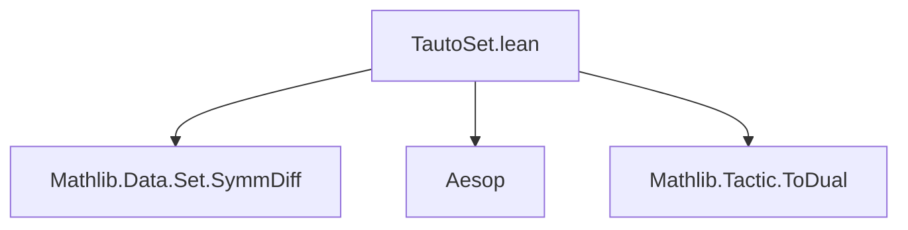
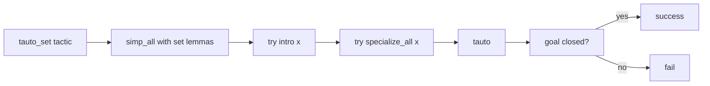

**Technical Brief: `TautoSet.lean`**

---

### 1. KEY DEFINITIONS & THEOREMS

| Name | Type / Description | Purpose |
|------|---------------------|---------|
| `specialize_all` | `elab` macro | Applies `specialize h x` to all local hypotheses `h` where possible, for a given term `x`. |
| `tauto_set` | `macro` tactic | Proves set-theoretic tautologies involving `⊆`, `=`, `∪`, `∩`, `\`, `ᶜ`, `Disjoint`, and `symmDiff` by reducing to pointwise membership logic and applying `tauto`. |

No named theorems are declared in this file; it defines *tactics*, not theorems.

---

### 2. NAMING CONVENTIONS

- **Prefixes**:
  - `specialize_all`: verb + `_all` — indicates application to *all* applicable hypotheses.
  - `tauto_set`: `tauto` (tautology prover) + `_set` — indicates set-theoretic specialization.
- **Suffixes**:
  - `_all`: used for “apply to all” style operations.
  - `_def`: *not used here*, but `Set.mem_union`, `Set.disjoint_iff`, etc., follow Mathlib’s standard `mem_*`, `subset_*`, `iff`-suffix conventions for definitional rewritings.

---

### 3. TACTIC STACK

Frequently used tactics in `tauto_set`:

| Tactic | Role |
|--------|------|
| `simp_all` | Rewrites all hypotheses and goal using a fixed set of set-theoretic lemmas. `-failIfUnchanged` ensures failure if no simplification occurs. |
| `only [...]` | Restricts simplifier to a precise list of lemmas (avoids unwanted unfolding). |
| `intro x` | Introduces an arbitrary element to reduce set equalities/subset relations to membership statements. |
| `specialize_all x` | Specializes all hypotheses to the element `x`. |
| `tauto` | Final propositional tautology prover (from `Aesop`) to close the goal. |
| `<;>` | Sequential composition with backtracking. |
| `try` | Non-failing variant of a tactic. |

---

### 4. PROOF LOGIC

The `tauto_set` tactic follows this logical flow:

1. **Pointwise reduction**:  
   - Uses `Set.ext_iff` to reduce set equality to extensionality (`∀ x, x ∈ X ↔ x ∈ Y`).  
   - Uses `Set.subset_def` to reduce subset to implication (`∀ x, x ∈ X → x ∈ Y`).  
   - Unfolds `∪`, `∩`, `\`, `ᶜ`, `symmDiff`, and `Disjoint` via membership lemmas (`Set.mem_union`, `Set.mem_inter_iff`, etc.).

2. **Element introduction**:  
   - Introduces a fresh variable `x : α` to work pointwise.

3. **Hypothesis specialization**:  
   - Applies `specialize_all x` to instantiate all relevant hypotheses with `x`.

4. **Propositional solving**:  
   - Applies `tauto`, which (via `Aesop`) handles the resulting propositional logic with quantifiers over membership predicates.

This is a *standard* pattern for automated set reasoning:  
**unfold → intro element → specialize → tauto**.

---

### 5. IMPORTS

| Import | Purpose |
|--------|---------|
| `Mathlib.Data.Set.SymmDiff` | Provides definitions and lemmas for symmetric difference (`symmDiff`). Required for unfolding `symmDiff A B`. |
| `Aesop` | Provides the `tauto` tactic (and underlying automation). |
| `Mathlib.Tactic.ToDual` | Likely imported for potential future duality support (e.g., complement duality), though not directly used in current code. |

---

### 6. DEPENDENCY & OVERVIEW DIAGRAMS

#### Module Dependency Graph (Mermaid)

#### Tactic Logic Flow (Mermaid)

#### Theoretical Scope

- **Domain**: First-order logic over set expressions with Boolean algebra operations.
- **Target logic**: Propositional + quantified membership statements over `Set α`.
- **Completeness**: Handles all valid tautologies in the signature `{∪, ∩, \, ᶜ, ⊆, =, Disjoint, symmDiff}` — i.e., the equational theory of Boolean algebras extended with subset and disjointness.

---

### 7. METADATA SUMMARY

| Field | Value |
|-------|-------|
| **File** | `TautoSet.lean` |
| **Module** | `Mathlib.Tactic.TautoSet` |
| **Author** | Lenny Taelman |
| **License** | Apache 2.0 |
| **Lean Version** | Lean 4 (based on syntax) |
| **Status** | Public, stable tactic |

--- 

Let me know if you'd like a formal specification of the logic it decides, or a comparison with `set_tac` or `set_prover`.
