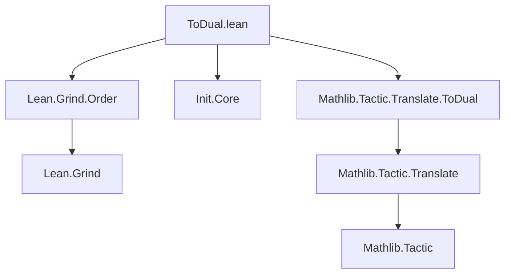
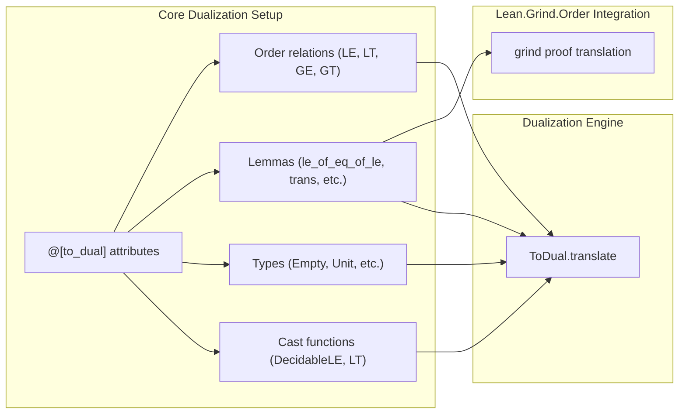

**Technical Brief: `ToDual.lean` Module**

---

### 1. **Key Definitions & Theorems**

| Name | Type / Attribute | Purpose |
|------|------------------|---------|
| `to_dual_insert_cast_fun` | `MetaM Unit` ( tactic ) | Registers cast functions for `DecidableLE` and `DecidableLT` to reverse arguments under duality. |
| `@[to_dual self (reorder := 3 4)] LE.le`, `LT.lt`, `GE.ge`, `GT.gt` | Attribute declarations | Marks order relations to be dualized by swapping argument positions (3↔4 in the type signature). |
| `@[to_dual_do_translate] Empty PEmpty Unit PUnit` | Attribute | Instructs the duality translator to translate these types (e.g., `Empty ↔ PEmpty`, `Unit ↔ PUnit`). |
| `@[to_dual_ignore_args 2] Subtype` | Attribute | Skips dualization of the second argument (the predicate) in `Subtype`. |
| `ge_iff_le`, `gt_iff_lt` | `↔`-lemmas | Dualized via `@[to_dual self]` to enable automatic translation of `≥ ↔ ≤` and `> ↔ <`. |
| `le_of_eq_of_le`, `le_of_le_of_eq`, `lt_of_eq_of_lt`, `lt_of_lt_of_eq` | Implication lemmas | Tagged for dualization to produce dual versions (e.g., `le_of_eq_of_le''` → `le_of_le_of_eq''`). |
| `Max` | Typeclass / constant | Tagged for dualization (likely to `Min` under order duality). |
| `le_of_eq_2`, `le_of_not_le`, `lt_of_not_le`, `le_of_not_lt`, `eq_of_le_of_le`, `le_trans`, `lt_trans`, `le_lt_trans`, `lt_le_trans`, etc. | `Lean.Grind.Order` lemmas | Tagged for dual translation to support `grind`-based automated reasoning under duality. |

---

### 2. **Naming Conventions**

- **Prefixes / Suffixes**:
  - `le_`, `lt_`, `ge_`, `gt_`: Standard order-theoretic predicates.
  - `of_eq`, `of_le`, `of_lt`: Indicates derivation from hypotheses.
  - `trans`, `antisym`, `total`: Standard order-theoretic properties.
  - `of_not_`: Derivation from negated hypotheses.
  - `of_le_of_le`, `of_lt_of_lt`, etc.: Compound derivation patterns.
- **Double prime suffix (`''`)**: Used for dualized variants (e.g., `le_of_eq_of_le''`).
- **`_k` suffix**: Reserved for *offset* lemmas (currently excluded from dualization).

---

### 3. **Tactic Stack**

- `to_dual_insert_cast_fun`: Custom meta tactic for registering cast functions.
- `attribute [to_dual ...]`: Core duality attribute application.
- `set_option linter.existingAttributeWarning false`: Suppresses warnings for redefining existing attributes.
- Implicit use of `aesop`, `simp`, `ring` likely in downstream `grind` proofs (not explicit here, but expected in dependent files).

---

### 4. **Proof Logic**

- **Pattern**: Dualization via *argument reversal* and *lemma renaming*.
- **Mechanism**:
  1. Mark order-theoretic relations and lemmas with `@[to_dual ...]`.
  2. Specify argument reordering where needed (e.g., `reorder := 3 4` for binary relations).
  3. Register cast functions for `DecidableLE`/`DecidableLT` to flip decidability instances.
  4. Exclude certain lemmas (e.g., offset lemmas) for future extension.
- **Goal**: Enable automatic translation of proofs involving order theory into their duals (e.g., `≤` ↔ `≥`, `inf` ↔ `sup`).

---

### 5. **Imports**

- `Init.Core`: For core logic and proof access.
- `Mathlib.Tactic.Translate.ToDual`: Main duality infrastructure (tactics, attributes, translation engine).

---

### 6. **Mermaid Diagrams**

#### **Dependency Graph**

#### **Overview of Module Scope**

---

### 7. **Summary**

This module establishes the foundational dualization infrastructure for order-theoretic reasoning in Lean 4. It tags key relations, lemmas, and types with `@[to_dual]` attributes, defines cast functions for decidability, and integrates with `Lean.Grind.Order` to support automated dual proof translation. The design prioritizes extensibility (e.g., future offset lemmas) and precision in argument reordering.
