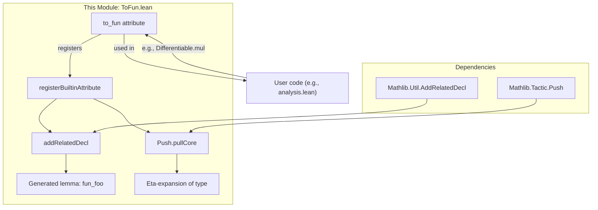

**Technical Brief: `ToFun.lean` Module**

---

### 1. KEY DEFINITIONS & THEOREMS

| Name | Type / Purpose |
|------|----------------|
| `to_fun` | **Attribute syntax** (`attr`): A user-facing Lean attribute that, when applied to a lemma, generates an eta-expanded variant with `fun`-abstraction introduced in place of point-free function expressions. |
| `registerBuiltinAttribute` (for `to_fun`) | **Initialization code**: Registers the `to_fun` attribute with Lean’s attribute system. It defines the behavior of the attribute at application time (post-compilation), including validation, declaration generation, and eta-expansion via `Push.pullCore`. |
| `addRelatedDecl` | **Helper function** (imported from `Mathlib.Util.AddRelatedDecl`): Used internally to generate a new declaration (e.g., `fun_foo`) derived from the original (`foo`), with customizable naming, docstring, and type adjustment. |
| `Push.pullCore` | **Core tactic utility** (imported from `Mathlib.Tactic.Push`): Performs the eta-expansion transformation on the lemma’s type by converting λ-abstractions or point-free expressions into explicit `fun x ↦ …` form. |

**No theorems are proven in this file** — it is a *tactic/attribute infrastructure* module.

---

### 2. NAMING CONVENTIONS

- **Prefix**: `fun_`  
  - Generated lemmas are named by prepending `fun_` to the original lemma name (e.g., `Differentiable.mul` → `Differentiable.fun_mul`).
- **Attribute name**: `to_fun`  
  - Used as `@[to_fun]` or `@[to_fun (attr := ...)]`.
- **Internal naming**:  
  - `src.appendBefore "fun_"` — standard naming pattern for derived declarations.
  - `docstringPrefix? := s!"Eta-expanded form of `{src}`"` — consistent documentation prefix.

---

### 3. TACTIC STACK

| Tactic / Utility | Role |
|------------------|------|
| `Push.pullCore` | Core transformation engine: extracts and rewrites λ/point-free expressions into `fun`-form. |
| `mkExpectedTypeHint` / `mkAppOptM ``cast``` | Type-correctness maintenance: ensures the new term has the eta-expanded type (via `cast` if needed). |
| `inferType` | Type inference for the original declaration. |
| `MetaM.run'` | Runs the monadic tactic logic in the `MetaM` context. |
| `throwError` / `throwUnsupportedSyntax` | Error handling for misuse or unsupported syntax. |

No user-facing tactics (e.g., `simp`, `rw`) appear — this is purely *meta-level* code.

---

### 4. PROOF LOGIC

This file contains **no proofs**, only *meta-programming logic* for declaration transformation. The logical flow is:

1. **Input**: A lemma `foo` with type `t`.
2. **Check**: Ensure `@[to_fun]` is applied globally.
3. **Transform**: Use `Push.pullCore .lambda` to eta-expand `t` → `t'`.
4. **Validate**: If no change (`t' = t`), error out.
5. **Adjust term**: Use `cast` or `mkExpectedTypeHint` to align the original proof term with `t'`.
6. **Register**: Emit new declaration `fun_foo` with adjusted type and docstring.

---

### 5. IMPORTS

| Module | Purpose |
|--------|---------|
| `Mathlib.Util.AddRelatedDecl` | Provides `addRelatedDecl`, the core utility for generating derived declarations. |
| `Mathlib.Tactic.Push` | Provides `Push.pullCore`, the eta-expansion engine. |
| `Lean.Meta Elab Tactic` | Standard Lean metaprogramming imports for tactic/attribute manipulation. |

---

### 6. DEPENDENCY & OVERVIEW DIAGRAM



```mermaid
graph LR
  subgraph "Theory Scope"
    X["Point-free lemmas"] -->|@[to_fun]| Y["Applied-form lemmas"]
    Y --> Z["Continuity/differentiability applications"]
  end

  subgraph "Implementation"
    A["to_fun attr"] --> B["Meta transformation"]
    B --> C["fun_ prefixed decl"]
  end
```

---

### 7. USE CASE EXAMPLE

Given:
```lean
theorem Differentiable.mul (hf : Differentiable 𝕜 f) (hg : Differentiable 𝕜 g) :
    Differentiable 𝕜 (f * g)
```

Applying `@[to_fun]` yields:
```lean
@[to_fun]
theorem Differentiable.mul ...
-- generates:
theorem Differentiable.fun_mul (hf : Differentiable 𝕜 f) (hg : Differentiable 𝕜 g) :
    Differentiable 𝕜 (fun x => f x * g x)
```

This is useful for applying continuity/differentiability lemmas in contexts where functions are explicitly written as `fun x ↦ …`.

---

### 8. SUMMARY

- **Purpose**: Automate eta-expansion of point-free lemmas into explicit `fun`-form.
- **Mechanism**: Meta-level attribute with `Push.pullCore`-driven transformation.
- **Scope**: Foundational tactic infrastructure for analysis/functional programming libraries (e.g., `Mathlib`).
- **Key innovation**: Seamless bridge between point-free and pointwise reasoning via attribute-driven metaprogramming.

--- 

*End of technical brief.*
