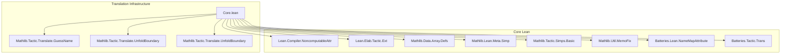

**Technical Brief: Translation Attribute Implementation in `Core.lean`**

---

### 1. KEY DEFINITIONS & THEOREMS

| Name | Type / Signature | Purpose |
|------|------------------|---------|
| `Reorder` | `abbrev Reorder := List (List Nat)` | Represents a permutation of arguments using disjoint cycle notation. |
| `TranslationInfo` | `structure TranslationInfo` | Stores translation metadata: target name, reorder info, relevant argument index. |
| `TranslateData` | `structure TranslateData` | Encapsulates all data for a translation attribute (e.g., `to_additive`, `to_dual`). Includes maps for `ignoreArgs`, `doTranslate`, `translations`, and configuration flags. |
| `findTranslation?` | `def findTranslation? (env : Environment) (t : TranslateData) : Name → Option TranslationInfo` | Looks up translation info for a given name in the environment. |
| `findPrefixTranslation?` | `def findPrefixTranslation? ... : Option TranslationInfo` | Looks up translation for a name or its prefix (for auto-generated declarations like `IsRegular.casesOn`). |
| `insertTranslation` | `def insertTranslation ... : CoreM Unit` | Adds a translation (and reverse, if dual) to the global translation map. Includes linter warnings for overwrites. |
| `Config` | `structure Config` | Holds user-provided options for `to_additive`/`to_dual` tactics (e.g., `reorder`, `existing`, `self`, `attrs`). |
| `shouldTranslate` | `def shouldTranslate ... : Option Expr` | Determines whether an expression contains a *non-fixed* translatable constant (e.g., blocks on `ℕ`, `ℝ`). |
| `applyReplacementFun` | `partial def applyReplacementFun ... : MetaM Expr` | Recursively replaces constants in an expression using translation info, including reordering and numeral changes. |
| `updateDecl` | `def updateDecl ... : MetaM ConstantInfo` | Transforms a declaration (type + value) using translation info, reordering, and optional unfolding boundaries. |
| `etaExpandN` | `def etaExpandN (n : Nat) (e : Expr) : MetaM Expr` | Eta-expands an expression to ensure sufficient arguments for reordering. |
| `changeNumeral` | `def changeNumeral : Expr → Expr` | Replaces `1` with `0` in numeral literals (used for additive translation of multiplicative numerals). |

**No named theorems** — this file is implementation-focused on *tactic infrastructure*, not mathematical theorems.

---

### 2. NAMING CONVENTIONS

- **Prefixes**:
  - `find*?`: Optional lookup functions (`findTranslation?`, `findPrefixTranslation?`).
  - `insert*`: Functions that modify global state (`insertTranslation`, `insertTranslationAux`).
  - `applyReplacement*`: Functions that perform translation on expressions (`applyReplacementFun`, `applyReplacementForall`, `applyReplacementLambda`).
  - `reorder*`: Functions handling permutation of binders (`reorderForall`, `reorderLambda`).
  - `update*`: Functions modifying declarations (`updateDecl`).
  - `etaExpand*`: Helper for argument normalization.

- **Suffixes**:
  - `Unsafe`: Internal unsafe version (`shouldTranslateUnsafe`).
  - `Aux`: Internal helper (`insertTranslationAux`).
  - `?`: Optional return (`find*?`, `reorder?`, `relevantArg?`).
  - `?`: Optional argument (`dontTranslate?`, `attrs?`).

- **Structure fields**:
  - `translation`, `reorder`, `relevantArg`, `ignoreArgsAttr`, `doTranslateAttr`, `unfoldBoundaries?`, `attrName`, `changeNumeral`, `isDual`, `guessNameData`.

---

### 3. TACTIC STACK

- **Core tactics & utilities**:
  - `withTraceNode`, `trace[translate]`, `trace[translate_detail]`
  - `modifyEnv`, `getEnv`, `hasConst`, `executeReservedNameAction`
  - `forallBoundedTelescope`, `lambdaBoundedTelescope`
  - `mkLambdaFVars`, `mkForallFVars`, `mkAppN`, `mkLambda`, `mkForall`
  - `permute!`, `swapFirstTwo`, `getUsedConstants`
  - `Meta.transform`-style recursion via `visit` in `applyReplacementFun`
  - `MonadCacheT`, `StateM`, `OptionT` for caching and backtracking

- **Linter utilities**:
  - `Linter.logLintIf linter.*`
  - `guard`, `failure`, `return`, `do`, `let?`, `if let?`

- **No high-level tactics** like `simp`, `rw`, `induction` — this is low-level infrastructure.

---

### 4. PROOF LOGIC (TRANSLATION FLOW)

The translation process follows this logical flow:

1. **Parse options** (`Config`) from syntax (e.g., `to_additive (reorder := 1 2) (existing)`).
2. **Lookup translation info** via `findTranslation?` / `findPrefixTranslation?`.
3. **Check if translation should occur**:
   - Use `shouldTranslate` on the *relevant argument* (default: first).
   - Skip if fixed type (e.g., `ℕ`, `Fin n`) appears in relevant position.
4. **Preprocess**:
   - Eta-expand if reorder needs more args (`etaExpandN`).
   - Insert unfolding boundaries if needed (`unfoldBoundaries?`).
5. **Apply replacement**:
   - Recursively walk expression (`visit`, `visitApp`, `visitLambda`, etc.).
   - Replace constants using `findPrefixTranslation?`.
   - Apply reordering (`permute!`), swap universes if needed.
   - Change numerals (`1 ↦ 0`) if `changeNumeral`.
6. **Reorder binders** (`reorderForall`, `reorderLambda`) *after* replacement.
7. **Update declaration** (`updateDecl`) — rebuild type + value.
8. **Insert into environment** (`insertTranslation`) — includes dual reverse if `isDual`.
9. **Linter checks**:
   - Overwrite (`translateOverwrite`)
   - Redundancy (`translateRedundant`)
   - Auto-name mismatch (`translateGenerateName`)
   - Existing flag correctness (`translateExisting`)

**Induction is not used** — this is purely *symbolic term rewriting*.

---

### 5. IMPORTS (PRIMARY DEPENDENCIES)

| Module | Role |
|--------|------|
| `Lean.Compiler.NoncomputableAttr` | Attribute infrastructure |
| `Lean.Elab.Tactic.Ext`, `Lean.Meta.Tactic.Rfl`, `Lean.Meta.Tactic.Symm` | Tactic infrastructure |
| `Mathlib.Data.Array.Defs` | Array utilities |
| `Mathlib.Lean.Meta.Simp`, `Mathlib.Tactic.Simps.Basic` | Simplifier & simp lemmas |
| `Lean.Meta.CoeAttr` | Coercion attributes |
| `Batteries.Lean.NameMapAttribute`, `Batteries.Tactic.Trans` | Attribute & tactic utilities |
| `Mathlib.Tactic.Eqns`, `Mathlib.Tactic.Translate.*` | Translation-specific helpers |
| `Mathlib.Util.MemoFix` | Memoization (used in caching) |

---

### 6. MERMAID DIAGRAMS

#### Dependency Graph (High-Level)



#### File Overview (Data Flow)

```mermaid
flowchart LR
  UserSyntax[User Syntax e.g. `to_additive (reorder := 1)`] --> Parse[Parse Config]
  Parse --> Lookup[Lookup TranslationInfo]
  Lookup --> Check[Check shouldTranslate?]
  Check -- Yes --> Preprocess[EtaExpand, Boundaries]
  Preprocess --> Apply[applyReplacementFun]
  Apply --> Reorder[reorderForall / reorderLambda]
  Reorder --> Update[updateDecl]
  Update --> Insert[insertTranslation]
  Insert --> Lint[Linter Checks]
  Lint --> Env[Environment Update]
```

---

### 7. SUMMARY

This file implements the **translation attribute system** (`@[to_additive]`, `@[to_dual]`) used throughout Mathlib. It provides:

- A **declarative framework** for defining how mathematical structures translate (e.g., multiplicative → additive).
- **Heuristics** to detect when translation is possible (e.g., skip `ℕ`, `Fin n`).
- **Reordering & renaming** of binders and arguments.
- **Caching & memoization** for performance.
- **Linter infrastructure** to catch misuse.

It is foundational for the *additive duality* and *dual category* abstractions in Mathlib, enabling automatic generation of additive versions of multiplicative lemmas (e.g., `mul_inv` → `add_neg`, `pow` → `smul`).

No mathematical theorems are proven here — it is **purely infrastructure** for *metaprogramming* and *automated translation*.
