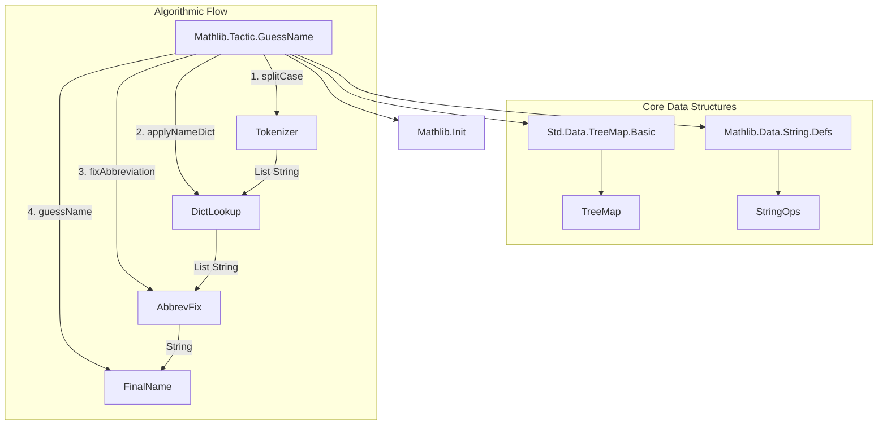

### Technical Brief: `GuessName.lean`

---

#### **1. Key Definitions & Theorems**

| Name | Type / Signature | Purpose |
|------|------------------|---------|
| `GuessNameData` | `structure` | Encapsulates two dictionaries: `nameDict` (component-wise translation) and `abbreviationDict` (post-processing fixes). |
| `endCapitalNames` | `TreeMap String (List String)` | Stores known suffixes of capitalized identifiers (e.g., `"LE"`, `"Coe"` with suffixes `["TC", "T", "HTCT"]`) to guide splitting logic. |
| `String.splitCase` | `String → Pos.Raw → List String → List String` | Splits a camelCase / underscored string into tokens (e.g., `"InvHMulLEConjugate₂SMul_ne_top"` → `["Inv", "HMul", "LE", "Conjugate₂", "SMul", "_", "ne", "_", "top"]`). |
| `String.decapitalizeSeq` | `String → Pos.Raw → String` | Lowercases leading uppercase sequence in a string (e.g., `"HMul"` → `"hMul"`). |
| `decapitalizeLike` | `String → String → String` | Decapitalizes `s` only if `r` starts with lowercase; preserves case style of `r`. |
| `decapitalizeFirstLike` | `String → List String → List String` | Applies `decapitalizeLike` to the first element of a list. |
| `applyNameDict` | `GuessNameData → List String → List String` | Applies `nameDict` word-by-word, preserving capitalization pattern of input. |
| `fixAbbreviationAux` | `GuessNameData → List String → List String → String` | Recursively joins tokens and replaces substrings using `abbreviationDict`, handling case and underscore correctly. |
| `fixAbbreviation` | `GuessNameData → List String → String` | Wrapper for `fixAbbreviationAux`; final abbreviation fix step. |
| `guessName` | `GuessNameData → String → String` | Main API: full pipeline from input string to translated additive name (via splitting, dict lookup, abbreviation fix). |

---

#### **2. Naming Conventions**

- **Prefixes / Suffixes**:
  - `decapitalize*`: Functions that lowercase leading uppercase letters.
  - `applyNameDict`, `fixAbbreviation*`: Reflect the two-stage translation process.
  - `splitCase`: Splits on case boundaries and underscores.
  - `endCapitalNames`: Names ending in uppercase letters (e.g., `"LE"`, `"Coe"`).
- **Case Handling**:
  - Input to `nameDict` is lowercased (`x.toLower`), output is decapitalized like input (`decapitalizeFirstLike`).
  - `abbreviationDict` keys are lowercase camelCase (`ltzero`), values are UpperCamelCase (`LTZero`), but output case is adjusted to match input.

---

#### **3. Tactic Stack**

- **Tactics used in proofs (not present in this file)**:  
  This file is *purely computational* (no proofs), so no Lean tactics appear.
- **Core computational tools**:
  - `Id.run`, `match`, `if ... then ... else`, `partial`, `termination_by`, `decreasing_by`
  - `String.Pos.Raw`, `extract`, `dropPrefix?`, `get`, `set`, `isUpper`, `toLower`, `join`, `mapTokens`

---

#### **4. Proof Logic**

- **Not applicable**: This file contains no theorems or proofs—only definitions and algorithms.
- **Algorithmic structure**:
  1. **Tokenization** (`splitCase`) → splits string into meaningful components.
  2. **Component translation** (`applyNameDict`) → replaces tokens via `nameDict`.
  3. **Abbreviation post-processing** (`fixAbbreviation`) → fixes multi-token abbreviations (e.g., `"addComm"` → `"commAdd"`).
  4. **Final formatting** (`guessName`) → joins tokens, handles apostrophes (`mapTokens '\''`).

---

#### **5. Imports**

| Import | Purpose |
|--------|---------|
| `Std.Data.TreeMap.Basic` | For `TreeMap` used in `endCapitalNames`. |
| `Mathlib.Data.String.Defs` | Core string operations (`splitCase`, `join`, `get`, `extract`, etc.). |
| `Mathlib.Init` | Basic infrastructure (e.g., `Pos.Raw`, `Option`, `List`, `String` primitives). |

---

#### **6. Dependency Diagram**



---

#### **7. Overview of File & Theory Context**

- **Purpose**: Provides name-generation utilities for `to_additive`-like transformations (e.g., converting multiplicative lemmas to additive ones).
- **Design Philosophy**:
  - **Modular**: Separates tokenization, translation, and abbreviation fixing.
  - **Case-aware**: Preserves capitalization style of original identifiers.
  - **Extensible**: Dictionaries (`nameDict`, `abbreviationDict`) allow easy addition of new translation rules.
- **Theoretical Scope**:
  - Part of `Mathlib.Tactic`, supporting automated naming in Lean 4.
  - Complements `to_additive` attribute system (not shown here, but implied by docstring).
  - Designed for use in metaprogramming (e.g., tactic proofs that generate names).

---

#### **8. Example Usage (from comments)**

```lean
#eval guessName data "InvHMulLEConjugate₂SMul_ne_top"
-- → "negHAddLEConjugate₂VAdd_ne_top"

#eval guessName data "MulSupport"
-- → "addSupport"
```

Where `data : GuessNameData` contains mappings like:
- `"Inv" ↦ ["Neg"]`
- `"HMul" ↦ ["HAdd"]`
- `"LE" ↦ ["LE"]`
- `"Support" ↦ ["Support"]`
- `"ltzero" ↦ "Nonneg"` (via `abbreviationDict`)

--- 

Let me know if you'd like a formalized correctness theorem sketch or a test suite in Lean.
