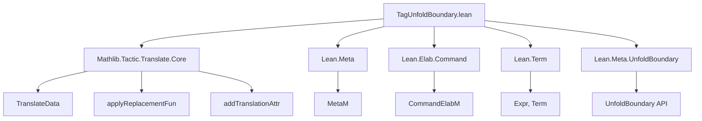
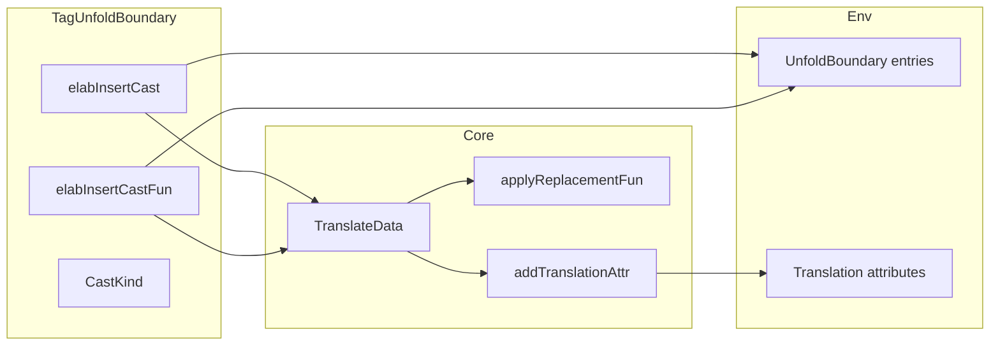

### Technical Brief: `TagUnfoldBoundary.lean`

---

#### **1. Key Definitions & Theorems**

| Name | Type / Signature | Purpose |
|------|------------------|---------|
| `CastKind` | `inductive CastKind` | Encodes three kinds of casts: equality (`eq`), unfolding (`unfoldFun`), and refolding (`refoldFun`). |
| `CastKind.mkRel` | `CastKind → Expr → Expr → MetaM Expr` | Constructs the *type* of the cast: `lhs = body`, `lhs → body`, or `body → lhs`. |
| `CastKind.mkProof` | `CastKind → Expr → MetaM Expr` | Constructs the *value* of the cast: `rfl` for equality, `fun x ↦ x` for functions. |
| `elabInsertCastAux` | `(declName : Name) → CastKind → Term → TranslateData → CommandElabM (Name × Name)` | Helper to generate a cast declaration and its translation, depending on `castKind`. |
| `elabInsertCast` | `(declName : Ident) → Term → TranslateData → CommandElabM Unit` | Command elaborator for `insert_cast foo := ...`, generating an equality cast and registering it as an unfold boundary. |
| `elabInsertCastFun` | `(declName : Ident) → Term → Term → TranslateData → CommandElabM Unit` | Command elaborator for `insert_cast_fun foo := ..., ...`, generating unfolding and refolding functions and registering them. |

---

#### **2. Naming Conventions**

- **Prefixes**:
  - `elabInsertCast`: Elaborator for insertion of casts.
  - `mkRel`, `mkProof`: “Make relation” / “Make proof” — standard pattern for constructing types/values.
- **Suffixes**:
  - `_cast`: Used for generated cast declarations (e.g., `foo_cast`, `foo_cast_cast`).
  - `_cast_fun`: For function casts (unfold/refold).
- **Internal naming**:
  - `name₁`, `name₂`: Original cast and its dual.
  - `translatedName₁`, `translatedName₂`: Translated versions.

---

#### **3. Tactic Stack**

- **Core tactics used**:
  - `withDeclNameForAuxNaming`, `withExporting`: For naming and scoping.
  - `lambdaTelescope`: To decompose definitions into lambdas.
  - `mkEq`, `mkEqRefl`, `mkForallFVars`, `mkLambdaFVars`, `mkAppN`: Term construction.
  - `unfoldDefinition?`, `applyReplacementFun`: For term rewriting and unfolding.
  - `elabTermEnsuringType`, `instantiateMVars`, `synthesizeSyntheticMVarsNoPostponing`: Term elaboration and solving.
  - `addDecl`, `addTranslationAttr`, `modifyEnv`, `addEntry`: Environment manipulation.

- **No high-level tactics like `aesop`, `ring`, or `simp`** — this is low-level elaboration logic.

---

#### **4. Proof Logic / Elaboration Flow**

1. **Input**: A declaration name (`declName`) and a syntax term (`valStx` or two terms for `cast_fun`).
2. **Unfold declaration**: Use `lambdaTelescope` to extract the body of the definition.
3. **Generate cast declaration**:
   - Compute `lhs` (original def application).
   - Compute `body` (definition body).
   - Use `mkRel` and `mkProof` to build type and value of the cast.
   - Add declaration (as theorem or definition depending on `castKind`).
4. **Generate translated cast**:
   - Apply `applyReplacementFun` (from `TranslateData`) to `lhs`, `body`.
   - Build translated type and value using user-provided `valStx`.
   - Add declaration and register translation attribute.
5. **Register unfold boundary**:
   - For `insert_cast`: register `.unfold declName castName`.
   - For `insert_cast_fun`: register `.cast declName unfoldName refoldName ...`.

---

#### **5. Imports**

- `Mathlib.Tactic.Translate.Core`: Core translation infrastructure (required here for `TranslateData`, `applyReplacementFun`, etc.).
- `Lean Meta Elab Command Term UnfoldBoundary`: Lean’s elaboration and meta-programming infrastructure.

---

#### **8. Mermaid Diagrams**

##### **Dependency Graph**



##### **Overview of File Logic**

```mermaid
flowchart TD
  Start[Start: elabInsertCast / elabInsertCastFun] --> Parse[Parse declName, valStx]
  Parse --> Unfold[Unfold definition via lambdaTelescope]
  Unfold --> BuildCast[Build cast type/value via mkRel/mkProof]
  BuildCast --> AddOrig[Add original cast declaration]
  AddOrig --> Translate[Apply translation to lhs/body]
  Translate --> AddTrans[Add translated declaration]
  AddTrans --> Register[Register unfold boundary / cast in env]
  Register --> End[End: (name, translatedName) returned]
```

##### **Relationship to Translation Infrastructure**



--- 

This file provides the **infrastructure for tagging unfold boundaries** in translation, enabling safe translation of terms that depend on definitions whose translations are not definitionally equal to the translation of their bodies.
