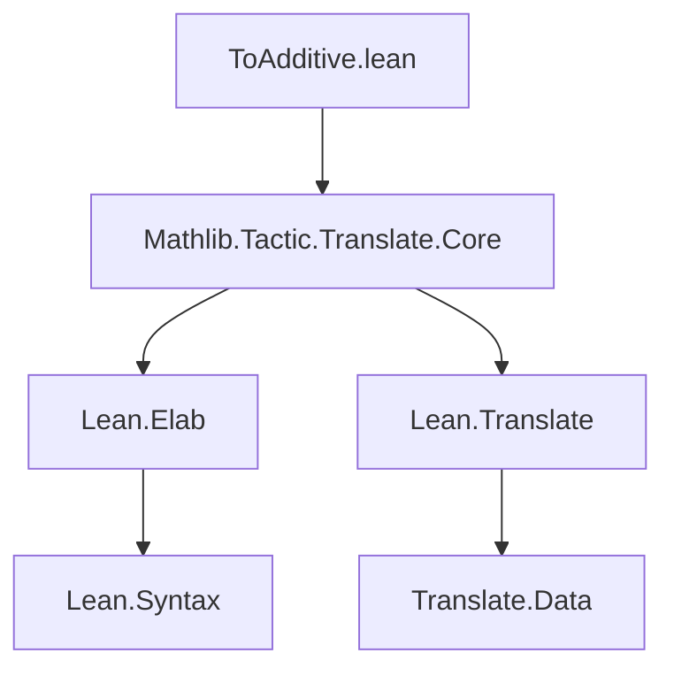
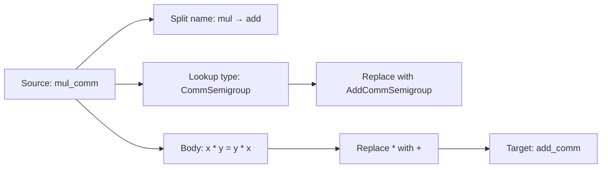

### Technical Brief: `ToAdditive.lean`

---

#### **1. Key Definitions & Theorems**

| Name | Type / Purpose |
|------|----------------|
| `to_additive_ignore_args` | Syntax attribute: specifies argument positions to ignore during additivization. |
| `to_additive_do_translate` | Syntax attribute: forces translation of operations on a type. |
| `to_additive_dont_translate` | Syntax attribute: prevents translation of operations on a type. |
| `to_additive` | Syntax attribute: triggers automatic translation of multiplicative declarations to additive ones. |
| `ignoreArgsAttr` | `NameMapExtension (List Nat)`: stores per-declaration argument indices to ignore. |
| `doTranslateAttr` | `NameMapExtension Bool`: stores whether a type should be translated. |
| `translations` | `NameMapExtension TranslationInfo`: stores known multiplicative ↔ additive name mappings. |
| `nameDict` | `Std.HashMap String (List String)`: core dictionary mapping multiplicative name fragments to additive ones (e.g., `"mul" ↦ ["Add"]`). |
| `abbreviationDict` | `Std.HashMap String String`: maps full multiplicative names to additive equivalents (e.g., `"isCancelAdd" ↦ "IsCancelAdd"`). |
| `data` | `TranslateData`: bundle of all `to_additive`-specific extensions and configuration. |
| `insert_to_additive_translation` | Command macro: manually registers a translation between two names (e.g., `QuotientGroup ↦ QuotientAddGroup`). |

**No theorems** are defined in this file — it is purely a *tactic/attribute infrastructure* module.

---

#### **2. Naming Conventions**

- **Prefixes / Suffixes**:
  - `to_additive_*`: all syntax and attribute names start with `to_additive`.
  - `ignore_args`, `do_translate`, `dont_translate`: suffixes indicate behavior.
  - `nameDict`, `abbreviationDict`: follow `GuessNameData` naming pattern from `GuessName.lean`.
  - `data`: standard Lean convention for `TranslateData` bundles.

- **Attribute names**:
  - Use underscores (`_`) to separate components: `to_additive_ignore_args`, `to_additive_do_translate`.

- **Macro names**:
  - `to_additive?` is a shorthand for `to_additive ? ...`.

---

#### **3. Tactic Stack**

- **Core tactics used**:
  - `elabTranslationAttr`: elaborates attribute arguments (e.g., `reorder`, `attr`, `relevant_arg`).
  - `addTranslationAttr`: main entry point to register and process translation.
  - `discard do ...`: monadic `do` block for side-effecting elaboration.
  - `run_cmd logInfo ...`: used in troubleshooting examples (not in actual code).
  - `match` on syntax trees (`stx`) for parsing attribute arguments.

- **No high-level proof tactics** (`simp`, `ring`, `aesop`, etc.) appear — this is a *meta-level* tactic infrastructure module.

---

#### **4. Proof Logic**

- **No proofs** are present — this file defines *syntax, attributes, and elaborators* for a *code generation* system.
- The logic is **data-driven**:
  - Name translation via `nameDict` and `abbreviationDict`.
  - Heuristic filtering via argument analysis (fixed types, `relevant_arg`, `ignore_args`).
  - Dependency scanning (auxiliary definitions, equational lemmas).
  - Manual override via `insert_to_additive_translation`.

---

#### **5. Imports**

- `Mathlib.Tactic.Translate.Core`: core translation infrastructure (shared with `dual`, etc.).
- `Lean`, `Elab`, `Translate`: Lean metaprogramming modules.

---

#### **8. Mermaid Diagrams**

##### **Dependency Graph (Module-Level)**



##### **Overview of `ToAdditive` System**

```mermaid
graph TD
  A[User writes: @\[to_additive\] foo] --> B[Elaborator: elabTranslationAttr]
  B --> C{Parse attrArgs}
  C -->|reorder| D[Argument reordering plan]
  C -->|attr| E[Attributes to propagate]
  C -->|relevant_arg| F[Which arg to check for multiplicative structure]
  C -->|name| G[Target name / prefix replacement]

  B --> H[Scan type & value for names starting with foo]
  H --> I[Transport auxiliary defs, equational lemmas]

  B --> J[Lookup nameDict / abbreviationDict]
  J --> K[Apply string replacements]
  K --> L[Build additive declaration]

  L --> M[Register in translations extension]
  M --> N[Add to environment]
```

##### **Translation Pipeline (Example: `mul_comm` → `add_comm`)**



---

### Summary

This file implements the **`@[to_additive]` metaprogramming framework**, a cornerstone of mathlib’s strategy for avoiding duplication between multiplicative and additive mathematics. It provides:

- **Syntax attributes** for fine-grained control over translation.
- **Heuristics** to decide *when* and *how* to translate identifiers.
- **Extensible dictionaries** (`nameDict`, `abbreviationDict`) for name mapping.
- **Manual override mechanisms** (`insert_to_additive_translation`, `relevant_arg`, `reorder`, `ignore_args`).

It is a *meta-level* module — no theorems, only infrastructure for *generating* theorems automatically.
