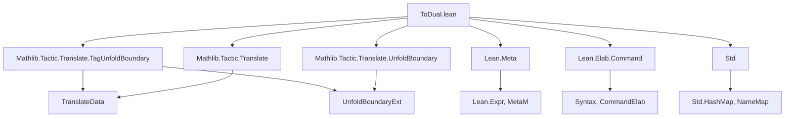

**Technical Brief: `ToDual.lean` Module**

---

### 1. **Key Definitions & Theorems**

| Name | Type / Syntax | Purpose |
|------|----------------|---------|
| `to_dual_ignore_args` | Syntax attribute | Marks arguments to be *ignored* during dual translation (i.e., not dualized). |
| `to_dual_do_translate` / `to_dual_dont_translate` | Syntax attributes | Control whether operations on a type should be translated (used for type-class–dependent behavior). |
| `to_dual` | Syntax attribute | Main attribute for dual translation: transports theorems/definitions to their duals (e.g., `max` ↔ `min`, `≤` ↔ `≥`). Supports `?`, `(reorder := ...)`, `self`, `existing`, `(attr := ...)`, and more. |
| `to_dual?` | Macro | Debug variant of `to_dual`; traces translation steps. |
| `ignoreArgsAttr` | `NameMapExtension (List Nat)` | Stores arguments to ignore per declaration. |
| `unfoldBoundaries` | `UnfoldBoundaryExt` | Tracks which definitions should be left unfolded during translation (to avoid unfolding non-dualizable terms). |
| `doTranslateAttr` | `NameMapExtension Bool` | Tracks whether a type’s operations should be translated. |
| `translations` | `NameMapExtension TranslationInfo` | Maps original names to dual counterparts (e.g., `max` ↦ `min`). |
| `nameDict` | `Std.HashMap String (List String)` | Dictionary for heuristic name dualization (e.g., `"top"` → `["Bot"]`, `"min"` → `["Max"]`). |
| `abbreviationDict` | `Std.HashMap String String` | Special-case abbreviations (e.g., `"wellFoundedLT"` ↔ `"WellFoundedGT"`). |
| `data` | `TranslateData` | Bundle of all extensions and metadata required for `to_dual`. |
| `elabInsertCast` / `elabInsertCastFun` | Command elaborators | Support `to_dual_insert_cast` / `to_dual_insert_cast_fun`, enabling insertion of casts or casting functions to avoid unfolding problematic definitions. |

**No theorems are defined in this file** — it is purely a *tactic infrastructure* module.

---

### 2. **Naming Conventions**

- **Prefixes / Suffixes**:
  - `to_dual_*`: All syntax, attributes, and internal extensions follow this pattern.
  - `*_attr`: Attribute names (`to_dual_ignore_args`, `to_dual_do_translate`, etc.).
  - `*_dict`: Lookup tables for name translation (`nameDict`, `abbreviationDict`).
  - `data`: Bundled configuration for translation.
  - `elab*`: Elaborator functions (`elabInsertCast`, `elabInsertCastFun`).

- **Dualization patterns**:
  - `top` ↔ `bot`, `inf` ↔ `sup`, `min` ↔ `max`, `≤` ↔ `≥`, `Ico` ↔ `Ioc`, `cone` ↔ `cocone`, etc.
  - Category-theoretic duals: `limit` ↔ `colimit`, `product` ↔ `coproduct`, `kernel` ↔ `cokernel`, etc.

---

### 3. **Tactic Stack**

- **Core tactics used**:
  - `discard`, `do`, `←`, `match`, `pure`, `throwUnsupportedSyntax`
  - `registerNameMapAttribute`, `registerBuiltinAttribute`, `registerNameMapExtension`
  - `elabTranslationAttr`, `addTranslationAttr`
  - `elabInsertCast`, `elabInsertCastFun`

- **No high-level proof tactics** (e.g., `simp`, `ring`, `aesop`) appear — this is a *meta-level* module for *declaration transformation*, not proof automation.

---

### 4. **Proof Logic**

- **Not applicable** — this file defines *syntax and elaboration logic*, not proof scripts.
- The *translation logic* (i.e., how `to_dual` rewrites declarations) is implemented in the `Translate` and `UnfoldBoundary` infrastructure (imported from `Mathlib.Tactic.Translate`), and is not duplicated here.

---

### 5. **Imports**

| Import | Purpose |
|--------|---------|
| `Mathlib.Tactic.Translate.TagUnfoldBoundary` | Provides `TranslateData`, `TranslationInfo`, `UnfoldBoundaryExt`, and utilities for translation infrastructure. |
| `Lean Meta Elab Command Std Translate UnfoldBoundary` | Core Lean + Mathlib tactic infrastructure: `Meta`, `Elab.Command`, `Std.HashMap`, `NameMapExtension`, etc. |

---

### 6. **Mermaid Diagrams**

#### **Dependency Graph (Module-Level)**



#### **Overview of `to_dual` Workflow**

```mermaid
flowchart LR
  User -->|@[to_dual]| ElabAttr
  ElabAttr -->|elabTranslationAttr| ParseAttr
  ParseAttr -->|e.g., reorder, self, existing| BuildTranslationInfo
  BuildTranslationInfo -->|store in translations| NameMapExtension
  NameMapExtension -->|used at runtime| TranslateDecl
  TranslateDecl -->|via TranslateData| ApplyDualMap
  ApplyDualMap -->|nameDict, abbreviationDict| GuessDualName
  ApplyDualMap -->|unfoldBoundaries| PreserveUnfoldedDefs
  ApplyDualMap -->|insert casts if needed| InsertCast
  TranslateDecl -->|emit new decl| GeneratedDecl
```

#### **Relationship to `to_additive`**

- `to_dual` and `to_additive` share the same underlying `TranslateData` infrastructure.
- `to_dual` is parameterized with `isDual := true`, while `to_additive` uses `isDual := false`.
- Dualization is *contravariant* (reverses arrows), additive is *covariant* (reverses `+` ↔ `*`, `≤` ↔ `≤`).

---

### 7. **Key Design Notes**

- **Dualization is not automatic for all terms**: e.g., `Ico a b` ↔ `Ioc b a` requires explicit cast insertion.
- **`to_dual self`** is used when a lemma is self-dual up to argument reordering (e.g., `a ≤ b ↔ b ≤ a`).
- **`to_dual existing`** avoids regenerating duals when they already exist (e.g., for `le_add` ↔ `add_le`).
- **`reassoc` interaction**: `_assoc` theorems (e.g., `mul_assoc`) are *not* dual to anything, so `to_dual none` is added to prevent spurious dual generation.

---

### 8. **Known Limitations (from docstring)**

- Reordering arguments of *constructors* (e.g., `Pow.mk`, `OrderTop.mk`) is unsupported.
- Combining `to_additive` and `to_dual` requires manual care (e.g., `attribute [to_dual existing le_add] add_le`).
- Docstrings are *not* auto-dualized — must be provided explicitly.

--- 

**End of Technical Brief**
