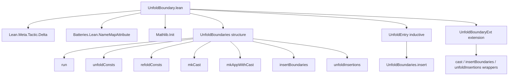

### Technical Brief: `UnfoldBoundary.lean`

---

#### **1. Key Definitions & Theorems**

| Name | Type / Signature | Purpose |
|------|------------------|---------|
| `UnfoldBoundaries` | `structure` | Stores configuration for abstraction boundaries: rewrite theorems (`unfolds`), casting functions (`casts`), and functions to re-unfold (`insertionFuns`). |
| `run` | `(b : UnfoldBoundaries) → SimpM α → MetaM α` | Sets up the monadic context: restricts unfolding via `withCanUnfoldPred`, sets transparency to `.all`, and initializes `SimpM` with `b.unfolds` as rewrite rules. |
| `unfoldConsts` | `(b : UnfoldBoundaries) → Expr → SimpM Expr` | Transforms a term `e` by inserting equality casts to unfold constants in its *type*, using `Simp.simp` and `Eq.mp`. |
| `refoldConsts` | `(b : UnfoldBoundaries) → Expr → Expr → SimpM Expr` | Adjusts a term `e` to match a *target type* `expectedType`, using `Simp.simp` and explicit casts for type constants. |
| `mkCast` | `(b : UnfoldBoundaries) → Expr → Expr → SimpM Expr` | Attempts to make `e` have type `expectedType` via `unfoldConsts` + `refoldConsts` if needed. |
| `mkAppWithCast` | `(b : UnfoldBoundaries) → Expr → Expr → SimpM Expr` | Applies `f a`, inserting casts if type mismatch occurs (e.g., due to non-unfoldable constants in function/domain types). |
| `UnfoldBoundaries.cast` | `(b : UnfoldBoundaries) → Expr → Expr → Name → MetaM Expr` | Public wrapper for `mkCast`, with error reporting tied to an attribute name. |
| `UnfoldBoundaries.insertBoundaries` | `(b : UnfoldBoundaries) → Expr → Name → MetaM Expr` | Walks expression tree, inserting casts at applications to ensure well-typedness under restricted unfolding. |
| `UnfoldBoundaries.unfoldInsertions` | `Expr → UnfoldBoundaries → CoreM Expr` | Re-unfolds auxiliary functions inserted during boundary translation (via `delta?` + beta-reduction). |
| `UnfoldEntry` | `inductive` | Represents entries for the environment extension: either an `unfold` (rewrite theorem) or a `cast` (4 functions for unfolding/refolding in both directions). |
| `UnfoldBoundaries.insert` | `UnfoldBoundaries → UnfoldEntry → UnfoldBoundaries` | Updates `UnfoldBoundaries` with a new `UnfoldEntry`. |
| `UnfoldBoundaryExt` | `abbrev SimplePersistentEnvExtension UnfoldEntry UnfoldBoundaries` | Persistent environment extension for managing `UnfoldBoundaries` across imports/modules. |
| `registerUnfoldBoundaryExt` | `IO UnfoldBoundaryExt` | Registers the extension in the environment. |
| `UnfoldBoundaryExt.cast`, `insertBoundaries`, `unfoldInsertions` | `MetaM` / `CoreM` wrappers | Delegate to the underlying `UnfoldBoundaries` state stored in the environment. |

---

#### **2. Naming Conventions**

- **Prefixes**:
  - `unfold*`: operations related to *unfolding* constants (e.g., `unfoldConsts`, `unfoldInsertions`).
  - `refold*`: operations related to *refolding* or matching types (e.g., `refoldConsts`).
  - `mk*`: construction helpers (`mkCast`, `mkAppWithCast`).
  - `insert*`: insertion of casts/boundaries (`insertBoundaries`, `insert`).
- **Suffixes**:
  - `*Cast`: cast-related functions (`mkCast`, `cast`).
  - `*Boundary*`: boundary-related logic (`insertBoundaries`, `UnfoldBoundaries`).
- **Constants**:
  - `unfold`, `refold`, `unfold'`, `refold'`: naming pattern for cast pairs (forward/backward for types).
  - `insertionFuns`: names of functions inserted as boundaries and later re-unfolded.

---

#### **3. Tactic Stack**

| Tactic / Method | Usage |
|-----------------|-------|
| `withCanUnfoldPred` | Restricts which constants can be unfolded (core to boundary enforcement). |
| `withTransparency .all` | Ensures full transparency for type checking (like `Meta.check`). |
| `Simp.simp` | Rewrites using stored theorems in `b.unfolds`; used in both `unfoldConsts` and `refoldConsts`. |
| `whnf` | Weak head normal form to inspect type structure (e.g., detect `.const` heads). |
| `isDefEq` | Checks definitional equality to decide if cast is needed. |
| `mkAppOptM`, `mkAppN`, `mkLambdaFVars`, `mkFreshExprMVar` | Expression construction utilities. |
| `delta?` | Used in `unfoldInsertions` to expand auxiliary definitions. |
| `headBeta` / `headBetaBody` | Beta-reduction helper for unfolding inserted lambdas. |
| `forallTelescope` | Used in `refoldConsts` to handle dependent function types. |

---

#### **4. Proof Logic / Algorithmic Flow**

The core logic follows a **type-directed cast insertion strategy**:

1. **Check well-typedness** under restricted unfolding (via `run` + `withCanUnfoldPred`).
2. **On type mismatch**:
   - **For term/prop types**: Use `Simp.simp` to rewrite the type using stored theorems, then apply `Eq.mp` (equality cast).
   - **For type constants** (e.g., `DecidableLE`): Use stored `(unfold, refold)` pairs to translate between types.
3. **Recursively apply** `unfoldConsts` / `refoldConsts` until no more mismatches.
4. **For applications** (`mkAppWithCast`):
   - Try `checkApp` first.
   - If fails, unfold `f`, then cast `a` to the domain type of `f`.
5. **For full expressions** (`insertBoundaries`):
   - Traverse expression tree bottom-up.
   - At each application, insert casts as needed.
6. **Post-processing** (`unfoldInsertions`):
   - Re-unfold inserted boundary functions (e.g., helper lemmas) using `delta?` + beta-reduction.

**Inductive structure** of `UnfoldEntry` supports two kinds of boundaries:
- **Propositional/term boundaries**: one rewrite theorem (`unfold`).
- **Type boundaries**: four functions (`unfold`, `refold`, `unfold'`, `refold'`) for bidirectional translation.

---

#### **5. Imports**

| Import | Role |
|--------|------|
| `Lean.Meta.Tactic.Delta` | For `delta?`, used in `unfoldInsertions`. |
| `Batteries.Lean.NameMapAttribute` | For `SimplePersistentEnvExtension`. |
| `Mathlib.Init` | Core Lean + Mathlib utilities (e.g., `Expr`, `Meta`, `SimpM`). |

---

#### **6. Mermaid Diagrams**

##### **Dependency Graph (High-Level)**



##### **Overview of File Logic Flow**

```mermaid
flowchart LR
  Start[Start: expression e, expected type T] --> Check{Well-typed?}
  Check -->|Yes| Return[e]
  Check -->|No| Unfold[unfoldConsts b e]
  Unfold --> Refold[refoldConsts b e T]
  Refold --> Return

  subgraph mkAppWithCast
    f a --> CheckApp{checkApp?}
    CheckApp -->|Yes| App[f a]
    CheckApp -->|No| UnfoldF[unfoldConsts b f]
    UnfoldF --> CastA[mkCast b a domain]
    CastA --> App'[f a']
  end

  subgraph insertBoundaries
    e --> Traverse[e withApp]
    Traverse --> mkAppWithCast
  end

  subgraph unfoldInsertions
    e --> Delta[delta? on insertionFuns]
    Delta --> Beta[headBetaBody]
  end
```

---

#### **7. Domain-Specific AI Agent Implications**

- **Focus Areas**:
  - Type-theoretic cast insertion under restricted unfolding.
  - Interactive proof term modification (e.g., for tactic automation).
  - Environment extension management for persistent configuration.
- **Key Patterns**:
  - **Type-directed transformation**: behavior depends on syntactic form of types.
  - **Bidirectional translation**: separate handling for terms vs. types.
  - **Modular boundary management**: via environment extension and attribute-based registration.
- **Use Cases**:
  - Enforcing abstraction boundaries in libraries (e.g., prevent unfolding `DecidableLE`).
  - Supporting modular verification where internal definitions must remain opaque.

--- 

Let me know if you'd like a formal specification of `mkCast` or a proof sketch of correctness for `unfoldConsts`.
