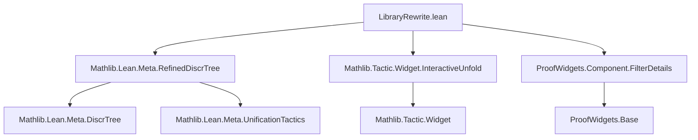
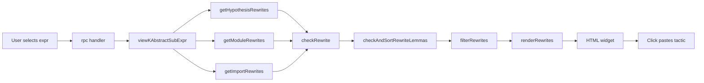
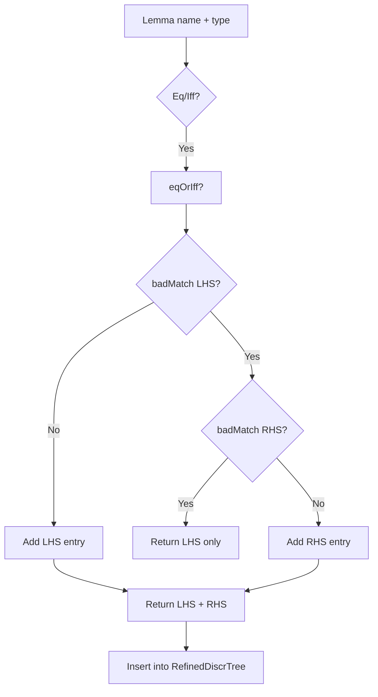

### Technical Brief: `LibraryRewrite.lean`

---

#### **1. Key Definitions & Theorems**

| Name | Type / Signature | Purpose |
|------|------------------|---------|
| `RewriteLemma` | `structure` | Stores metadata for rewrite lemmas: `name : Name`, `symm : Bool`. Used as payload in `RefinedDiscrTree`. |
| `isMVarSwap` | `Expr → Expr → Bool` | Checks if two expressions are equal up to metavariable renaming (used to avoid trivial symmetric rewrites). |
| `eqOrIff?` | `Expr → Option (Expr × Expr)` | Extracts LHS/RHS from equality (`Eq`) or iff (`Iff`) expressions. |
| `addRewriteEntry` | `Name → ConstantInfo → MetaM (List (RewriteLemma × List (Key × LazyEntry)))` | Adds a lemma to the `RefinedDiscrTree` if it is an equality/iff; returns both directions unless symmetric/trivial. |
| `addLocalRewriteEntry` | `LocalDecl → MetaM (List ((FVarId × Bool) × List (Key × LazyEntry)))` | Adds local hypotheses as rewrite entries (for hypothesis-driven rewriting). |
| `checkRewrite` | `Expr → Expr → Bool → MetaM (Option Rewrite)` | Attempts to unify `e` with LHS/RHS of a lemma (depending on `symm`), returns `Rewrite` if successful. |
| `Rewrite` | `structure` | Represents a successful rewrite: `symm`, `proof`, `replacement`, `stringLength`, `extraGoals`, `makesNewMVars`. |
| `checkAndSortRewriteLemmas` | `Expr → Array RewriteLemma → MetaM (Array (Rewrite × Name))` | Applies `checkRewrite` to all candidates and sorts by: fewer extra goals, L→R, shorter name, shorter replacement, alphabetical. |
| `getImportRewrites`, `getModuleRewrites`, `getHypothesisRewrites` | `Expr → MetaM (Array (Array (Rewrite × Name)))` | Retrieves rewrite candidates from imported libs, current file, and local hypotheses respectively. |
| `filterRewrites` | `(e : Expr) → Array α → (α → Expr) → (α → Bool) → MetaM (Array α)` | Filters out: reflexive, duplicate (up to explicit equality), and metavariable-introducing rewrites. |
| `tacticSyntax` | `Rewrite → Option Nat → Option Name → MetaM (TSyntax `tactic)` | Generates the tactic string (e.g., `rw [← add_comm]`, `nth_rw 2 [add_comm]`) for a rewrite. |
| `Rewrite.toInterface` | `Rewrite → Sum Name FVarId → Option Nat → Option Name → Lsp.Range → MetaM RewriteInterface` | Converts internal `Rewrite` to UI-friendly `RewriteInterface` (with tactic string, pretty-printed replacement, goals, etc.). |
| `getRewriteInterfaces` | `Expr → Option Nat → Option Name → Option FVarId → Lsp.Range → MetaM (… × …)` | Collects and structures all rewrite suggestions (filtered + unfiltered, by source: hypothesis/file/cache). |
| `renderRewrites`, `renderSection`, `renderSectionCore` | `Html` rendering functions | Renders rewrite suggestions in the VS Code widget (grouped by pattern, with buttons to paste tactics). |
| `LibraryRewrite.rpc` | `SelectInsertParams → RequestM (RequestTask Html)` | RPC handler for the interactive `rw??` widget (handles click events, expression selection, and UI rendering). |
| `#rw??` command | `syntax` + `elabrw??Command` | Command-line testing interface: prints rewrite suggestions to the infoview. |

---

#### **2. Naming Conventions**

- **Prefixes**:
  - `get*`: Functions that retrieve rewrite candidates (e.g., `getImportRewrites`, `getHypothesisRewrites`).
  - `add*`: Functions that populate the `RefinedDiscrTree` (e.g., `addRewriteEntry`, `addLocalRewriteEntry`).
  - `check*`: Functions that validate and construct rewrite data (e.g., `checkRewrite`, `checkAndSortRewriteLemmas`).
  - `is*`: Predicates (e.g., `isMVarSwap`, `isExplicitEq`).
  - `filter*`: Filtering logic (e.g., `filterRewrites`).
  - `render*`: UI rendering (e.g., `renderRewrites`, `renderSection`).
  - `tactic*`: Tactics generation (e.g., `tacticSyntax`).

- **Suffixes**:
  - `?`: Optional-returning functions (e.g., `eqOrIff?`, `isMVarSwap`).
  - `*`: Iterated or higher-order variants (e.g., `getImportRewrites`, `getModuleRewrites`).
  - `Interface`: UI-facing data structures (e.g., `RewriteInterface`).
  - `Entry`: Tree payload types (e.g., `RewriteLemma`, `(FVarId × Bool)`).

- **Booleans**:
  - `symm`: `true` for right-to-left rewrites (`← lemma`).
  - `makesNewMVars`: Whether replacement introduces fresh metavariables.

---

#### **3. Tactic Stack**

- **Core Tactics**:
  - `withTraceNodeBefore`, `withReducible`, `withoutModifyingMCtx`, `withNewMCtxDepth`
  - `forallMetaTelescope`, `forallTelescopeReducing`, `whnf`, `inferType`, `mkAppN`
  - `isDefEq`, `instantiateMVars`, `ppExpr`, `mkConstWithFreshMVarLevels`
  - `mkRewrite`, `tacticPasteString`, `viewKAbstractSubExpr`, `kabstractIsTypeCorrect`

- **Meta-level Utilities**:
  - `tryCatchRuntimeEx`, `guard`, `MonadExcept.ofExcept`, `filterMapM`, `qsort`, `find?`, `allM`
  - `registerTraceClass`, `registerEnvExtension`, `registerRpcMethod`, `mk_rpc_widget%`

- **Pattern Matching & Reduction**:
  - `getAppFn`, `getAppArgs`, `toHeadIndex`, `headNumArgs`
  - `hasExprMVar`, `hasLevelParam`

---

#### **4. Proof Logic / Logical Flow**

The core logic follows this flow:

1. **Candidate Retrieval**:
   - Build `RefinedDiscrTree` from imported lemmas (`addRewriteEntry`) and local hypotheses (`addLocalRewriteEntry`).
   - Match selected expression `e` against tree to get candidate lemmas.

2. **Validation & Construction**:
   - For each candidate lemma:
     - Unify `e` with LHS (or RHS if `symm = true`).
     - Check head symbol/arity match (`toHeadIndex`, `headNumArgs`).
     - Synthesize implicit arguments.
     - Collect extra goals and replacement expression.

3. **Sorting & Filtering**:
   - Sort rewrites by:  
     `#extraGoals < symm < nameLen < replacementLen < nameAlpha`.
   - Filter out:
     - Reflexive rewrites (`isExplicitEq replacement e`).
     - Duplicate rewrites (same explicit part).
     - Rewrites introducing new metavariables (`makesNewMVars`).

4. **UI Rendering**:
   - Group by match pattern (from `RefinedDiscrTree`).
   - Render each group as `
` section with pattern header.
   - Each rewrite suggestion includes:
     - Pasteable tactic string.
     - Replacement expression.
     - Extra goals (if any).
     - Lemma name + hover info.

5. **Interactive Execution**:
   - User clicks expression → `rw??` triggers RPC.
   - Expression is abstracted (`viewKAbstractSubExpr`).
   - Rewrites computed, filtered, and rendered.
   - Clicking a suggestion pastes tactic into editor.

---

#### **5. Imports**

| Module | Purpose |
|--------|---------|
| `Mathlib.Lean.Meta.RefinedDiscrTree` | Core indexing structure for efficient rewrite lookup. |
| `Mathlib.Tactic.Widget.InteractiveUnfold` | Supports unfolding before rewriting (via `unfoldsHtml`). |
| `ProofWidgets.Component.FilterDetails` | UI component for toggling filtered/unfiltered views. |

---

#### **8. Mermaid Diagrams**

##### **Dependency Graph (Module-Level)**

##### **Data Flow Diagram (High-Level)**

##### **Rewrite Lemma Entry Flow**

---

### Summary

`LibraryRewrite.lean` implements a **point-and-click library rewrite assistant** (`rw??`) that:
- Uses a **lazy `RefinedDiscrTree`** for efficient lemma lookup.
- Supports **bidirectional rewriting** (`rw [lemma]`, `rw [← lemma]`).
- Integrates **local hypotheses**, **current-file lemmas**, and **imported lemmas**.
- Provides **smart filtering** and **user-friendly UI** (VS Code widget).
- Exposes both **interactive** (`rw??`) and **batch** (`#rw??`) interfaces.

It is a cornerstone of mathlib’s interactive rewriting infrastructure, designed for usability, correctness, and extensibility.
