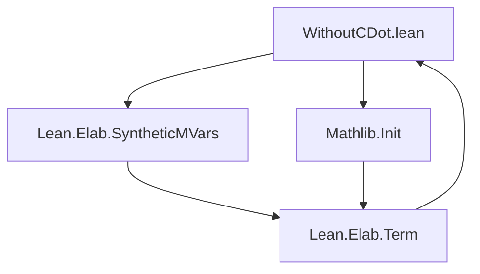

**Technical Brief: `WithoutCDot.lean`**

---

### 1. **Key Definitions & Theorems**

| Name | Type | Purpose |
|------|------|---------|
| `withoutCDotContents` | `Parser` | Parses the content inside `without_cdot(...)`, allowing optional type ascriptions (`: ty`) and supporting terms with implicit lambdas suppressed. |
| `withoutCDot` | `term_parser` macro | Public-facing syntax macro: `without_cdot(e)` or `without_cdot(e : ty)`. Prevents `·` (wildcard holes) from being interpreted as multiplication placeholders inside the macro’s scope. |
| `withoutCDotImpl` | `term_parser` macro | Internal implementation syntax: `without_cdot_impl(e)` or `without_cdot_impl(e : ty)`. Used after macro expansion to avoid re-parsing issues. |
| `elabWithoutCDot` | `TermElab` | Elaborator for `without_cdot_impl(...)`. Handles type ascription and term elaboration, delegating to `elabTerm` and `ensureHasType`. |

> **Note**: No theorems are proven in this file — it is purely a *syntax elaboration utility*.

---

### 2. **Naming Conventions**

- **Prefixes**:
  - `withoutCDot*`: Public and internal parser/elaborator names.
  - `elab*`: Standard Lean 4 elaborator naming (`elabWithoutCDot`).
- **Suffixes**:
  - `Impl`: Denotes internal implementation (e.g., `withoutCDotImpl`).
  - `Contents`: Denotes helper parser for inner syntax (`withoutCDotContents`).
- **Style**: Uses `snake_case` for definitions, consistent with Lean 4’s `Lean.Elab.Term` module.

---

### 3. **Tactic Stack**

- **Tactics used**:
  - `withSynthesize` (with `postpone := .yes` / `.no`)
  - `elabType`, `elabTerm`, `ensureHasType`
  - `throwUnsupportedSyntax`
- **Macro expansion** uses:
  - `no_implicit_lambda%`
  - `leading_parser`
  - `macro_rules`

No proof tactics (`simp`, `ring`, `aesop`, etc.) appear — this is a *syntax elaboration* module, not a proof module.

---

### 4. **Proof Logic**

- **No proofs** — this file defines *syntax and elaboration logic*, not mathematical content.
- **Elaboration logic flow**:
  1. Macro expands `without_cdot(...)` → `without_cdot_impl(...)`.
  2. `elabWithoutCDot` pattern-matches on syntax shape:
     - With type ascription: elaborate type first, then term.
     - Without type: use expected type (if any), or infer.
  3. Uses `ensureHasType` to validate well-typedness.

---

### 5. **Imports**

| Import | Purpose |
|--------|---------|
| `Lean.Elab.SyntheticMVars` | Required for `withSynthesize`, `postpone`, and metavariable handling. |
| `Mathlib.Init` | Provides foundational utilities (e.g., `Parser`, `TermElab`, `leading_parser`). |
| `Parser` (via `open Parser`) | Enables use of parser combinators like `withoutPosition`, `withoutForbidden`, `termParser`. |

---

### 8. **Dependency & Theory Overview**

#### Mermaid Diagram: File Dependencies



#### Mermaid Diagram: Module Structure & Flow

```mermaid
graph LR
  subgraph Syntax
    S1[without_cdot(...)]
    S2[without_cdot_impl(...)]
  end

  subgraph Macro Expansion
    M[macro_rules]
  end

  subgraph Elaboration
    E[elabWithoutCDot]
  end

  S1 -- expands via --> M --> S2
  S2 -- elaborated by --> E
  E -->|uses| Lean_Elab_Term[Lean.Elab.Term]
```

#### Theory Context

- **Purpose**: Provide a *safe quoting/anti-quoting* mechanism for user syntax inside parentheses, especially when embedding user input in macros.
- **Motivation**: In Lean, `·` is often used for multiplication (e.g., `a · b`), but inside quoted syntax (e.g., in macros), this can interfere with hole-filling semantics. `without_cdot` disables this interpretation.
- **Scope**: Part of the *term elaboration infrastructure*, not part of core logic or algebraic theories.

---

**Summary**: `WithoutCDot.lean` is a *Lean 4 elaborator utility* that defines a custom syntax `without_cdot(...)` to prevent `·` from being interpreted as multiplication inside quoted terms. It leverages Lean’s parser/elaborator infrastructure to safely embed user syntax in macros.
