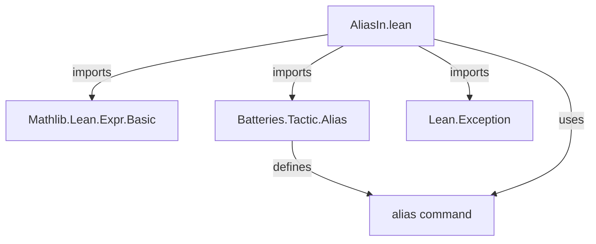
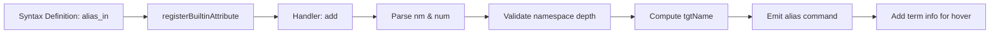

**Technical Brief: `AliasIn.lean` Module**

---

### 1. **Key Definitions & Theorems**

| Name | Type / Purpose |
|------|----------------|
| `aliasIn` | **Syntax attribute** (`attr`) — defines a Lean 4 attribute `@[alias_in ...]` that, when applied to a declaration, creates an alias in a different namespace. |
| `registerBuiltinAttribute` (for `aliasIn`) | **Initialization function** — registers the `aliasIn` attribute at compile time with metadata and implementation logic. |
| `add` (field of `registerBuiltinAttribute`) | **Attribute handler** — implements the core logic: parses the attribute arguments, computes the target alias name, and emits an `alias` command. |

**No theorems** — this is a *metaprogramming module* for syntax extension, not a mathematical theory.

---

### 2. **Naming Conventions**

- **Prefixes / Suffixes**:
  - `alias_in` — attribute name (lowercase, underscore-separated).
  - `aliasIn` — syntax token name (PascalCase, used internally for the syntax constructor).
  - `tgtName`, `src`, `newNamespace`, `num` — internal variable names follow Lean 4 metaprogramming style (descriptive, camelCase).
- **Namespace manipulation**:
  - `components.take ... ++ newNamespace ++ [components.getLast!]` — replaces inner namespaces while preserving the final identifier.
  - `fromComponents` — reconstructs a `Name` from a list of components.

---

### 3. **Tactic Stack**

- **Metaprogramming tactics used**:
  - `do` / `←` — monadic sequencing.
  - `match` / `|>` — pattern matching and function application.
  - `throwError`, `throwUnsupportedSyntax` — error handling.
  - `liftCommandElabM`, `elabCommand`, `mkIdent`, `mkConstWithLevelParams` — Lean 4 metaprogramming API.
  - `Term.addTermInfo'` — for mouse-over documentation support.

- **No user-level tactics** (e.g., `simp`, `ring`) appear — this is purely *compile-time metaprogramming*.

---

### 4. **Proof Logic / Execution Flow**

The logic is **not proof-based**, but *syntax transformation*:

1. **Input**: A declaration `d` in namespace `A.B.C`, with `@[alias_in Foo.Bar]` or `@[alias_in Foo.Bar 3]`.
2. **Parse**:
   - Extract `newNamespace = [Foo, Bar]`.
   - Extract optional `num` (default = `newNamespace.length`).
3. **Validate**:
   - Ensure `src` has > `num` namespaces (i.e., at least one namespace to keep).
4. **Compute target name**:
   - Remove `num` inner namespaces from `src.components`.
   - Prepend remaining outer namespaces, insert `newNamespace`, append final identifier.
   - Example: `A.B.C.d` + `Foo.Bar` + `num=1` → `A.Foo.Bar.d`.
5. **Emit**:
   - Generate and execute `alias Foo.Bar.d := A.B.C.d`.
6. **Metadata**:
   - Attach mouse-over info for the alias name (`nm`) pointing to the target.

---

### 5. **Imports**

| Import | Role |
|--------|------|
| `Mathlib.Lean.Expr.Basic` | Provides low-level `Expr`, `Name`, `Level` utilities. |
| `Batteries.Tactic.Alias` | Defines the `alias` command (used to create aliases). |
| `Lean.Exception` | Provides `throwError`, `throwUnsupportedSyntax`. |

> **Scope**: This module extends Lean’s syntax and attribute system — it is part of *Lean’s metaprogramming infrastructure*, likely in `mathlib` or a related library.

---

### 6. **Mermaid Diagrams**

#### **Dependency Graph**

#### **Overview of File Structure**

---

### Summary

This file implements the `@[alias_in]` attribute — a *compile-time metaprogram* that automates namespace aliasing in Lean 4. It enables concise declaration of aliases (e.g., `@[alias_in Topology.Hausdorff] def MySpace.T2 := ...`) by manipulating `Name` components and emitting `alias` commands. No mathematical content — purely a *tooling extension* for Lean’s syntax and attribute system.
