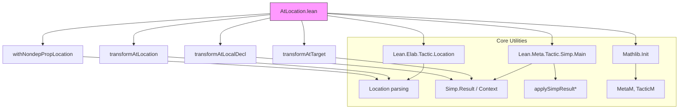

**Technical Brief: `AtLocation.lean`**

---

### 1. KEY DEFINITIONS & THEOREMS

| Name | Type / Signature | Purpose |
|------|------------------|---------|
| `Lean.Elab.Tactic.withNondepPropLocation` | `Location → (FVarId → TacticM Unit) → TacticM Unit → (MVarId → TacticM Unit) → TacticM Unit` | Applies a tactic to all *nondependent Prop hypotheses* and/or the goal, depending on `Location`. Fails if no progress is made. |
| `Mathlib.Tactic.transformAtTarget` | `(Expr → ReaderT Simp.Context MetaM Simp.Result) → String → Bool → MVarId → ReaderT Simp.Context MetaM (Option MVarId)` | Applies a transformation `m` to the goal type, updates the goal if the result is `True`, or replaces the goal with the transformed expression. Fails if `failIfUnchanged = true` and no change occurs. |
| `Mathlib.Tactic.transformAtLocalDecl` | `(Expr → ReaderT Simp.Context MetaM Simp.Result) → String → Bool → Bool → FVarId → MVarId → ReaderT Simp.Context MetaM (Option MVarId)` | Applies `m` to a local hypothesis `fvarId`, removing it from the `SimpTheorems` context to avoid circular rewriting. Fails if no progress and `failIfUnchanged`. |
| `Mathlib.Tactic.transformAtLocation` | `(Expr → ReaderT Simp.Context MetaM Simp.Result) → String → Location → Bool → Bool → Simp.Context → TacticM Unit` | High-level tactic combinator: applies `m` at all locations specified by `loc` (via `withLocation`). |
| `Mathlib.Tactic.transformAtNondepPropLocation` | Same as above, but uses `withNondepPropLocation` to restrict to nondependent Prop hypotheses. | |

> **Note**: None are theorems in the logical sense; these are *metaprogramming utilities* for building tactics that rewrite expressions at specific locations.

---

### 2. NAMING CONVENTIONS

- **Prefixes**:
  - `transformAt*`: Indicates transformation of expressions at a location (goal or hypothesis).
  - `with*Location`: Indicates higher-level control flow over `Location` structures.
- **Suffixes**:
  - `LocalDecl`: Refers to transformation at a *local hypothesis* (`FVarId`).
  - `Target`: Refers to transformation at the *goal* (target).
  - `NondepProp`: Restricts to *nondependent Prop* hypotheses.

---

### 3. TACTIC STACK

Frequently used tactics and combinators:

| Tactic / Combinator | Role |
|---------------------|------|
| `withLocation` | Standard Lean tactic combinator for applying tactics at goal/hypotheses based on `Location`. |
| `withNondepPropLocation` | Custom variant for Prop-only, nondependent hypotheses. |
| `liftMetaTactic1` | Lifts a `ReaderT _ MetaM (Option MVarId)` to a `TacticM Unit`. |
| `tryTactic` | Attempts a tactic, returns success/failure without failing the whole tactic. |
| `getFVarIds`, `getNondepPropHyps` | Extract hypotheses for processing. |
| `instantiateMVars`, `cleanupAnnotations`, `mkOfEqTrue`, `applySimpResultToTarget`, `applySimpResultToLocalDecl` | Core `MetaM` utilities for expression manipulation and goal update. |
| `withReader` | Modifies the reader environment (here, to erase `fvarId` from `SimpTheorems`). |

---

### 4. PROOF LOGIC (Metaprogramming Flow)

The logic is *metaprogrammatic*, not logical deduction:

1. **Input**: A transformation procedure `m : Expr → ReaderT Simp.Context MetaM Simp.Result`, a `Location`, and flags (`failIfUnchanged`, `mayCloseGoal`).
2. **Location parsing**:
   - If `loc = targets hyps target`: apply `m` to each `hyps` (via `transformAtLocalDecl`) and possibly the goal (`transformAtTarget`).
   - If `loc = wildcard`: iterate over `getNondepPropHyps`, try `m` at each; if none succeed, try goal.
3. **Transformation**:
   - Instantiate goal/hypothesis type.
   - Run `m` (optionally with modified `Simp.Context` to avoid self-rewriting).
   - Check if expression changed (via `cleanupAnnotations`).
   - If result is `True`, assign `True`-intro to goal/hyp.
   - Else, update goal/hyp with new expression.
4. **Failure handling**:
   - If `failIfUnchanged = true` and no progress, throw error.
   - If `loc = *` and no progress anywhere, throw error.

---

### 5. IMPORTS

| Import | Purpose |
|--------|---------|
| `Mathlib.Init` | Core Lean + Mathlib initialization. |
| `Lean.Elab.Tactic.Location` | Parsing and handling of `Location` syntax (e.g., `at h`, `at *`, `at ⊢`). |
| `Lean.Meta.Tactic.Simp.Main` | `Simp.Result`, `Simp.Context`, `applySimpResult*`, etc. |
| `Lean.Elab.Tactic.Location` | Duplicate import (likely legacy). |

---

### 6. DEPENDENCY & OVERVIEW DIAGRAM

#### Overview of File Purpose

This file provides *metaprogramming infrastructure* for tactics that rewrite expressions at *user-specified locations* (hypotheses and/or goal), especially in the context of simplification (`simp`-like procedures). It abstracts over the boilerplate of:

- Locating hypotheses (`FVarId`s),
- Handling goal vs hypothesis transformations,
- Avoiding circular rewriting (by erasing the hypothesis from the `SimpTheorems` context),
- Reporting progress (or lack thereof),
- Supporting both general (`transformAtLocation`) and Prop-restricted (`transformAtNondepPropLocation`) use cases.

It is foundational for tactics like `rw_at`, `simp_at`, `norm_num_at`, etc., where precise control over *where* rewriting occurs is required.

--- 

Let me know if you'd like a companion diagram for how `transformAtLocation` composes with `withLocation`, or a usage example.
