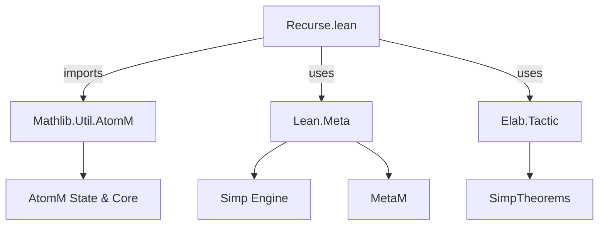
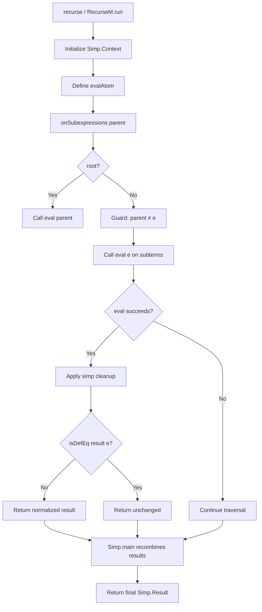

### Technical Brief: `Recurse.lean` — Recursive Normalization in `AtomM`

---

#### **1. Key Definitions & Theorems**

| Name | Type / Signature | Purpose |
|------|------------------|---------|
| `Recurse.Config` | `Structure` | Configuration for recursive normalization: reducibility (`red`), zeta-delta expansion (`zetaDelta`), and contextual discharger (`contextual`). |
| `Recurse.Context` | `Structure` | Read-only runtime context: `ctx` (Simp.Context for traversal), `simp` (cleanup function). |
| `RecurseM` | `abbrev RecurseM := ReaderT Recurse.Context AtomM` | Monad stack for recursive normalization: extends `AtomM` with context for simp traversal and cleanup. |
| `onSubexpressions` | `def onSubexpressions (eval : Expr → AtomM Simp.Result) (parent : Expr) (wellBehavedDischarge : Bool) (root := true) : RecurseM Simp.Result` | Applies `eval` to *maximal* subexpressions where it succeeds, using `Simp.main` with custom pre/post processors. Implements bottom-up recursion. |
| `RecurseM.run` | `partial def RecurseM.run ... (x : RecurseM α) : MetaM α` | Executes a `RecurseM` tactic with full recursive setup: initializes simp context, defines `evalAtom` (recursive evaluator), and runs `x`. |
| `recurse` | `def recurse ... (tgt : Expr) : MetaM Simp.Result` | Convenience wrapper: runs recursive normalization on a single expression `tgt`. |

> **Note**: `wellBehavedDischarge` must be `false` if `eval` accesses local hypotheses with index ≥ `Context.lctxInitIndices`, to avoid over-caching in `simp`.

---

#### **2. Naming Conventions**

- **Prefixes**:
  - `Recurse.`: Module namespace for recursive normalization.
  - `onSubexpressions`: Emphasizes traversal over subterms.
  - `eval`: Standard for normalization operations in `AtomM`.
- **Suffixes**:
  - `M`: Indicates monadic action (`RecurseM`, `AtomM`).
  - `ctx`, `rctx`, `nctx`: Context variables (`Simp.Context`, `ReaderT` environment, normalized context).
- **Structure fields**:
  - `red`, `zetaDelta`, `contextual`: Reflect Lean’s simplifier configuration.
  - `ctx`, `simp`: Standard for simp context and postprocessor.

---

#### **3. Tactic Stack**

Frequent tactics & utilities used:

| Tactic / Utility | Role |
|------------------|------|
| `Simp.main` | Core simplifier engine for traversal. |
| `Simp.postDefault` | Default postprocessor for `Simp.main`. |
| `withReducible`, `withConfig` | Adjust transparency / config for evaluation. |
| `isDefEq` | Definitional equality check (used to detect no-op normalization). |
| `guard` | Conditional branching (e.g., recursion guard: `guard <| root || parent != e`). |
| `try ... catch _ => ...` | Error handling for `eval` failures. |
| `pure`, `return`, `do`-notation | Standard monadic control flow. |
| `←`, `let rec` | For monadic binding and recursive definitions. |

---

#### **4. Proof Logic / Execution Flow**

The core logic follows a **bottom-up recursive normalization** pattern:

1. **Top-level call** (`recurse` / `RecurseM.run`):
   - Initializes `Simp.Context` with user config (`cfg`), built-in simp theorems, and congruence rules.
   - Defines `evalAtom` as the recursive evaluator (calls `onSubexpressions` with `root = false`).

2. **`onSubexpressions`**:
   - Builds a *simproc* `pre` that:
     - Skips the current expression if `root = false` and `parent = e` (prevents infinite recursion).
     - Attempts `eval e`.
     - Applies cleanup `simp`.
     - Checks if result is definitionally equal to input (`isDefEq`). If yes, returns `.done` unchanged.
     - Otherwise, returns `.done` with normalized result.
     - If `eval` fails, returns `.continue` (let `Simp.main` try other rules).
   - Runs `Simp.main` with `pre`, `postDefault`, and `wellBehavedDischarge`.

3. **Recursion**:
   - `Simp.main` traverses subterms depth-first.
   - At each node, `pre` tries `eval` on the *largest* subterm where it succeeds (maximal subexpression).
   - Normalized atoms are recombined upward — enabling e.g. `sin(x + y) + sin(y + x) ↦ 2 * sin(x + y)`.

---

#### **5. Imports & Dependencies**

| Import | Role |
|--------|------|
| `Mathlib.Util.AtomM` | Core `AtomM` monad, atom state, and normalization infrastructure. |
| `Lean Meta` | Lean metaprogramming API: `MetaM`, `Simp.*`, `withConfig`, etc. |
| `Elab.Tactic.simpOnlyBuiltins` | Provides built-in simp theorems for normalization. |
| `getSimpCongrTheorems` | Retrieves congruence theorems for `Simp.main`. |

---

#### **6. Mermaid Diagrams**

##### **Dependency Graph (Module Level)**

##### **Execution Flow (Recursive Normalization)**

---

#### **7. Theory Scope & Use Cases**

- **Domain**: Metaprogramming for *algebraic normalization* (e.g., `ring`, `abel`, `norm_num`).
- **Key Insight**: `AtomM` tracks "atomic" expressions (e.g., variables, constants, function applications) that cannot be further decomposed *within the algebraic signature*. Recursive normalization applies the same algebraic rules *inside* these atoms (e.g., `sin(x + y)` → `sin(y + x)`).
- **Applications**:
  - Recursive ring/abel normalization over non-algebraic contexts (e.g., trigonometric expressions).
  - Normalization of expressions with nested arithmetic (e.g., `sin (x + y) + sin (y + x)`).
  - Ensuring consistent atom ordering across recursive calls via shared `IO.Ref State`.

---

#### **8. Notes on Correctness & Safety**

- **Recursion Guard**: `guard <| root || parent != e` prevents infinite loops when `eval` is applied to the same expression repeatedly.
- **Caching Caution**: `wellBehavedDischarge = false` avoids aggressive caching when `eval` uses local hypotheses beyond initial context.
- **Cleanup Function**: `simp : Simp.Result → MetaM Simp.Result` ensures normalized results are human-readable (e.g., simplifying `2 * 3` to `6`).

--- 

This file formalizes a *generic recursive normalization framework* for `AtomM`-based tactics, enabling modular, sound, and efficient bottom-up algebraic simplification.
